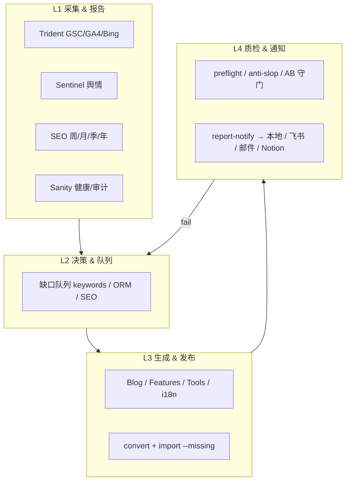

# Lovart 自动化总蓝图

> **版本**：2026-06-07  
> **SSOT 索引**：[06-自动化状态.md](./06-自动化状态.md) · [07-多Agent迁移](./07-多Agent自动化迁移指南.md)  
> **目标**：报告全节奏自动化 → 触发内容生成 → 质检 / anti-bug / i18n → **本地 + Notion + 飞书/邮件** 归档。

---

## 一、四层架构



| 层 | 谁跑 | 产物 |
|----|------|------|
| **L1** | Cursor Automation + shell | `1-2 Insight/`、`1-7 Output/` |
| **L2** | Agent 读报告写队列 | `1-3 Content Gen/` 日历、缺口 JSON |
| **L3** | OpenCode / Cursor Agent | Draft MD/JSON、NDJSON |
| **L4** | shell + Agent | `automation-reports/`、Notion、飞书 |

**铁律**：L3 发布前必过 L4；L1 失败不进入 L3。

---

## 二、报告节奏矩阵（应有 Automation）

### 2.1 每日

| ID | 任务 | 脚本 / Skill | Cursor cron | 草稿 JSON |
|----|------|--------------|-------------|-----------|
| D01 | GSC 日报数据 | `trident/gsc_fetch.py --daily` | `0 5 * * *` | `lovart-gsc-daily.workflow.json` |
| D02 | Sentinel 采集 | `sentinel/collect.py --source all` | `10 0 * * *` | 同 sentinel-daily |
| D03 | Sentinel 日报 | `sentinel/report.py --daily` | 接 D02 后 | 同 sentinel-daily |
| D04 | SEO 日报片段 | `sentinel/sources/gsc_daily.py` | `0 18 * * *` | 待建 |
| D05 | 飞书日汇总 | `trident/push_to_feishu.py --daily-summary` | `0 20 * * *` | `lovart-feishu-daily.workflow.json` |

### 2.2 每周

| ID | 任务 | 脚本 | cron | 草稿 JSON |
|----|------|------|------|-----------|
| W01 | Trident 全量 | `lovart-trident-data-engine/scripts/run_all.sh` | 周一 06:00 | ✅ `lovart-trident-weekly` |
| W02 | Tools Pull | `automation/tools-pull/...` | 周一 08:00 | ✅ 已 Save |
| W03 | Sanity 健康 | `content-health/weekly-health-check.sh` | 周一 08:30 | ✅ 草稿 |
| W04 | SEO 复盘周报 | `weekly_review_v3.py` | 周一 09:00 | ✅ 草稿 |
| W05 | Sentinel 周报 | `sentinel/report.py --weekly` | 周一 10:00 | `lovart-sentinel-weekly.workflow.json` |
| W06 | Sitemap | Skill `lovart-sitemap-update` | 周一 02:00 | 待建 |
| W07 | 自然周报 | `weekly_review_v3.py --natural` | 周三 09:00 | 待建 |
| W08 | i18n 缺口扫描 | `translate-tools.py` / pt-ru 队列 | 周五 10:00 | `lovart-i18n-gap-weekly.workflow.json` |

### 2.3 每月

| ID | 任务 | cron | 草稿 |
|----|------|------|------|
| M01 | SEO 月报 V2 | 3 日 06:00 | `lovart-seo-monthly.workflow.json` |
| M02 | Sentinel 月报 | 3 日 12:00 | `lovart-sentinel-monthly.workflow.json` |
| M03 | 内容老化 / audit | 5 日 09:00 | `lovart-content-audit-monthly.workflow.json` |
| M04 | 全量 HTTP 封面/composite | 5 日 10:00 | 同 M03 或独立 |
| M05 | Sitemap 全量 | 5 日 10:00 | 待建 |

### 2.4 每季 / 每年

| ID | 任务 | cron |
|----|------|------|
| Q01 | SEO 季报 | 季末月 5 日 06:00 |
| Q02 | Sentinel 季报 | 季末月 5 日 12:00 |
| Y01 | SEO 年报 | 1 月 10 日 |
| Y02 | 年度内容批量（年份替换） | 12 月 28 日（需人工批准门） |

---

## 三、报告 → 内容生成（L2→L3 承接）

| 上游报告 | 触发 Automation | Agent 动作 | Skill |
|----------|-----------------|------------|-------|
| SEO 周报 / 月报 | `lovart-post-seo-content.workflow.json` | 读 weekly 报告 TOP 缺口 → 写 3 篇 Blog 草稿 | `lovart-content-writer` + calendar |
| Sentinel 日报/周报 | `lovart-post-sentinel-content.workflow.json` | 负面舆情 → 回应稿 / FAQ 补丁 | `lovart-content-writer` |
| Trident 关键词缺口 | `lovart-post-trident-content.workflow.json` | 高潜词 → Features/Tools 页选题 | `lovart-landing-page` / features |
| Tools Pull legacy=0 | 人工或 `--include-drafts` | 仅 drift 修复，不自动 publish | `lovart-tools-sanity-publish` |
| i18n 缺口周报 | `lovart-i18n-gap-weekly` | pt/ru 批次翻译 + preflight | OpenCode + `translate-*` |

**门控**：L3 Automation prompt 必须含：

```
If upstream report status != ok OR quality gates failed: STOP. Do not generate or import.
Max new items this run: 3 (blog) / 1 (landing page) unless user override in report.
```

---

## 四、质检 / Anti-slop / Anti-bug / i18n（L4 守门）

| 触发时机 | Automation | 命令 |
|----------|------------|------|
| 每批 MD/JSON 完成后 | `lovart-quality-gates-batch.workflow.json` | `preflight-content.js --strict` |
| Blog import 前 | 同上 | + `verify-blog-publish.js` |
| Tools/Features import 前 | 同上 | `--type tools|features` |
| 每月 | `lovart-content-audit-monthly` | `audit-content-quality.js` |
| 发布后 | `lovart-post-publish-verify.workflow.json` | GROQ 抽样 + cover 404 |
| i18n 批次 | `lovart-i18n-verify.workflow.json` | marker repair + link-translations |

**Anti-Bugs SSOT**：[ANTI-BUGS-REGISTRY.md](../ANTI-BUGS-REGISTRY.md) — Automation 失败时 Agent 必须引用 AB-* id。

**Anti-slop**：`lovart-content-audit` 五维审计；BLOCK 则 `report-notify --status fail`。

---

## 五、通知 & 归档（每次 run 必做）

### 5.1 本地（已实现）

```bash
bash "1-4 Dev/automation/report-notify/report-notify.sh" \
  --type seo-weekly \
  --status ok \
  --summary "522 tools v2, 0 legacy" \
  --artifact "1-2 Insight/Trident Insights/reports/weekly/..."
```

产出：

- `1-7 Output/automation-reports/YYYY-MM-DD/{type}-{timestamp}.md`
- 同路径 `.json` manifest
- `automation-reports/INDEX.md` 滚动索引

### 5.2 飞书

- 凭证：`1-1 Harness/Skills/lovart-trident-data-engine/credentials/feishu.json`
- 或 env `FEISHU_WEBHOOK_URL`
- PRD：`push_to_feishu.py --daily-summary`（日汇总 Automation D05）

### 5.3 邮件

- env `LOVART_REPORT_EMAIL=you@domain.com` → `report-notify.sh` 调用 macOS `mail`
- 生产环境可换 SendGrid/SES（待接）

### 5.4 Notion

> **同步策略**：全文镜像（见 `notion-sync/sync-manifest.json`）。Notion 备份本地全文，切换后 Notion 为主库；运行报告写完整正文，不只索引。

**建议数据库**：`Lovart Ops Reports`（与 `Reports/Insights`、`Automation Runs` 合并镜像）

| 属性 | 类型 | 示例 |
|------|------|------|
| Title | title | `SEO Weekly 2026-06-07` |
| Type | select | seo-weekly / sentinel-daily / tools-pull / quality-gates |
| Status | select | ok / warn / fail |
| Date | date | run date |
| Local path | url | Obsidian `automation-reports/...md` |
| Summary | rich text | Agent 摘要 |
| Artifacts | rich text | 链接列表 |
| Follow-up | checkbox | 是否触发了 L3 |

**写入方式**（每次 report-notify 后）：

1. Cursor Automation 末尾一步：「用 Notion MCP `create-page` / `create-database-row` 写入上表」
2. 或独立 Automation `lovart-notion-sync-reports`（webhook / 每日 21:00 扫 `automation-reports/` 未同步项）

---

## 六、Cursor Automation 标准 Prompt 尾段（复制到所有 workflow）

```
After the main task:
1. bash "1-4 Dev/automation/report-notify/report-notify.sh" \
     --type <TYPE> --status <ok|fail> --summary "<one paragraph>" \
     --artifact "<primary output path>"
2. If status=ok and type matches content trigger table in 08-自动化总蓝图.md §三, \
     chain to the next automation OR enqueue items in content calendar (max 3).
3. Create/update Notion row in Lovart Ops Reports (use Notion MCP if connected).
4. Never sanity deploy, --replace, or delete production without explicit user approval.
```

---

## 七、实施分期

| 阶段 | 范围 | 验收 |
|------|------|------|
| **P0** | W01–W05 + D02/D03 + report-notify | 5 个 Automation Save；INDEX.md 有行 |
| **P1** | M01–M03 + 全量 audit | 月报 + Notion 首行 |
| **P2** | L3 承接（post-seo / post-sentinel / i18n） | 报告后自动生成 ≤3 草稿 |
| **P3** | 飞书日汇总 + 邮件 + Notion 全自动 | 失败 30min 内飞书 @ |
| **P4** | Q/Y + 年度批量（人工批准门） | 文档 + 单次 Run |

---

## 八、与现有文档关系

| 文档 | 关系 |
|------|------|
| [PRD-部署上线方案.md](../PRD-部署上线方案.md) | launchd 历史；本蓝图 supersede 调度层 |
| [定期任务/](../定期任务/) | 人工 checklist；Automation 覆盖后改为验收表 |
| [LOVART-AUTOMATION-WORKFLOW.md](../../1-1 Harness/Skills/LOVART-AUTOMATION-WORKFLOW.md) | Skill 索引；L3 引用 |
| `.cursor/automations/` | 全部 workflow JSON 草稿 |

---

## 九、下一步（建议顺序）

1. Save 已有 4 个 weekly 草稿 + 新建 `lovart-seo-monthly`、`lovart-sentinel-weekly`
2. 每个 Automation **Run once**，确认 `automation-reports/` 有 MD
3. Notion 建 `Lovart Ops Reports` 库（或告诉我库名，我用 MCP 建）
4. P2：Save `lovart-post-seo-content`（仅 SEO 周报 ok 时触发）
5. `unload-all-launchd.sh` 当 Cursor 全覆盖后
