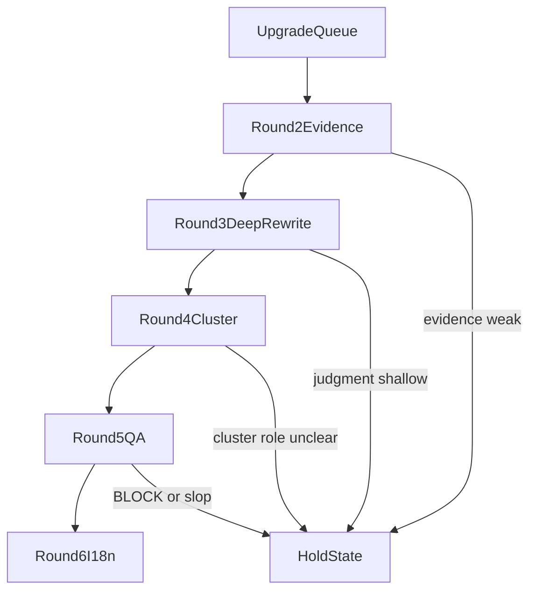

# Lovart Blog 多轮升级执行工作流 2026-07-13

## 结论

从现在开始，Blog 升级不再按 `Top 301-360` 这类 rank 段推进，而是按 **升级类型** 推进：

1. `Queue`
2. `Evidence`
3. `Deep Rewrite`
4. `Cluster`
5. `QA`
6. `i18n`

也就是说，后续主线从“批量 signal refresh”切到“分层质量升级生产线”。

## 新工作流

## Round 1：Upgrade Queue

### 目标

决定“谁值得深写”，不是立刻开写。

### 输入

- `Lovart Blog 高质量升级队列 2026-07-13.csv`
- `Lovart Blog 高质量升级队列 2026-07-13.md`
- `tmp/blog-upgrade-queue-2026-07-13.json`

### 动作

- 给每篇文章确定：
  - `pillar_candidate`
  - `deep_refresh_candidate`
  - `keep_refresh_only`
  - `cluster_support_only`
- 同时确定目标子 skill：
  - `lovart-complete-guide`
  - `lovart-101`
  - `lovart-review`
  - `lovart-best-practice`
  - `lovart-insight-trend`
  - `how-to-benchmark-research`

### 退出标准

- 没有标签冲突
- 每篇只归一个主升级角色
- 不再按 rank 段直接开工

## Round 2：Evidence

### 目标

让文章拥有“为什么值得升级”的证据基础。

### 每篇最低动作

- 补一张 SERP / 竞品证据卡
- 明确主 query 与次级 query
- 补 Lovart 相关功能证据
- 补 2026 数据点 / 行业 benchmark / 竞品价格或限制

### 输出

- `article-evidence-card`
- `upgrade-brief`

### 退出标准

- 已知 Top 3–5 SERP 结构
- 已知这篇与竞品/现有内容的差距
- 已知本篇要靠什么赢，而不是只靠“更长”

## Round 3：Deep Rewrite

### 目标

把文章从“结构合格”升级成“有判断、有方法、有实操”。

### 必补内容

- framework
- decision logic
- tested walkthrough / first-person scenario
- failure diagnosis
- anti-recommendation
- realistic FAQ

### 类型规则

- `Complete Guide`：必须走多轮状态机，不允许一轮拉长
- `Review`：必须给 tested verdict 与真实 trade-off
- `101`：必须能把 broad intent 导向更深页
- `Best Practice / How-To`：必须能让读者照着执行，而不是只会点头

### 退出标准

- 不再只是 signal refresh 结构块
- 文章的判断力明显高于同 SERP 结果平均水平

## Round 4：Cluster

### 目标

让文章成为内容网络的一部分，而不是单页。

### 动作

- 明确该文在 cluster 中的角色：
  - hub
  - pillar
  - comparison
  - support
- 补：
  - Internal Links
  - Next Steps
  - footer cluster 路由
  - CTA 落点（signup / pricing / feature）

### 退出标准

- 该页的“上一页 / 下一页 / 支柱页 / 支持页”关系清楚
- 内链不是堆数量，而是能驱动读者下一步

## Round 5：QA

### 目标

只允许高质量英文原稿进入后续扩张。

### QA 项

- Anti-Slop
- 结构完整性
- 证据密度
- FAQ 质量
- CTA 自然度
- metadata
- verified internal links
- banned token / placeholder

### 退出标准

- 通过质量门禁
- 不需要再靠“后面再补”掩盖结构性问题

## Round 6：i18n

### 目标

只把“已经过关的英文稿”扩展到多语言。

### 原则

- 翻译不是直译，是重写
- 不把半成品英文稿复制成多份半成品
- A 先于 B1，B1 先于 C

### 退出标准

- 多语言版本保留原文判断力
- 没有明显缩水、模板感、机翻腔

## Sprint 节奏

后续建议固定成 4 类 Sprint，而不是继续按 rank 段：

### Sprint A：Pillar Sprint

- 只处理 `pillar_candidate`
- 目标是打出支柱页模板

### Sprint B：Deep Refresh Sprint

- 只处理 `deep_refresh_candidate`
- 目标是打出第二阶段深写模板

### Sprint C：Cluster Support Sprint

- 只处理 `keep_refresh_only` 与 `cluster_support_only`
- 目标是补 cluster，而不是膨胀篇幅

### Sprint D：QA + i18n Sprint

- 只处理已完成深写的文章
- 目标是发布前收口与多语言放大

## 不再做的事情

- 不再默认“只要是 blog 就往 7500 词冲”
- 不再继续把全部页面按 rank 段做同质化 signal refresh
- 不再让 C 批次全员进入长文化
- 不再让未过 QA 的英文稿先进入多语言

## 最终目标

后面提升的不是“全库篇幅”，而是：

- 全库的判断力
- 全库的证据密度
- 全库的 cluster 组织能力
- 全库的可转化质量
