# Lovart 1—7 月全投放渠道增长 Benchmark

## Executive Summary

**全盘经营基准应采用“历史中位数 + 盈利线 + 优秀线”，不能只对比上月。** 1—7 月投放消耗中位数约 42.76 万美元，MTD收入中位数约 30.77 万美元，ROI中位数 84.5%。历史优秀状态出现在 3 月：ROI 147.62%、MTD付费率 3.73%、ARPPU 99.65美元；这比单纯追求最大 UV或注册规模更适合作为增长质量标杆。

**渠道Benchmark只覆盖付费投放。** Google Search是主投放渠道；Meta、Twitter和TikTok保留为实验渠道。现有材料没有完整披露后三者的UV—注册—付费—收入—成本链路，因此它们不会被自然搜索或GEO数据补位，而是明确标为“数据不足，暂不进入常规扩量池”。

**投放品牌词和非品牌词必须使用两套Benchmark。** 品牌词负责防守已有需求，核心看增量注册、增量付费、竞品截流和成熟ROI；非品牌词负责拓新，核心看注册成本、注册到付费率、付费成本、ARPPU、MTD和Day30 ROI。7月非品牌整体ROI约33.5%，仍远低于全盘85%的止损线，所以只能按模型词、竞品词、场景词和行业词分别管理。

**Day30目前不能形成历史实绩 Benchmark。** 现有“DataWorks 30天”是滚动30天渠道汇总，不是注册或获客 cohort的 Day30累计收入。Benchmark中把 Day30列为必采指标，但不填造数；预算扩量前必须补齐 `cohort_day30_revenue / cohort_cost`。

## Benchmark的使用方式

这套基准分为三个状态：低于底线为红色，表示需要停止扩量或立即诊断；进入正常区间为黄色，表示可以维持和优化；达到优秀线为绿色，表示允许在边际效率可控的前提下扩量。

基准优先使用同口径投放实绩。月度大盘采用1—7月投放漏斗、收入与消耗数据；其中1—5月使用月报主表，6—7月使用7月报告对6月的回填版总计表。品牌/非品牌结构采用1—2月Google Search消耗结构；词类ROI和优化事件采用7月SEM数据。自然搜索、SEO和GEO来源全部排除。

## 全盘月度规模与漏斗 Benchmark

### UV与注册规模

1 月新用户访问 UV为 66.17万、注册 UV为 24.69万，是全期最大规模，但不代表最优效率。2—5月新用户访问UV分别为26.97万、23.11万、31.34万、33.71万；BI注册UV分别为15.64万、14.15万、15.44万、14.77万。6—7月报告改用“有行为新用户”口径，分别为7.73万、6.34万；同期BI注册分别为9.03万、7.62万。1—7月BI注册中位数为14.77万。

因此，月注册 UV的全盘基准建议设为：低于14万为规模预警；14万—17万为正常区；17万—20万为扩量区；超过20万时必须同时满足付费率和ARPPU门槛，否则视为低质量放量。

访问到注册率必须使用报告定义，不能用 `BI注册UV / 新用户访问UV`自行替代。月报明确披露的整体访问→注册率为3月47%、4月40%、5月25%；6—7月总计表未提供同口径访问UV与访问→注册率，因此不跨口径续接。建议暂以低于30%为红色、30%—40%为恢复区、40%—50%为健康区；待统一埋点后再重算历史分位。

### 付费人数与付费率

1—7 月 MTD付费 UV分别为4,852、3,496、5,278、5,194、4,016、2,111和2,010，中位数4,016。月付费 UV低于2,500为红色；2,500—4,000为恢复区；4,000—5,200为正常健康；超过5,200为历史优秀。

注册到MTD付费率1—7月分别为1.97%、2.23%、3.73%、3.36%、2.72%、2.34%和2.64%。建议把低于2.2%定义为红色，2.2%—3.2%定义为正常，3.2%—3.7%定义为良好，达到或超过3.7%视为历史优秀线。规模扩张时，付费率不得跌破2.2%。

### ARPPU

1—7 月 ARPPU分别为112.84、85.07、99.65、80.05、76.61、86.27和93.66美元，中位数86.27美元、均值约90.59美元。建议把低于80美元定义为红色，80—95美元为正常区，95—105美元为良好，超过105美元为优秀。

ARPPU与付费率必须组合判断。付费率高但ARPPU低，可能只是低价套餐占比上升；ARPPU高但付费人数低，则可能是少数大额用户造成。允许扩量的最低组合建议为：MTD付费率不低于2.5%，ARPPU不低于85美元。

## 收入、成本与ROI Benchmark

### MTD收入和消耗

1—7 月投放消耗分别约为56.48万、42.76万、35.63万、50.21万、45.75万、21.55万和14.30万美元，中位数约42.76万美元。

同期可核验MTD收入分别约为54.75万、29.74万、52.59万、41.58万、30.77万、18.21万和18.83万美元，中位数约30.77万美元。

月MTD收入低于20万美元定义为规模红线；20万—35万美元为恢复区；35万—50万美元为健康区；超过50万美元为历史高位。需要注意，收入高位只有在ROI同步合格时才可评价为优秀：1月收入最高但ROI仅96.93%，3月收入52.59万美元且ROI147.62%，后者才是质量标杆。

### ROI分层

1—7 月ROI分别为96.93%、69.55%、147.62%、82.81%、67.25%、84.5%和131.6%，历史中位数84.5%，均值约97.2%。公司7月目标为143%。

经营基准建议设为：低于85%为红色，表示收入无法覆盖足够获客成本；85%—100%为止损恢复区；100%—120%为可持续观察区；120%—143%为健康区；达到143%以上为目标达成和扩量候选。扩量不能只看当月ROI，至少还需满足Day30预测不下降、付费率不低于2.5%、ARPPU不低于85美元。

### D0、MTD与Day30

1—7 月D0收入分别为246,376、153,686、254,935、222,524、191,313、101,427和108,064美元。D0用于快速预警，不用于最终预算判断。5月D0收入环比下降14%，MTD收入却下降26%，说明D1之后的留存和追加付费会显著改变最终结果；7月D0收入环比增长6.54%，MTD收入增长3.37%。

MTD是当月运营观察口径。6月月末快照收入约23.5万美元、ROI约106%，次月回填后收入变成18.21万美元、ROI84.5%，差异达到约5.29万美元和21.5个百分点。因此，MTD只能在明确数据版本后使用。

Day30必须定义为“同一获客或注册 cohort在第0—30天产生的累计收入”。Day30 ROI等于该cohort Day30收入除以相应获客成本。目前没有可核验的Day30实绩，状态为缺失。正式基准建议在积累至少3个成熟月后设定：Day30 ROI低于100%停止扩量；100%—120%观察；120%—143%健康；达到143%以上扩量。这个阈值是经营规则，不是已观测历史分布。

## 投放渠道 Benchmark

### Google Search / SEM

Google Search是1—7月最主要的付费搜索承载渠道。1月搜索消耗结构约为品牌词71%、非品牌29%；2月调整到品牌51%、非品牌49%。非品牌占比迅速扩大后，2月整体收入和ROI明显承压，说明Google Search不能以注册量或非品牌预算占比作为扩量标准。

Google Search的健康基准沿用全盘投放门槛：注册到付费率不低于2.5%、ARPPU不低于85美元、MTD ROI不低于120%，Day30 ROI达到143%后才进入强扩量。品牌与非品牌必须分campaign、国家、词类、落地页和优化事件评价。

7月tROAS和AI Max落地页匹配是Google Search当前最可靠的优化标杆。相对浅层事件，tROAS显著提高MTD回收并降低付费成本；相对普通关键词，AI Max落地页匹配使收入增长42%、ROI提升193%、注册成本下降25%、付费成本下降30%。

### Meta、Twitter与TikTok

Meta、Twitter和TikTok在4—5月均未形成稳定的后端回收。现有材料显示Meta归因较弱，Twitter规模小且付费差，TikTok存在大量访问后不注册流量，但没有完整、同口径的渠道UV、注册、付费、ARPPU、MTD、Day30和成本序列。

因此，这三类渠道当前状态统一标记为“数据不足，不进入常规扩量池”。重新进入测试的最低数据合同是：渠道UV、注册UV、付费UV、访问到注册率、注册到付费率、D0/MTD/Day30收入、ARPPU、消耗、注册成本、付费成本和D0/MTD/Day30 ROI全部可按campaign与国家拆分。

实验渠道的临时门槛建议为：访问到注册率不低于全盘同落地页基线的80%，注册到付费率不低于1.5%，ARPPU不低于80美元，Day30 ROI预测不低于100%。任一指标连续两周低于门槛即暂停。

## SEM品牌词 Benchmark

1月Google Search消耗中品牌词约占71%、非品牌29%；2月调整为51%/49%。品牌消耗占比下降后，整体收入和ROI也下降，但同时受到地区、ARPPU和非品牌质量影响，不能把变化全部归因于品牌占比。

SEM品牌词的基准不应是固定预算占比，而应是增量防守效率。建议要求品牌搜索印象份额、绝对顶部份额、自然与付费重复率、增量注册和增量Day30收入。缺少增量实验前，不以品牌ROI表面值决定无限加预算。运营上把品牌消耗占搜索预算40%—60%作为观察区，超过60%需证明竞品截流或自然损失，低于40%需检查品牌覆盖和竞品抢占。

## SEM非品牌词与词类ROI Benchmark

7月同范围非品牌ROI从26.4%提升到33.5%，注册成本从8.51美元升至10.03美元。说明收入质量有所改善，但整体ROI仍远低于全盘85%的止损线；非品牌不能作为一个整体扩量，只能按词类和优化方式筛选。

模型词ROI约44%，贡献约64.5%的非品牌收入，是当前非品牌词类的相对标杆，但仍未达到全盘盈利线。模型词的下一阶段合格线建议为ROI不低于45%，向60%以上推进；同时必须观察Day30是否能把回收提升至100%以上。

竞品词注册成本下降22.2%、注册量增长111.8%，是扩量效率最明确的词类。但现有材料没有给出完整的付费率、ARPPU和ROI绝对值，因此先以注册成本不高于10美元、注册到付费率不低于2.5%、Day30 ROI不低于100%作为准入门槛。

场景词ROI约39%，但注册成本翻倍、注册量下降76.2%。场景词Benchmark建议为ROI不低于40%、注册成本不高于12美元；未达到前只使用精准匹配和高匹配落地页。

行业词ROI仅15%、注册成本20.18美元，属于明确红色。只有当注册成本降到12美元以内、ROI超过30%且Day30预测超过80%时才恢复小规模测试，否则暂停该词类预算。

优化方式方面，tROAS相对浅层事件表现显著更好：相对`image_generated`，MTD回收增长1,336%、ROI提升94%、付费成本下降34%；相对`export_success`，回收增长773%、ROI提升33%。AI Max落地页匹配相对普通关键词使注册成本下降25%、收入增长42%、ROI提升193%、付费成本下降30%。因此所有非品牌Benchmark都应以收入优化事件和匹配落地页为默认配置，浅层事件只能作冷启动对照组。

## 可直接用于月报的红黄绿规则

全盘ROI：低于85%红色；85%—120%黄色；120%—143%绿色观察；达到143%以上为目标达成。

MTD收入：低于20万美元红色；20万—35万美元黄色；35万—50万美元绿色；超过50万美元为高规模，但仍需ROI合格。

注册UV：低于14万红色；14万—17万黄色；17万以上绿色，但付费率低于2.2%时降级。

MTD付费UV：低于4,000红色；4,000—4,800黄色；4,800—5,200绿色；超过5,200优秀。

注册到付费率：低于2.2%红色；2.2%—3.2%黄色；3.2%—3.7%绿色；3.7%以上优秀。

ARPPU：低于80美元红色；80—95美元黄色；95—105美元绿色；105美元以上优秀。

Google Search注册到付费率：低于2.2%红色；2.2%—3.2%黄色；3.2%—3.7%绿色；3.7%以上优秀。必须与ARPPU和ROI联合判断。

SEM非品牌ROI：低于30%红色；30%—45%黄色；45%—60%为相对健康；超过60%才进入下一阶段扩量验证，最终仍以Day30 ROI为准。

Day30 ROI：当前无历史实绩；临时经营规则为低于100%红色、100%—120%黄色、120%—143%绿色观察、143%以上允许扩量。

## 下一步：把Benchmark从报告变成数据合同

第一，建立统一投放事实表，最小粒度为“日期 × 国家 × 投放渠道 × 广告平台 × 品牌类型 × 词类 × campaign × ad group × creative × landing page × cohort”。

第二，每个粒度固定输出UV、注册UV、付费UV、访问到注册率、注册到付费率、消耗、注册成本、付费成本、D0收入、MTD收入、Day30收入、ARPPU、D0/MTD/Day30 ROI。

第三，收入保存月末快照、次月回填和Day30最终值，不覆盖历史版本。6月ROI从106%回填为84.5%的偏差必须成为质量告警。

第四，SEM查询统一使用项目品牌识别脚本分类，并把query class回写到campaign、landing page和DataWorks cohort，确保品牌/非品牌都能追到注册、付费、ARPPU和Day30收入。

第五，月报默认同时展示实际值、历史中位数、经营目标和红黄绿状态；没有数据的指标显示“缺失”，不显示0。

## 待补问题与解释边界

现有材料没有完整提供Google Search、Meta、Twitter和TikTok各自的月度UV、注册、付费、ARPPU、消耗和Day30序列，因此渠道间无法形成同口径精确排名。缺失项不会用SEO、自然搜索或GEO数据替代。

SEM品牌/非品牌有消耗结构和部分词类ROI，但缺少完整的品牌/非品牌UV、付费人数、ARPPU和Day30收入。后续必须补充投放平台到DataWorks cohort的归因后才能形成全漏斗Benchmark。

6月收入同时存在月末快照和次月修订值，本Benchmark经营判断采用修订后的182,112美元和84.5% ROI。

“注册率”在源材料中存在访问到注册、有行为用户到注册、注册到付费等多种口径。本报告分别命名，不把不同分母的比例直接比较。

## 附录：快速看板（表格与趋势图版）

### 1—7月全盘KPI速查

最后一行是后续月报默认使用的历史平均基准。“—”表示源材料没有同口径实绩。表内数值均来自月报主表或后续报告的回填总计，不再用环比反推。Day30没有用滚动30天数据代替。

| 月份 | 访问/行为UV（按源口径） | BI注册UV | MTD付费UV | 访问→注册 | 注册→MTD付费 | ARPPU | 消耗 | D0收入 | MTD收入 | MTD ROI | Day30收入 / ROI |
|---|---:|---:|---:|---:|---:|---:|---:|---:|---:|---:|---:|
| 1月 | 661,737 | 246,893 | 4,852 | 未按统一口径披露 | 1.97% | $112.84 | $564,840 | $246,376 | $547,479 | 96.93% | 缺失 |
| 2月 | 269,728 | 156,424 | 3,496 | 未按统一口径披露 | 2.23% | $85.07 | $427,581 | $153,686 | $297,402 | 69.55% | 缺失 |
| 3月 | 231,099 | 141,527 | 5,278 | 47% | 3.73% | $99.65 | $356,274 | $254,935 | $525,944 | 147.62% | 缺失 |
| 4月 | 313,448 | 154,355 | 5,194 | 40% | 3.36% | $80.05 | $502,062 | $222,524 | $415,776 | 82.81% | 缺失 |
| 5月 | 337,062 | 147,742 | 4,016 | 25% | 2.72% | $76.61 | $457,494 | $191,313 | $307,685 | 67.25% | 缺失 |
| 6月 | 有行为新用户77,292 | 90,295 | 2,111 | 不可比 | 2.34% | $86.27 | $215,528 | $101,427 | $182,112 | 84.50% | 缺失 |
| 7月 | 有行为新用户63,435 | 76,178 | 2,010 | 不可比 | 2.64% | $93.66 | $143,047 | $108,064 | $188,250 | 131.60% | 缺失 |
| **历史平均基准** | **1—5月访问UV 362,615；6—7月行为UV 70,364** | **144,773** | **3,851** | **3—5月均值37.3%** | **2.71%** | **$90.59** | **$380,975** | **$182,618** | **$352,093** | **97.18%** | **缺失** |

### 新增UV趋势与口径断点

1—5月为“新用户访问UV”，历史平均362,615；6—7月改为“有行为新用户”，平均70,364。两段分别用于各自口径的Benchmark，不把绝对值直接比较。

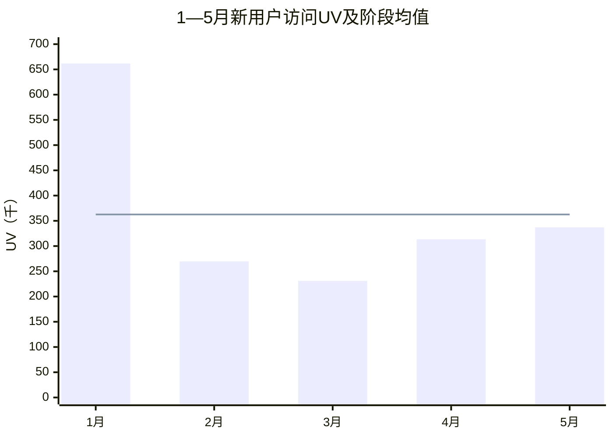

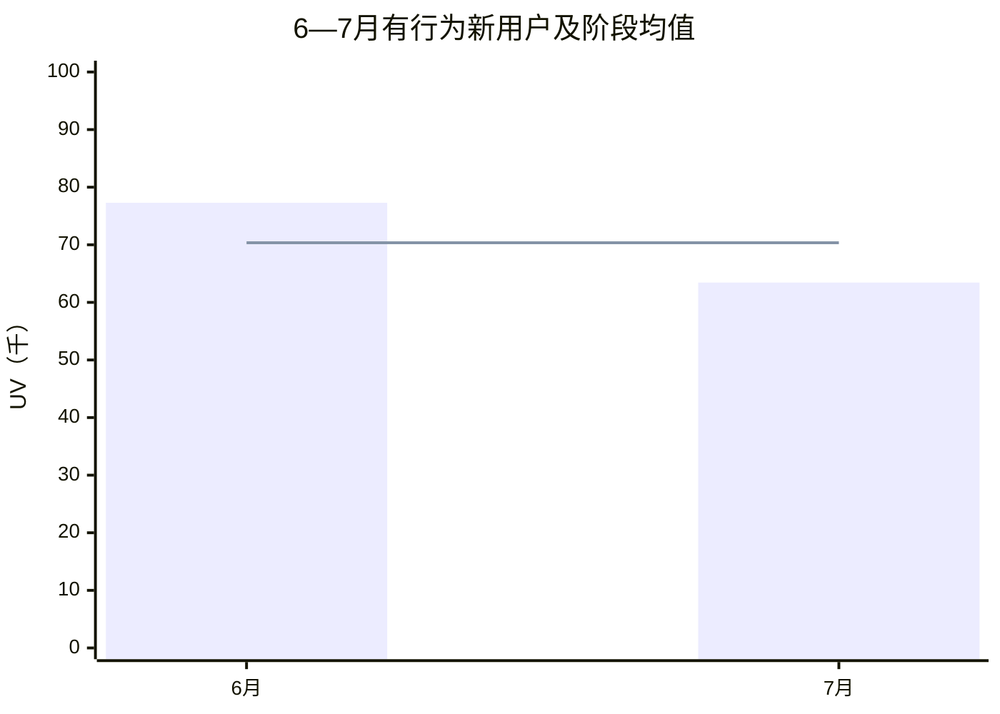

### BI注册UV趋势与历史平均基准

7个月BI注册UV平均为144,773。6—7月已连续低于该基准，7月只有平均值的52.6%。

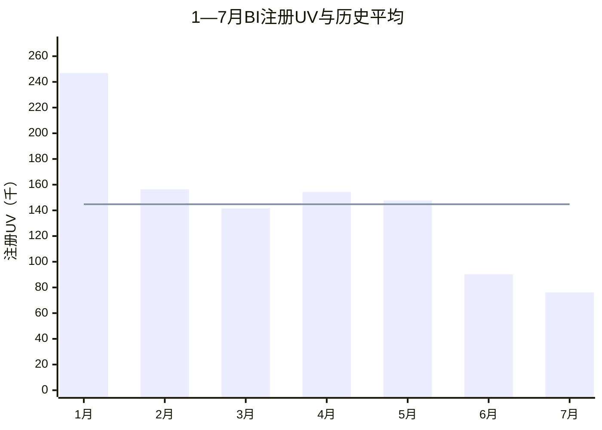

### MTD付费UV趋势与历史平均基准

7个月MTD付费UV平均为3,851。3—4月高于5,000，6—7月约为平均基准的一半。

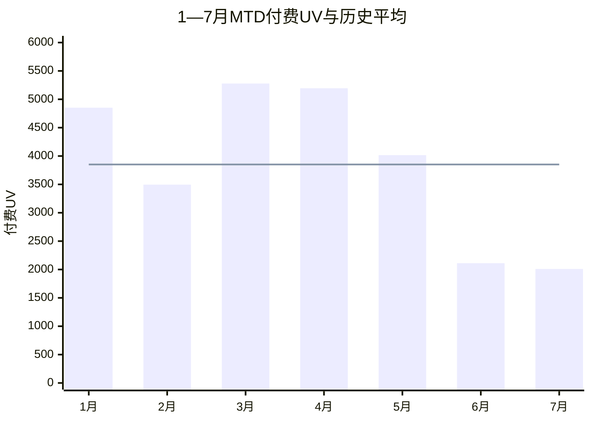

### 访问注册率趋势与阶段平均基准

源报告仅明确披露3—5月同口径访问→注册率，阶段平均37.3%。5月25%比阶段平均低12.3个百分点。1—2月及6—7月不补算、不跨口径连线。

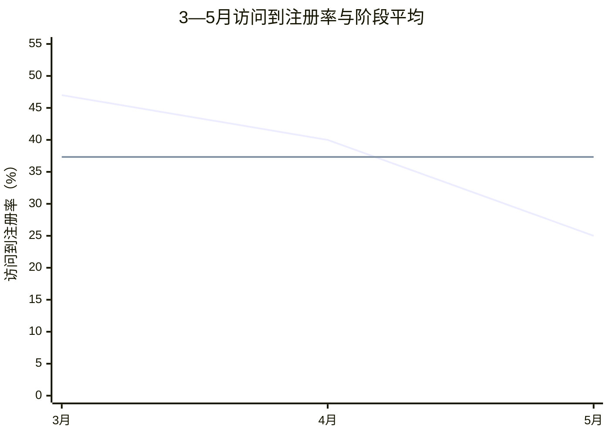

### 注册到MTD付费率趋势与历史平均基准

7个月平均付费率为2.71%。3—4月高于基准，5—7月连续低于基准；7月虽环比恢复，仍低0.07个百分点。

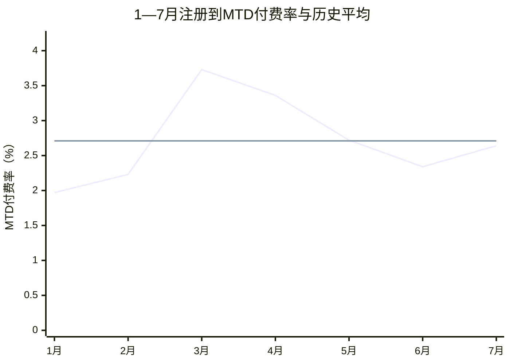

### ARPPU趋势与历史平均基准

7个月ARPPU平均为90.59美元。7月已修复至93.66美元，但仍低于1月和3月的高质量月份。

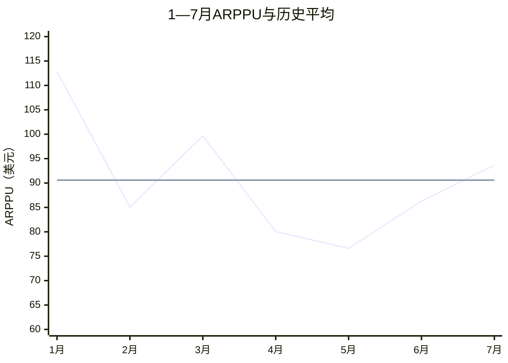

### ROI趋势与历史平均、经营目标

月度ROI的7个月历史平均为97.18%，经营目标为143%。7月高于历史平均34.4个百分点，但仍比目标低11.4个百分点。

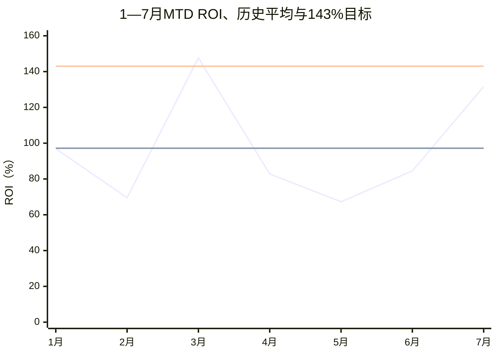

### 投放消耗趋势与历史平均基准

7个月月均消耗为380,975美元。6—7月连续大幅低于平均，7月只相当于历史平均的37.5%。

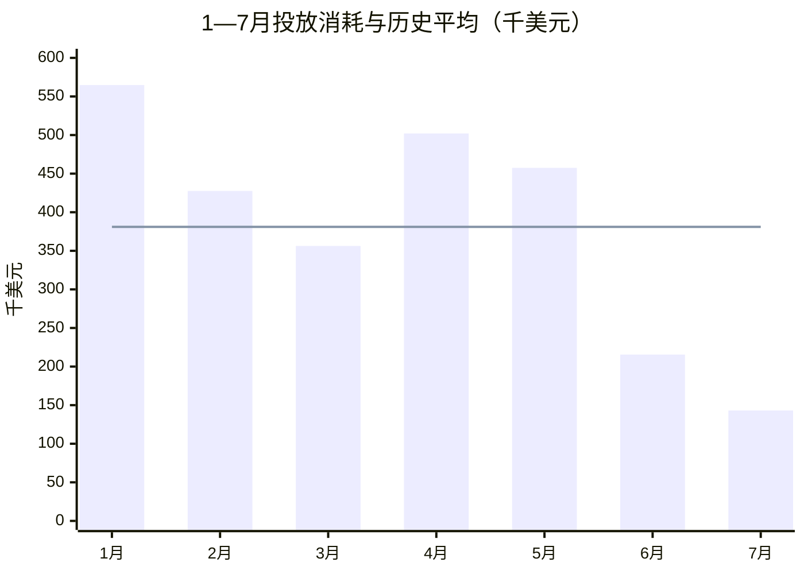

### D0与MTD收入趋势及历史平均基准

7个月D0收入平均为182,618美元，MTD收入平均为352,093美元。7月D0收入和MTD收入分别只有历史平均的59.2%和53.5%，因此ROI修复不能替代收入规模Benchmark。

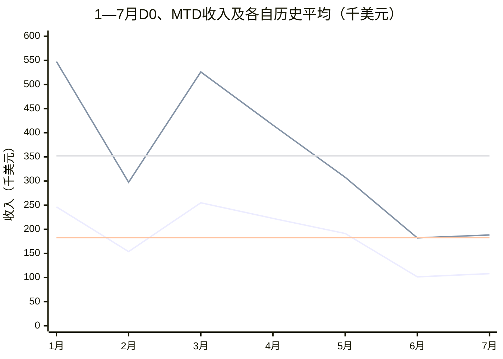

### 全投放渠道状态速查

现有材料只有Google Search能够下钻到品牌/非品牌、词类和优化事件；Meta、Twitter和TikTok缺少完整的同口径UV—注册—付费—收入—成本序列，因此只呈现已验证状态，不补入任何自然搜索或GEO数据。

| 投放渠道 | 1—7月已验证表现 | 数据完整度 | Benchmark状态 | 下一步 |
|---|---|---|---|---|
| Google Search / SEM | 主投放渠道；4—5月扩量后付费与回收恶化；7月tROAS和AI Max显著改善效率 | 中：有大盘、词类、区域和实验数据，但缺完整月度渠道漏斗 | 黄：可优化，不可按注册量盲目扩量 | 按国家×品牌属性×词类×落地页×收入事件管理 |
| Meta | 4—5月未形成稳定后端回收，归因偏弱 | 低 | 红黄：实验渠道 | 补齐campaign级Day30收入和成本后复测 |
| Twitter / X | 规模小、付费表现弱 | 低 | 红 | 暂停常规扩量，仅保留小预算实验 |
| TikTok | 存在大量访问后不注册流量 | 低 | 红 | 先修复素材—受众—落地页匹配，再验证注册和付费 |

### Google Search品牌/非品牌预算结构

1月品牌词约占Google Search消耗71%、非品牌29%；2月调整为51%/49%。非品牌占比快速增加的同时，全盘ROI从96.93%降至69.55%。这不是严格因果分解，但足以说明预算结构不能脱离后端收入独立优化。

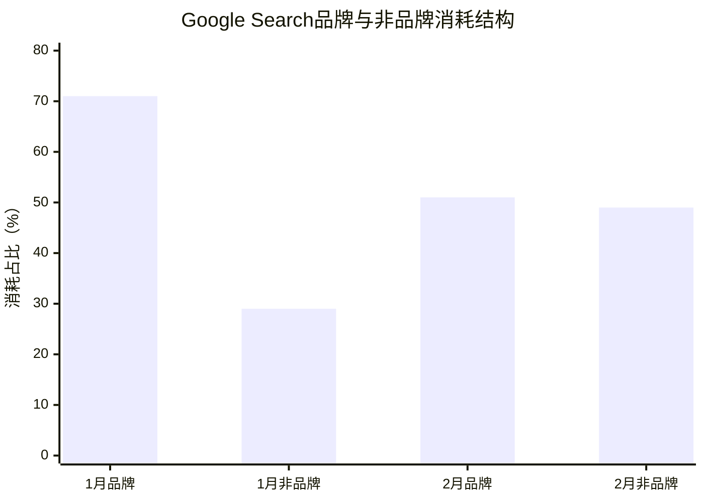

### SEM非品牌词类速查

| 词类 / 策略 | 当前数据 | Benchmark状态 | 快速动作 |
|---|---|---|---|
| 非品牌整体 | ROI 33.5%；前期26.4%；注册成本$10.03 | 红：远低于全盘85%止损线 | 不整体扩量，按词类筛选 |
| 模型词 | ROI约44%；贡献约64.5%非品牌收入 | 黄：相对最好，绝对仍未盈利 | P0，收入优化下继续验证 |
| 竞品词 | 注册成本下降22.2%；注册量增长111.8% | 绿：扩量信号最明确 | 补齐付费率、ARPPU和Day30后放量 |
| 场景词 | ROI约39%；注册成本翻倍；注册量下降76.2% | 红黄：有效但成本失控 | 精确匹配、限价、高匹配落地页 |
| 行业词 | ROI约15%；注册成本$20.18 | 红 | 暂停该词类预算 |
| tROAS vs image_generated | MTD回收+1,336%；ROI+94%；付费成本-34% | 绿 | 以收入事件作为默认优化目标 |
| tROAS vs export_success | MTD回收+773%；ROI+33% | 绿 | 停止把浅层事件当最终目标 |
| AI Max落地页匹配 | 收入+42%；ROI+193%；注册成本-25%；付费成本-30% | 绿 | 查询、页面和收入目标三者对齐 |

### 红黄绿Benchmark总表

| 指标 | 红色：停止/诊断 | 黄色：维持/优化 | 绿色：健康/扩量候选 | 优秀/目标 |
|---|---|---|---|---|
| 全盘MTD ROI | <85% | 85%—120% | 120%—143% | ≥143% |
| MTD收入 | <$200k | $200k—$350k | $350k—$500k | >$500k且ROI合格 |
| 月注册UV | <140k | 140k—170k | >170k且付费率合格 | >200k且不稀释质量 |
| MTD付费UV | <2,500 | 2,500—4,000 | 4,000—5,200 | >5,200 |
| 注册→MTD付费 | <2.2% | 2.2%—3.2% | 3.2%—3.7% | ≥3.7% |
| ARPPU | <$80 | $80—$95 | $95—$105 | >$105 |
| Google Search注册→付费 | <2.2% | 2.2%—3.2% | 3.2%—3.7% | ≥3.7%且ARPPU合格 |
| SEM非品牌ROI | <30% | 30%—45% | 45%—60% | >60%，再以Day30验证 |
| Day30 ROI | <100% | 100%—120% | 120%—143% | ≥143%；当前无历史实绩 |

### 快速决策顺序

1. 先看Day30是否成熟；未成熟时只用MTD做预警，不做最终扩量决定。
2. 再看ROI是否达到120%，并检查是否以大幅牺牲收入规模换来。
3. 同时检查注册到付费率是否高于2.5%、ARPPU是否高于85美元。
4. 渠道层以Google Search为主；Meta、Twitter和TikTok在完整Day30链路建立前只做实验。
5. 非品牌优先模型词和竞品词，场景词限价，行业词暂停。
6. 品牌词负责守住需求和入口；非品牌词必须用注册、付费和Day30收入证明新增价值。
