<div align="center">

# MFlow —— GEO Agent · 让品牌在 AI 回答中被引用

**从信号获取到组织生产，从上线分发到数据洞察，全部在一个闭环里转起来。**

[](LICENSE)
[](#快速开始)
[](1-4%20Dev/tests/)
[](#完全开源)

[快速开始](#快速开始) · [功能总附录](#附录功能总清单每个模块截图--介绍--使用说明) · [部署指南](docs/deploy-guide.md) · [在线体验](https://nownexts.com/mflow/)

</div>

---

## 这是什么：搜索的入口正在换成 AI 的回答，你的内容准备好了吗

用户正在从"搜索框 + 十条蓝链接"迁移到"直接问 AI"。Google AI Overview、ChatGPT Search、Perplexity 决定了你的品牌是否出现在回答里——**被引用才有流量，不被引用就不存在**。这门学科叫 GEO（Generative Engine Optimization），它不是 SEO 的补丁，而是一条全新的内容生产线：

```
内容数量 × 内容质量 × 数据回流速度 = AI 引用概率
```

人工方式数量是瓶颈；无治理的 AI 批量生产质量是灾难。MFlow 是这条生产线的开源实现——**一个真正的 GEO Agent**，而不是"又一个 AI 写作脚本"：

```
① 信号获取 SIGNAL          ② 组织生产 PRODUCE          ③ 上线分发 PUBLISH
   搜索控制台真实查询    →     信号驱动选题入队     →      增量导入 + 状态门禁
   22 源舆情监控               多语言重写非直译            10 语言落地页 / Blog
   关键词缺口 · 竞品覆盖        生成 → 质检 → 反馈重写       Sitemap / IndexNow
                               四道质量钩子 + Anti-Slop      四轨道站外分发
          ↓                                                            ↓
        ④ 数据洞察  ←—————————————————————————————  引用与排名回流
   SEO 周报/月报（强制环比） · AI 引用感知探测 · 内容衰减监测 · 选题队列回灌 ①
```

洞察不躺在报告里：衰减的页面自动回炉重写，缺口的关键词自动进入选题队列，AI 引用率每天探测——**LOOP 转起来，内容资产才会复利**。

## 系统长什么样：每个界面都是闭环的一环

下面的截图不是功能罗列，而是同一条 LOOP 的四段证据：

**① 总览：今天的信号先收口成行动** —— 待办、阻塞、失败任务、待授权发布集中在一屏；工作模式手动/自动/自治三挡切换，推荐下一步由系统状态自动生成。

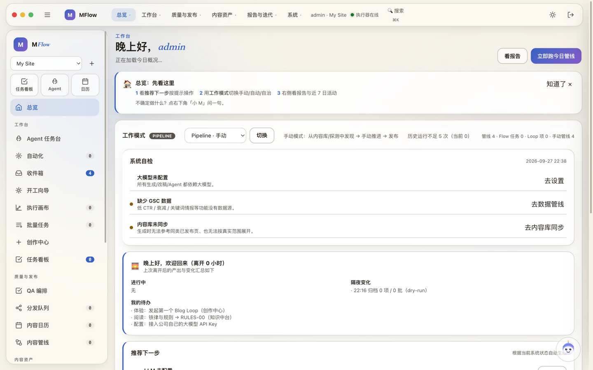

**② 创作中心 → Loop：生产是带质检的自循环** —— 填类型、语言、主题，Agent 自动走"生成 → 质检 → 带反馈重写"最多 3 轮，通过即止、失败熔断；每个 Loop 记录 token 消耗。

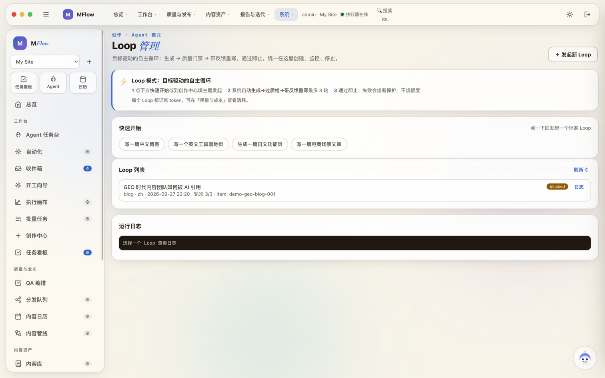

**③ 分发队列：上线永远有人工闸门** —— 四轨道分发状态一目了然，发布铁律：停在 ready 等人工授权；授权后才真正发出，全程审计。

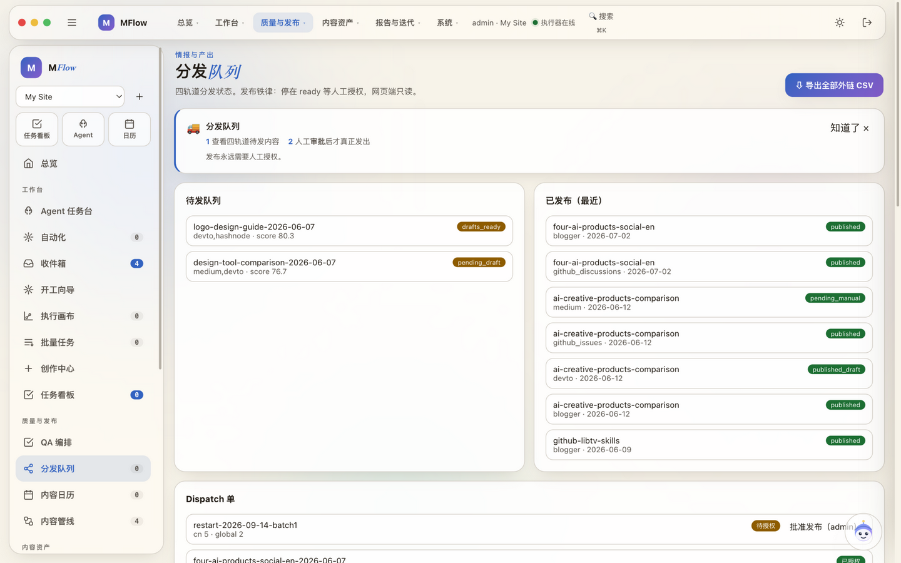

**④ 报告仪表 → 自我迭代：洞察回灌生产** —— Markdown 月报自动渲染成指标卡与比例条；质检 BLOCK 率、token 消耗、吞吐三条曲线看清系统健康度。

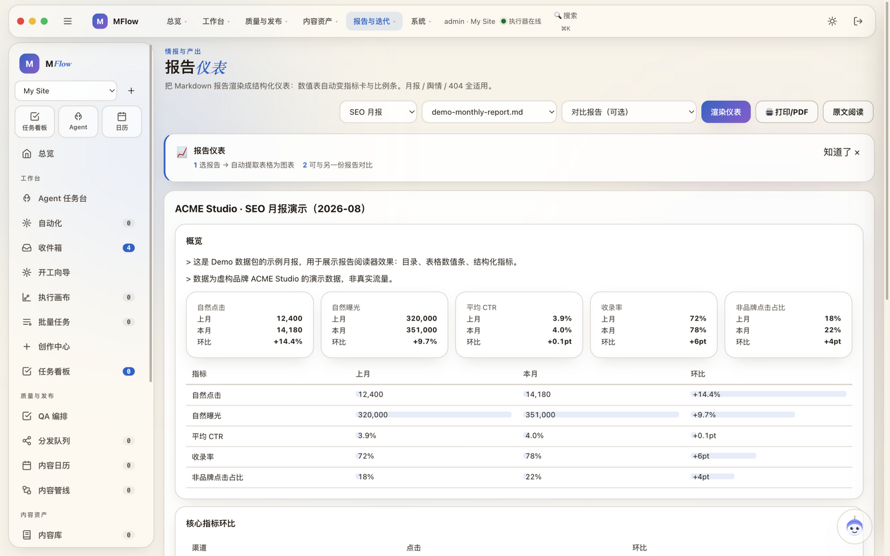

<details>
<summary><b>更多界面</b>（Agent 任务台 / 内容管线 / 知识中台 / 执行画布）</summary>

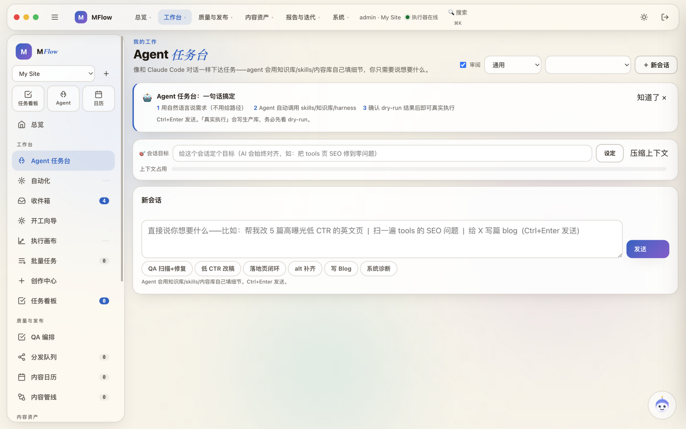

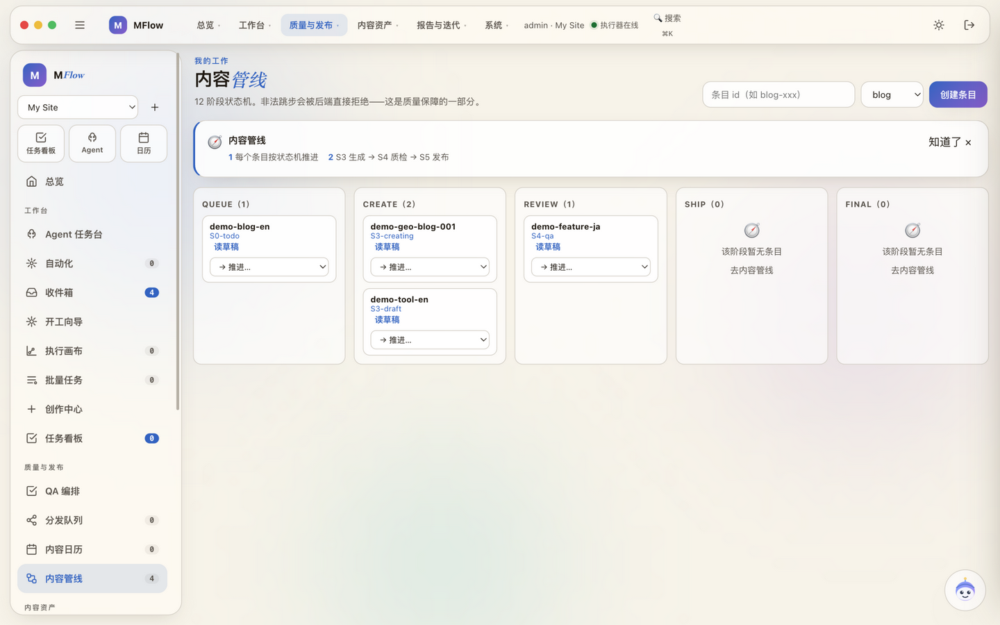

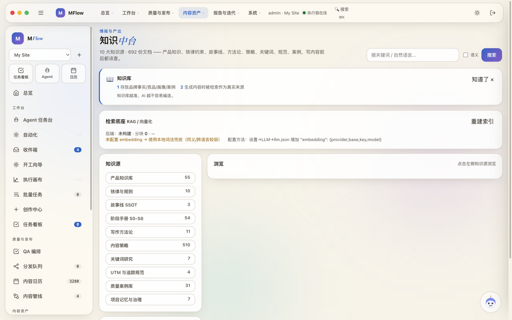

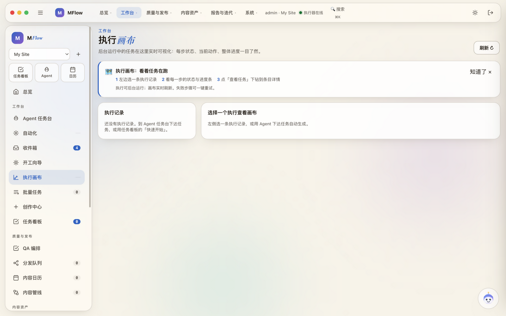

</details>

## 特色能力

### 状态机 + 路由器 + 质量钩子：治理不是文档，是代码

AI 内容生产有三个经典失控：**跑偏**（多 Agent 接力时"上一步是谁、下一步该谁"全靠猜）、**自降质量**（模型"善意绕过"文本规则）、**知识流失**（会话结束经验归零）。MFlow 的答案是把治理做成可执行的三件套：

- **12 阶段状态机**（`pipeline-state`）：原子写 JSON、非法转换直接 exit 2，进度变成共享事实；
- **决策矩阵路由器**（`router`）：这个任务该谁干、加载什么技能，规则回答而不是猜；
- **四道质量钩子**：写前/写后/导入前 bash 门禁 + 7 类 AI 模板化表达禁止，BLOCK 就是 BLOCK。

### Loop 与 Flow：自动挡与手动挡

最重要的永远是**人**：你的策略、你的审核、你的发布决定权。所以 MFlow 的两种执行模式都把方向盘留给你：

- **Flow 模式是手动挡**：选中条目按节点逐步执行（生成 → 质检 → 推进状态机），每步都是真实动作，适合已经想清楚的 SOP；
- **Loop 模式是自动挡**：定目标、给主题，Agent 在白名单工具里自动"生成 → 质检 → 带反馈重写"最多 3 轮，通过即止、失败熔断，token 全程记账。

### 多项目：一台实例服务所有站点

每个项目 = 独立数据命名空间（管线 / 看板 / Loop / 生成物 / 选题队列），新建项目即全新空白；共享平台能力（用户 / LLM / 模板 / 知识中台 / 报告）。站点档案定义"栏目 → 目录 → URL 规则"，适配任意无头 CMS 或静态站。

### 知识中台 + 项目记忆：AI 越用越懂你的业务

10 大知识源（产品事实、铁律、方法论、案例库……）在生成时自动检索作为真实来源；每次质检结果埋点进历史，"自我迭代仪表"把 BLOCK 率变成下一轮提示词的禁例——**系统从自己的错误里学习**。

### 开放接入：MCP、Playbook 与正文编辑器

- **MCP 开放接入**：17 个标准工具（检索内容库/知识库、查任务、跑预设强制 dry-run、看执行画布……），Claude / Cursor / 自研 Agent 可直接驱动 MFlow，动作强制 dry-run；
- **Playbook 剧本**：多步 + 条件 + 分支 + 触发器的可视化编排，支持前向分支、步骤级重试/超时与硬闸，试运行预览后再启用；
- **正文编辑器**：阅读器从只读变工作台——直接改稿、版本对照、保存即重跑四道门禁，BLOCK 硬拦发布；
- **机器 API**：`X-MFlow-Token`（GET-only）供业务系统拉取只读数据。

## 完全开源

MFlow 的核心能力——状态机、路由器、质量钩子、GEO 闭环——**过去、现在、将来都持续开源**，MIT 协议。

我们承诺与社区一起持续维护生态：**完全欢迎任何善意的组织与个人 fork 出自己的版本、参与到市场竞争中**。在 AI 时代，消耗 token 产出的代码从来不是稀缺品，稀缺的是把内容方法论沉淀为可执行系统的范式。

## 快速开始

技术栈刻意保持低门槛：**Python 标准库 + 单文件工作台，无数据库、无常驻服务依赖**，一台云服务器或本地电脑即可跑起来。

```bash
git clone https://github.com/sevenaaaaaaaaa/mflow.git
cd mflow

# 1) 依赖：Python 3.10+，装 markdown 包即可
pip install markdown

# 2) 设置访问密码（fail-closed：不设则 API 全部拒绝）
export MFLOW_CONSOLE_PASSWORD=你的密码

# 3) 启动工作台
python3 "1-4 Dev/console/console.py"
# → http://127.0.0.1:8088/
```

打开浏览器登录后：侧栏「首次引导 · Setup」→ ①一键导入 Demo 数据（无 API Key 也能体验完整闭环）→ 创作中心发起第一个 Loop → 看板查看质检日志 → 设置页配置真实大模型 Key。

**命令行入口**（可选）：

```bash
# 看管线状态
python3 "1-1 Harness/Skills/06-orchestrate/pipeline-state/pipeline_state.py" summary

# 问路由器：这个任务该谁干、加载什么技能
python3 "1-1 Harness/Skills/06-orchestrate/router/router.py" decide --stage S3 --scenario blog

# 跑每日信号管线（搜索控制台 + 舆情采集 + 规则同步）
bash "1-4 Dev/automation/run-daily-pipeline.sh"
```

所有脚本按自身位置推导路径，clone 到任意平铺目录即可运行。服务器部署（systemd timer）与 Docker 路径见 [部署指南](docs/deploy-guide.md)；调度时间表（每日 08:00 信号管线 / 每周管线 / 记忆整理 02:30）见「系统 → 调度与日志」。

## 文档

[快速上手](docs/quickstart.md) · [使用指南](docs/USAGE-GUIDE.md) · [产品介绍](docs/product.md) · [帮助中心](docs/help-center.md) · [模块扩展](docs/modules.md) · [部署指南](docs/deploy-guide.md) · [插件开发](docs/plugins.md) · [产品路线图](ROADMAP.md)

## 当前边界（诚实声明）

- 大模型 API 需自备（任意 OpenAI 兼容端点）；未配置时相关功能明确降级、不假成功；
- 发布永远停在「待人工授权」：工作台到 CMS 是草稿写入 + 审计，前台上线由你在 CMS 侧确认；
- AI 引用感知探测依赖你配置的探测引擎与预算；GSC/GA4/Bing 数据源需各自授权；
- 舆情监控的部分数据源依赖第三方页面结构，源失效会如实报告而不是静默失败。

我们区分**已实现 / 已接入 / 已被使用 / 已验证有效**，不把远景写成现状。

## License

[MIT](LICENSE)

---

## 附录：功能总清单（每个模块：截图 + 介绍 + 使用说明）

> 工作台共 31 个模块，按侧栏分组逐一说明。截图为本地 Demo 实例（设置访问密码 + 一键导入 Demo 数据即可复现）。

### 0. 登录


**功能**：多用户 bcrypt 登录（admin / 创作质检级 / viewer 三级角色）+ 单密码模式（环境变量）双形态；fail-closed——未配置密码且无账号文件时 API 全部拒绝。viewer 角色只读拦截，发布类动作仅 admin 可批。
**使用**：本地快速体验设 `MFLOW_CONSOLE_PASSWORD` 环境变量后任意用户名 + 该密码登录；生产环境用 `deploy/reset-account.sh` 重置账号。

### 1. 总览（home）


**功能**：每日入口。系统自检（大模型 / 搜索数据 / 内容库同步三项体检）+ 工作模式切换（Pipeline 手动 / Flow 自动 / Loop 自治）+ 欢迎回来摘要（隔夜变化、我的待办）+ 推荐下一步（按系统状态生成 P0-P3 行动卡）+ 最新成果报告 + 近 7 日管线活动 + 调度状态。
**使用**：按「推荐下一步」处理 P0 卡片；「切换」按钮换工作模式；右上「立即跑今日管线」手动触发信号采集。

### 2. Agent 任务台（agent）


**功能**：像和编程 Agent 对话一样下达任务——Agent 自动调用知识库 / Skills / 内容库补齐细节。支持会话目标设定（对齐目标不走偏）、上下文占用显示、压缩上下文、审阅开关（关键动作先确认）、会话管理。
**使用**：直接说需求（如"扫一遍 tools 页的 SEO 问题"）→ Agent 先给 dry-run 结果 → 确认后真实执行；`Ctrl+Enter` 发送；不确定就点预设 chips（QA 扫描+修复 / 低 CTR 改稿 / alt 补齐）。

### 3. 自动化（auto）

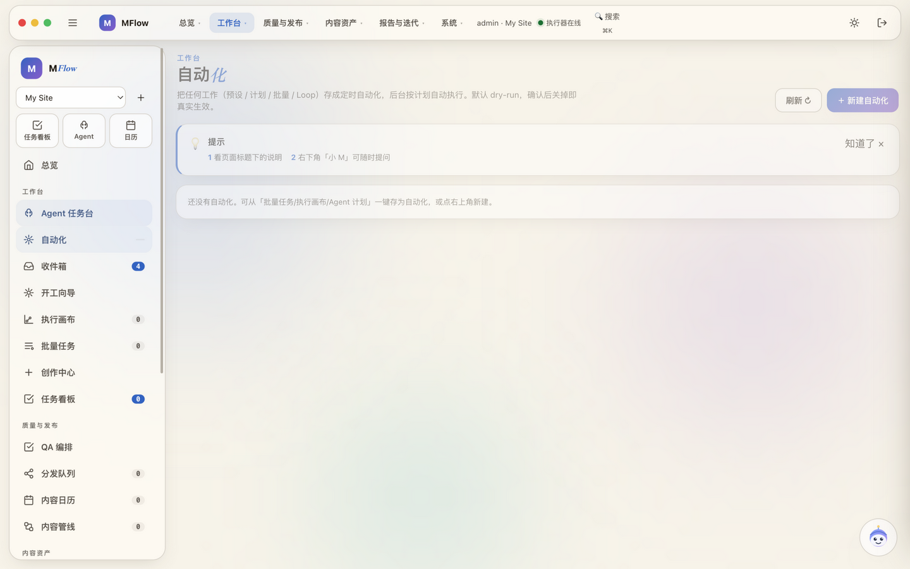

**功能**：把任何工作（预设 / 计划 / 批量 / Loop）存成定时自动化，后台按计划自动执行。默认 dry-run，确认后关掉才真实生效。
**使用**：从批量任务/Agent 计划一键"存为自动化"，或右上新建；每条可单独启停。

### 4. 收件箱（inbox）

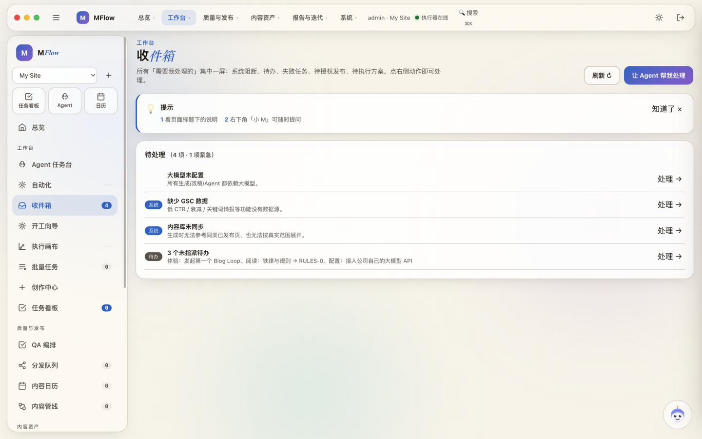

**功能**：所有"需要我处理的事"集中一屏：系统阻塞、待办、失败任务、待授权发布、待执行方案，按紧急度排序；点右侧动作直接处理，或整屏丢给 Agent 代办。
**使用**：先处理「紧急」标记项；每条「处理 →」跳转对应模块；「让 Agent 帮我处理」批量委托。

### 5. 开工向导（onboard）

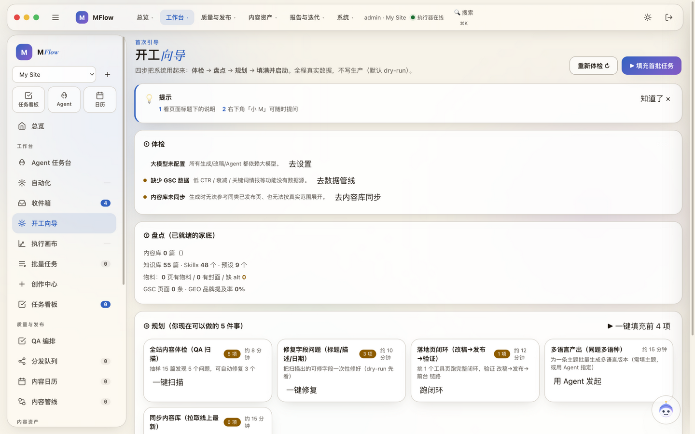

**功能**：四步把系统用起来——体检（还有什么没配）→ 盘点（知识库/Skills/物料/GEO 提及率家底）→ 规划（当前可以做的 5 件事，带项数与耗时预估）→ 填满并启动。全程真实数据，默认 dry-run。
**使用**：「重新体检」刷新状态；规划卡的「一键扫描 / 一键修复 / 跑闭环」直接发起；「一键填充前 4 项」批量建任务。

### 6. 执行画布（run）


**功能**：后台运行中的任务实时可视化：每步状态、当前动作、整体进度、失败步骤一键重试；执行可后台化，画布随刷。
**使用**：左侧选执行记录 → 画布看每一步；「查看任务」下钻条目详情；失败步骤点重试。

### 7. 批量任务（batch）

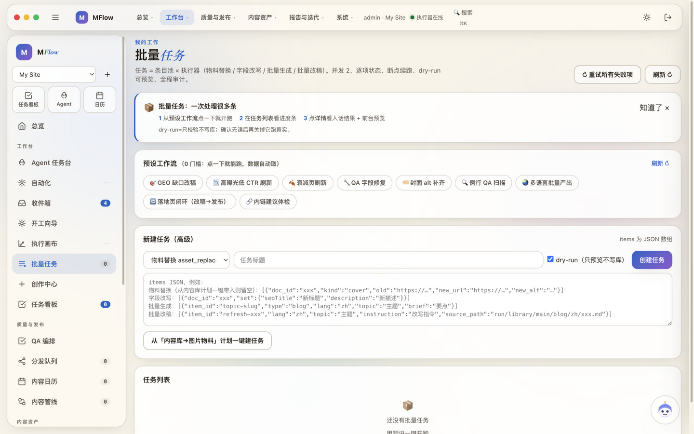

**功能**：任务 = 条目池 × 执行器（物料替换 / 字段改写 / 批量生成 / 批量改稿 / 发布上线）。8 个零门槛预设工作流（GEO 缺口改稿、高曝光低 CTR 刷新、衰减页刷新、QA 字段修复、封面 alt 补齐、例行 QA 扫描、多语言批量产出、落地页闭环），高级模式支持手写 items JSON。并发 2、逐项状态、断点续跑、dry-run 预览、全程审计。
**使用**：预设点一下就能跑（数据自动取）；「创建任务」默认 dry-run 只校验不写库；确认无误后关掉 dry-run 真跑；「重试所有失败项」一键续跑。

### 8. 创作中心（create）

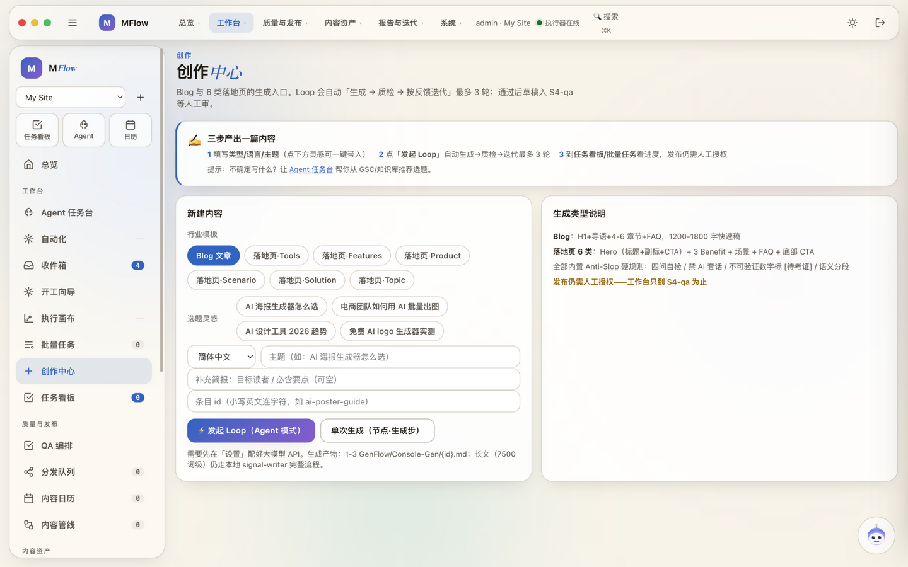

**功能**：Blog + 6 类落地页（Tools / Features / Product / Scenario / Solution / Topic）的生成入口。行业模板（广告法禁例 / SaaS 禁无出处 ROI 承诺等）、选题灵感 chips、10 语言选择；Loop 模式自动循环质检，单次生成走节点步。全部内置 Anti-Slop 硬规则：四问自检 / 禁 AI 腔 / 不可验证数字标 [待考证] / 语义分段。
**使用**：选类型 + 语言 + 主题（不确定让 Agent 从搜索数据/知识库推荐选题）→ 「发起 Loop」自动生成→质检→迭代；生成物落 `1-3 GenFlow/Console-Gen/{id}.md`，过质检后入 S4-qa 等人工审；**发布仍需人工授权**。

### 9. 任务看板（tasks）

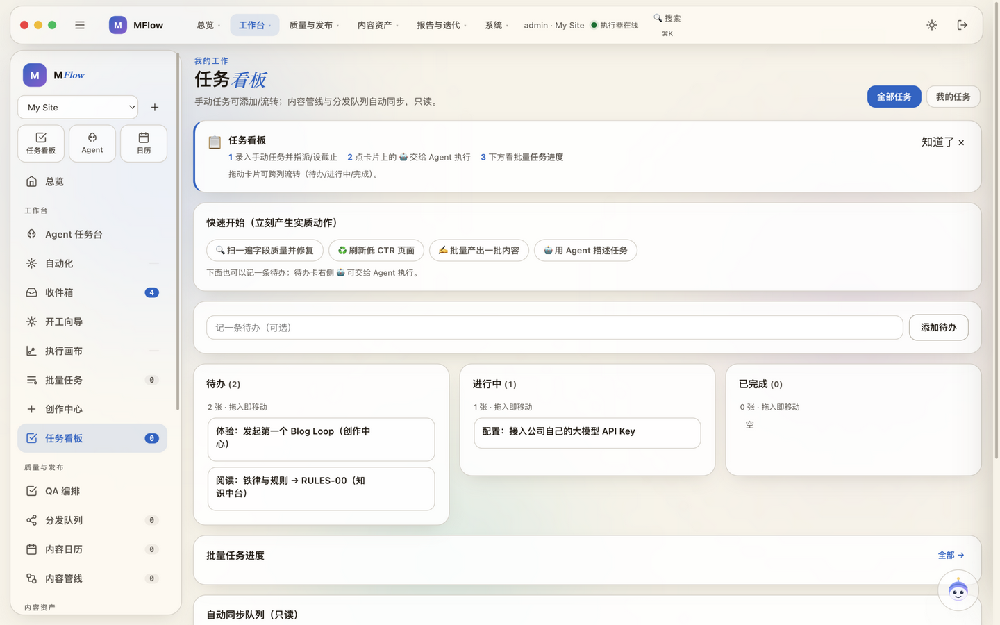

**功能**：Trello 式拖拽看板（待办 / 进行中 / 已完成），手动任务可添加/流转/设截止负责人；内容管线与分发队列自动同步只读；批量任务进度卡；卡片可直接交 Agent 执行。
**使用**：输入框记一条待办；拖卡跨列流转；卡片上的 🤖 图标交 Agent。

### 10. QA 编排（qa）

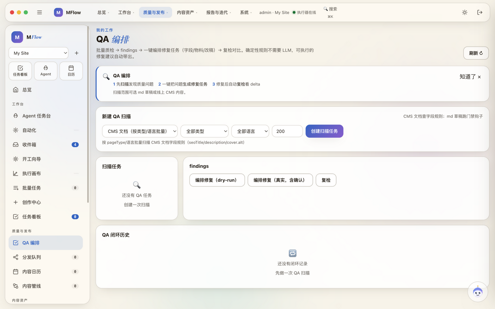

**功能**：批量质检 → findings → 一键编排修复任务（字段 / 物料 / 改稿）→ 复检对比。扫描范围：CMS 文档（按类型/语言批量，字段规则确定性检查，不需要 LLM）或本项目 md 草稿（跑门禁钩子）。
**使用**：选范围 + 条数上限 → 「创建扫描任务」→ findings 里「编排修复（dry-run）」预览 → 真实编排含确认 → 修复后「复检」看 delta。

### 11. 分发队列（dist）


**功能**：四轨道分发状态；Dispatch 单批量授权（分 组，admin 批准发布入审计日志）；外链 × 搜索控制台效果归因 Top20；内容衰减监测（发布 ≥30 天无排名无引用）；发布后 7 天复测窗口；全部外链 CSV 导出。**发布铁律：停在 ready 等人工授权，网页端只读。**
**使用**：Dispatch 单点「批准发布」才真正发出；「导出全部外链 CSV」拿去做外链台账。

### 12. 内容日历（calt）

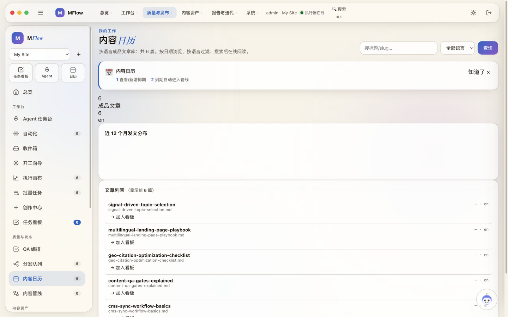

**功能**：多语言成品文章库（按日期浏览、语言过滤、搜索后在线阅读）；近 12 个月发文分布柱状图；文章一键加入看板进入管线；到期自动进管线。
**使用**：搜标题/slug；语言下拉过滤；「加入看板」把成品稿排进生产计划。

### 13. 内容管线（pipe）


**功能**：12 阶段状态机看板（QUEUE / CREATE / REVIEW / SHIP / FINAL 五大相），每个条目显示当前阶段 + 「读草稿」+ 「推进」下拉（只列合法转换，非法跳步被后端直接拒绝——这是质量保障的一部分）。
**使用**：顶部输入 id + 类别「创建条目」；推进下拉选目标阶段；「读草稿」直接预览生成物。

### 14. 内容库（lib）

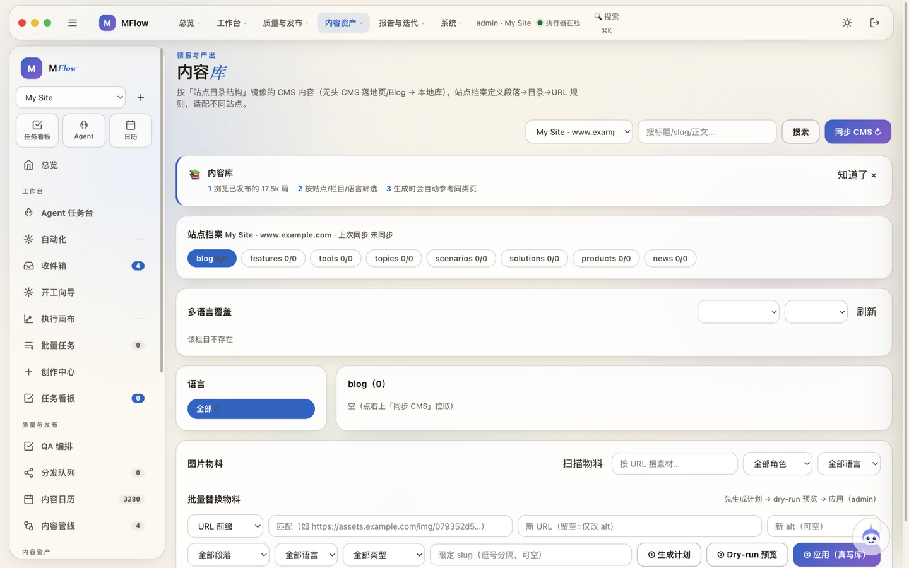

**功能**：按「站点目录结构」镜像的 CMS 内容（无头 CMS 落地页/Blog → 本地库）。站点档案定义段落→目录→URL 规则，适配不同站点；多语言覆盖盘点（哪个栏目缺哪门语言）；图片物料台账（角色 / alt / 引用）；批量替换物料（URL 前缀 / 精确 / 正则 → 生成计划 → dry-run 预览 → 应用）。
**使用**：右上「同步 CMS」拉线上最新；生成时自动参考同类已发布页；物料替换先「生成计划」再「Dry-run 预览」最后「应用（真写库）」。

### 15. 知识中台（kb）


**功能**：10 大知识源 · 数百份文档——产品知识 / 铁律约束 / 故事线 / 方法论 / 策略 / 关键词 / 规范 / 案例。写内容前都该查；支持语义检索（配置 embedding 后向量召回，未配置用本地词法兜底）。
**使用**：搜关键词或自然语言；生成/Agent 会自动按域内检索引用；「重建索引」在知识文件变更后执行。

### 16. 模板市场（mkt）

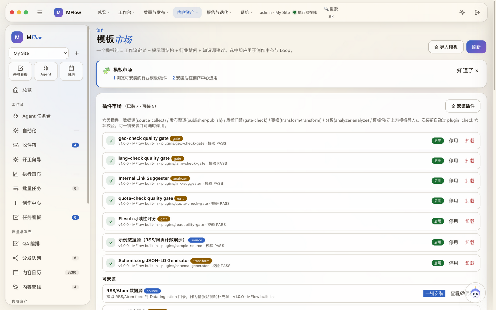

**功能**：模板包 = 工作流定义 + 提示词结构 + 行业禁例 + 知识源建议，选中即应用于创作中心与 Loop；插件市场：数据源 / 发布渠道 / 质检门禁 / 变换 / 分析 / 模板包六类插件，安装前自动过 plugin_check 六项校验，可随时停用/卸载。
**使用**：右上「导入模板」装 JSON 模板包；「安装插件」一键装内置插件（geo-check / lang-check / 内链建议 / Flesch 可读性 / Schema.org 生成器 / RSS 数据源）。

### 17. 数据管线 Trident（trident）

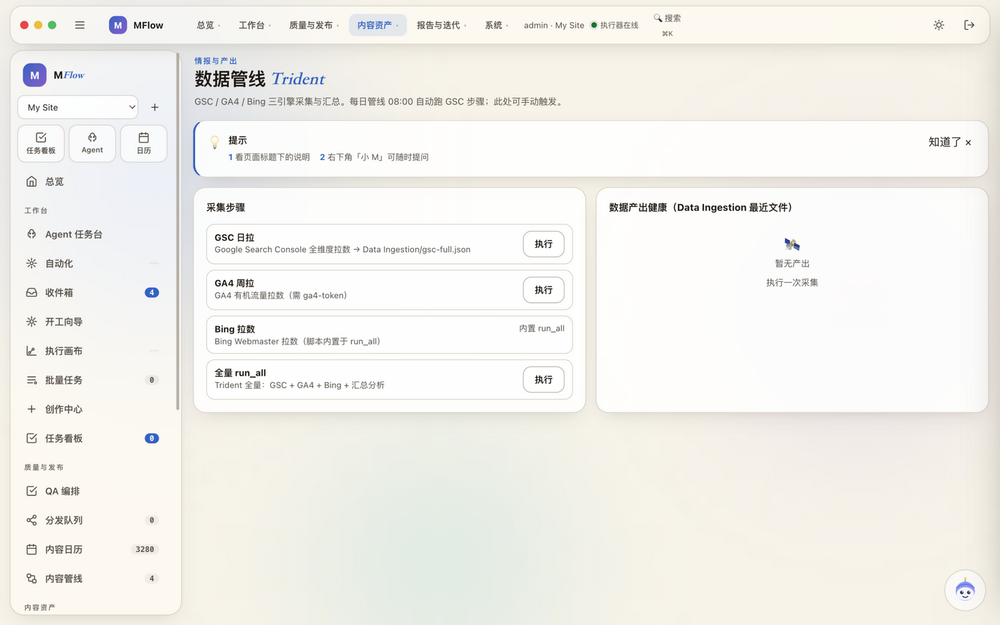

**功能**：GSC / GA4 / Bing 三引擎采集与汇总——GSC 日拉（全维度拉数入 Data Ingestion）、GA4 周拉（有机流量）、Bing 拉数、全量 run_all（三源 + 汇总分析）；数据产出健康面板（最近文件新鲜度）。每日管线 08:00 自动跑 GSC 步骤，此处可手动触发。
**使用**：配好凭证后按「执行」；关键词情报六源（真实查询 / 舆情 / 竞品词缺口 / SERP 文案分析 / 用户行为 / 落地页转化）驱动选题。

### 18. 报告中心（reports）

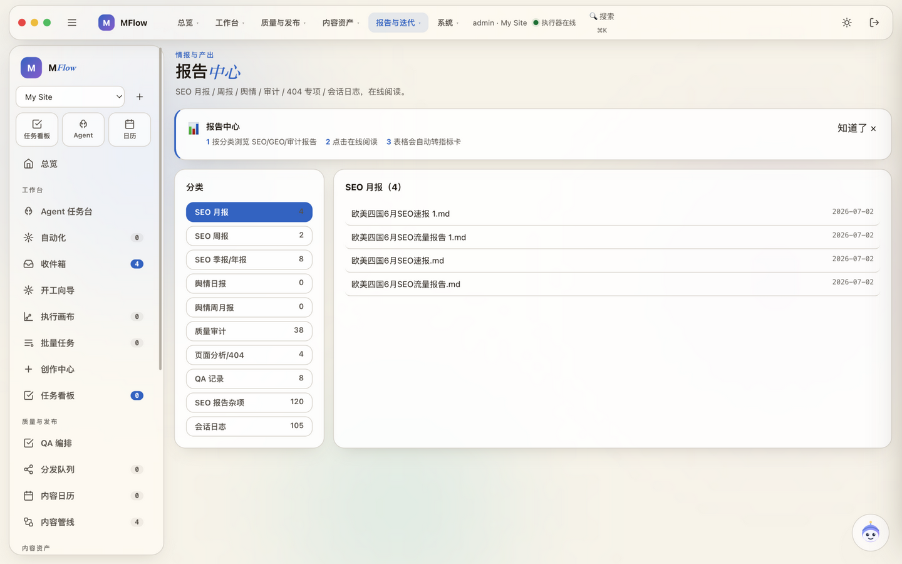

**功能**：SEO 月报/周报/季报、舆情日报/周报、质量审计、页面分析/404、QA 记录、会话日志——分类浏览、在线阅读，表格自动转指标卡。
**使用**：左侧分类 → 点文件在线读；周报月报强制环比与日均值口径。

### 19. 报告仪表（rdash）


**功能**：把 Markdown 报告渲染成结构化仪表：数值表自动变指标卡与比例条，支持双报告并排对比、打印/PDF、原文阅读切换。月报 / 舆情 / 404 全适用。
**使用**：选分类 → 选报告 →（可选选对比报告）→ 「渲染仪表」。

### 20. 自我迭代仪表（iter）

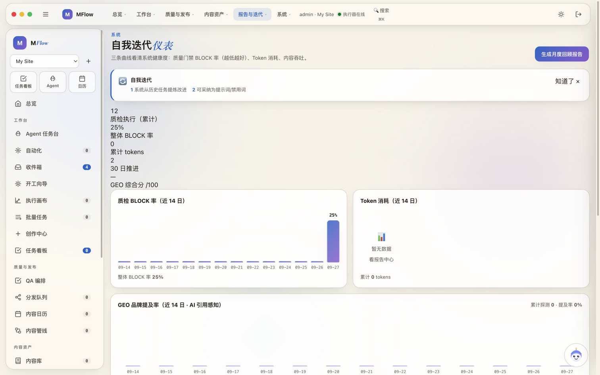

**功能**：三条曲线看清系统健康度——质检 BLOCK 率（近 14 日，越低越好）、Token 消耗、内容吞吐（状态机推进）；GEO 品牌提及率（AI 引用感知，实心柱 = 品牌被 AI 提及的探测次数）；最近质检记录明细可采纳为提示词/禁用词。一键生成月度回顾报告入报告中心。
**使用**：看 BLOCK 率趋势决定是否收紧门禁；质检记录「采纳」变成新禁例——系统从自己的错误里学习。

### 21. 工作流地图（wfmap）

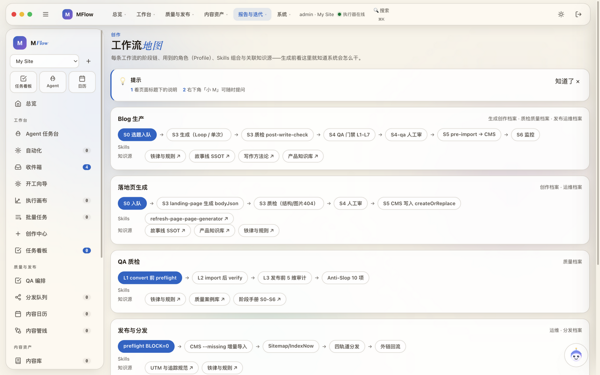

**功能**：六条工作流（Blog 生产 / 落地页生成 / QA 质检 / 发布与分发 / 数据采集 / 每日管线）的阶段链、所用角色档案、Skills 组合与关联知识源全景图——生成前看这里就知道系统会怎么干。
**使用**：只读参考图；点知识源 chip 可跳知识中台。

### 22. 节点流水线（flow）

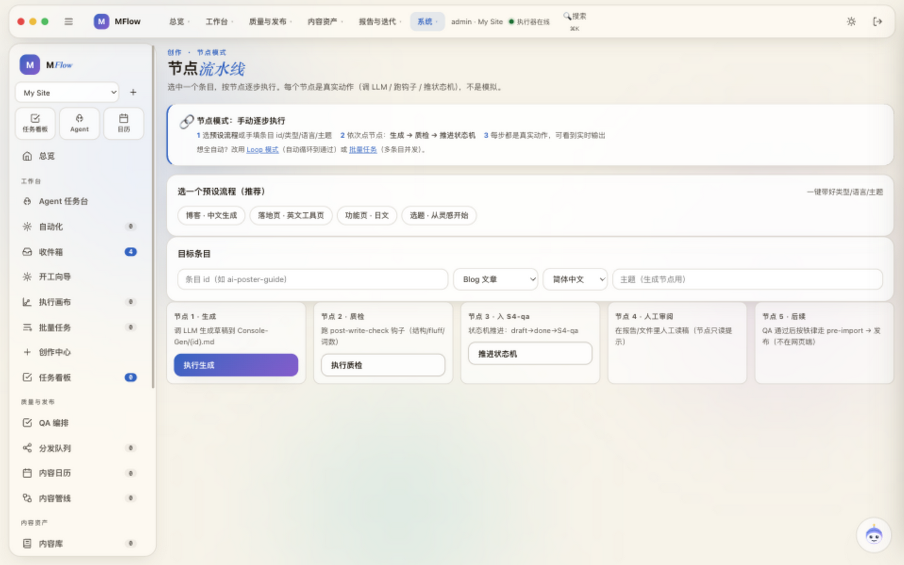

**功能**：Flow 模式（手动挡）。选预设流程（博客中文生成 / 落地页英文工具页 / 功能页日文 / 选题-从灵感开始）或手填条目，按五个节点逐步执行：生成 → 质检 → 入 S4-qa → 人工审阅 → 后续。每步都是真实动作（调 LLM / 跑钩子 / 推状态机），可看到实时输出。
**使用**：点预设一键带出类型/语言/主题 → 逐节点点执行；想全自动请用 Loop 模式或批量任务。

### 23. Loop 管理（loops）


**功能**：Loop 模式（自动挡）。目标驱动的自主循环：生成 → 质量门禁 → 带反馈重写，通过即止，最多 3 轮；失败熔断保护，不烧额度；每个 Loop 记录 token 与轮次日志；统一创建、监控、停止。
**使用**：快速开始 chips 一键发起；列表看状态（queued / running / passed / blocked）；点「日志」看每轮反馈与门禁结果；「发起新 Loop」自定义主题与简报。

### 24. 路由 · 门禁（eng）

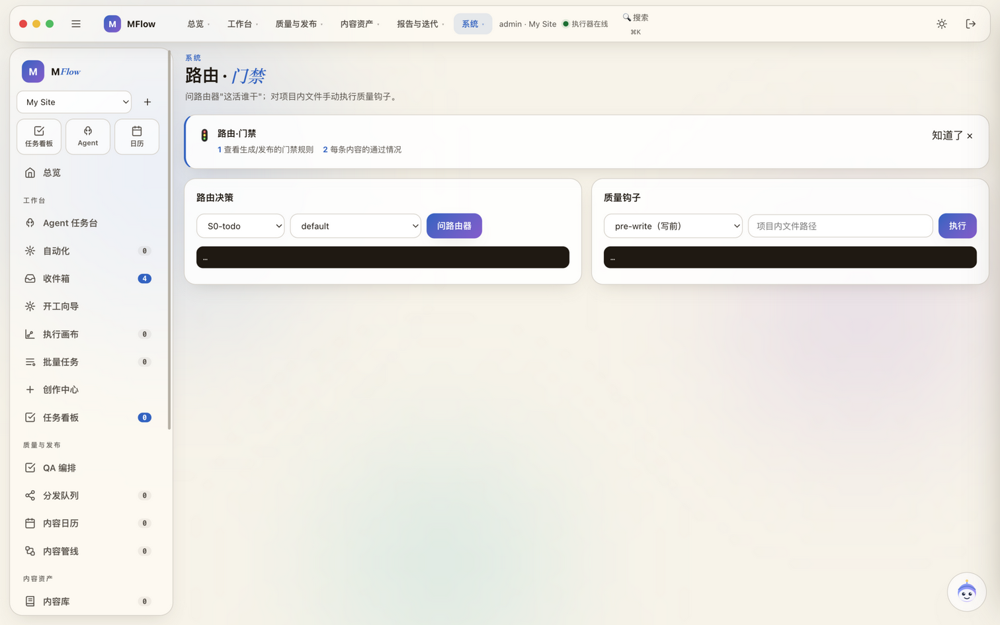

**功能**：问路由器"这活谁干"——选阶段与场景，决策矩阵返回负责角色档案、应加载 Skills 与规则文件；对项目内文件手动执行质量钩子（pre-write / post-write / pre-import），看通过/阻塞明细。
**使用**：选 `S3 + blog` 问路由器；填文件路径选钩子「执行」，输出 JSON 判定。

### 25. 支付 · 发卡（pay）

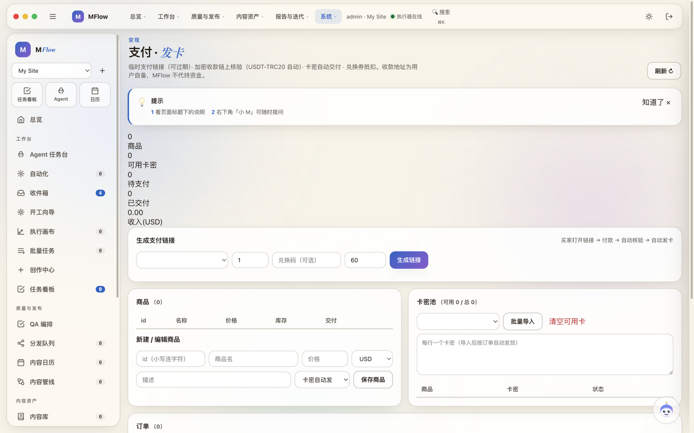

**功能**：变现闭环——临时支付链接（可过期）、加密收款链上校验（USDT-TRC20 自动）、卡密自动交付、兑换券抵扣；商品管理（价格 / 库存 / 交付方式）、卡密池批量导入、订单记录。收款地址为用户自备，MFlow 不代持资金。
**使用**：建商品 → 批量导入卡密 → 生成支付链接发买家 → 付款上链校验通过后卡密自动发出。

### 26. 调度与日志（sys）

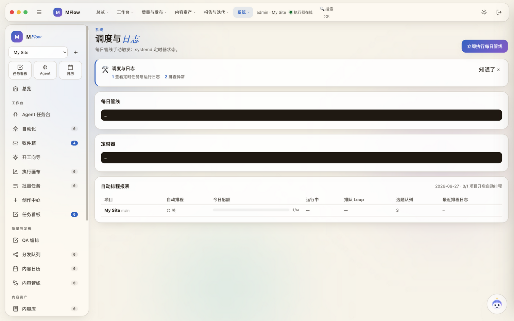

**功能**：每日管线手动触发 + 定时器（systemd timer / launchd）状态查看；自动排程报表（每项目配额、运行中、排队 Loop、选题队列、最近排程日志）。
**使用**：「立即执行每日管线」手动补跑；自动排程在设置页按项目开启。

### 27. 变更审计（audit）

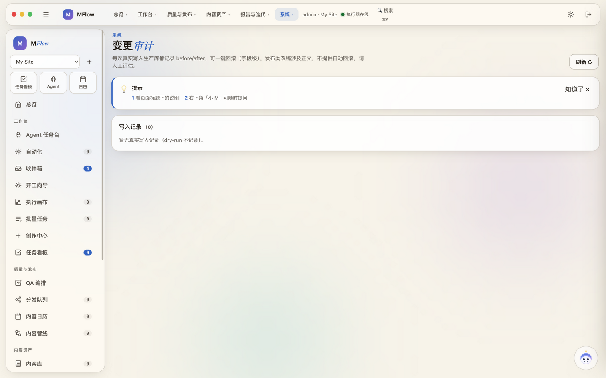

**功能**：每次真实写入生产库都记录 before/after，可一键回滚（字段级）；发布类改稿涉及正文，不提供自动回滚，请人工评估。
**使用**：写入记录列表按时间排查；字段级误改点「回滚」恢复。

### 28. 记忆审阅（mem）

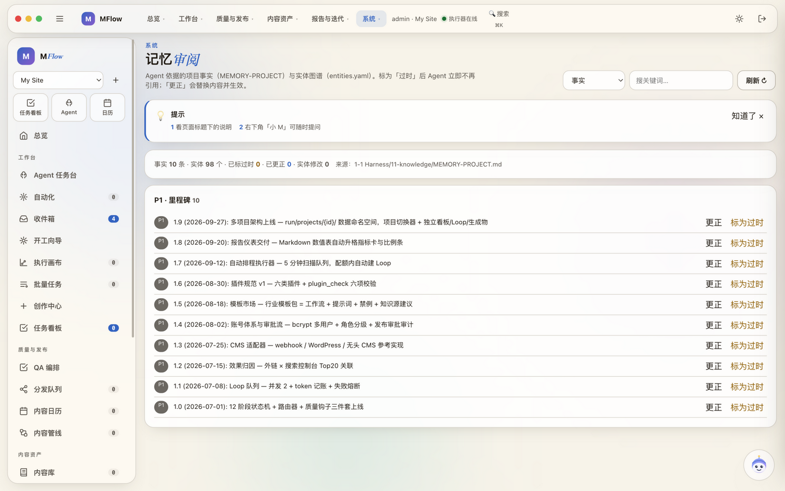

**功能**：Agent 依据的项目事实（MEMORY-PROJECT）与实体图谱（entities.yaml）审阅界面：按优先级浏览、搜索、更正、标为过时——标为「过时」后 Agent 立即不再引用，「更正」会替换内容并生效。
**使用**：发现 Agent 引用了错误事实 → 搜到该条 → 「更正」写新内容；过期里程碑「标为过时」。

### 29. 设置（set）

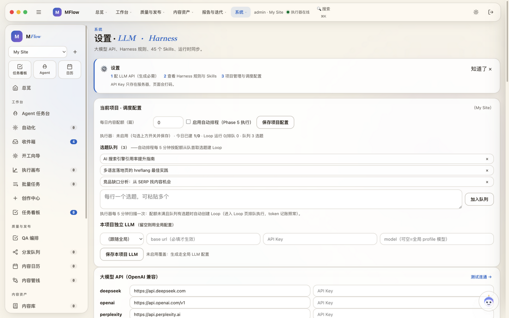

**功能**：大模型 API（任意 OpenAI 兼容端点：DeepSeek / OpenAI / Perplexity / 自建，Key 只存在服务器端页面不回显）、项目调度配置（每日内容配额 + 自动排程执行器 + 选题队列管理 + 项目独立 LLM）、Harness 规则与 Skills 清单、运行时同步、账号管理（多用户角色分配）、通知（飞书/Server酱/webhook）、出站 Webhook（任务/执行/自动化/回滚事件推送，可选 HMAC 签名）。
**使用**：先配 LLM（测试连通）→ 按项目设配额与选题队列 → 需要事件外呼时配 Webhook 并用「测试」验证。

### 30. Token 用量与成本（usage）

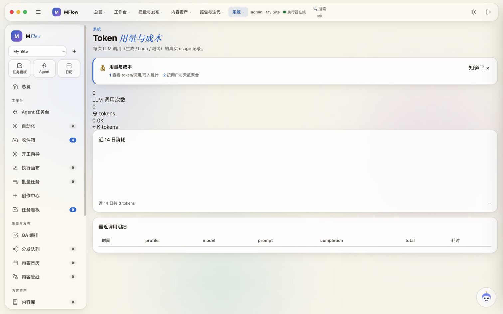

**功能**：每次 LLM 调用（生成 / Loop / 测试）的真实 usage 记录：按用户与天聚合、近 14 日消耗柱状图、最近调用明细（profile / model / prompt / completion / 耗时）。
**使用**：按 profile 看哪个工作线烧 token；月度成本 = 明细导出 × 单价。

### 31. 首次引导 · Setup（setup）

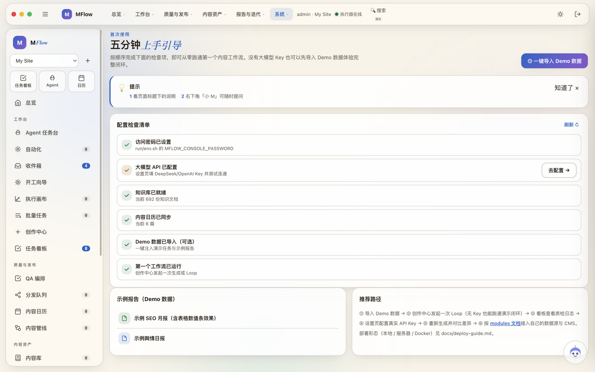

**功能**：五分钟上手清单——访问密码 / 大模型 API / 知识库 / 内容日历 / Demo 数据导入 / 第一个工作流，逐项点亮；示例报告与推荐路径。
**使用**：按清单从上往下点亮；「一键导入 Demo 数据」无 API Key 也能先体验完整闭环。
