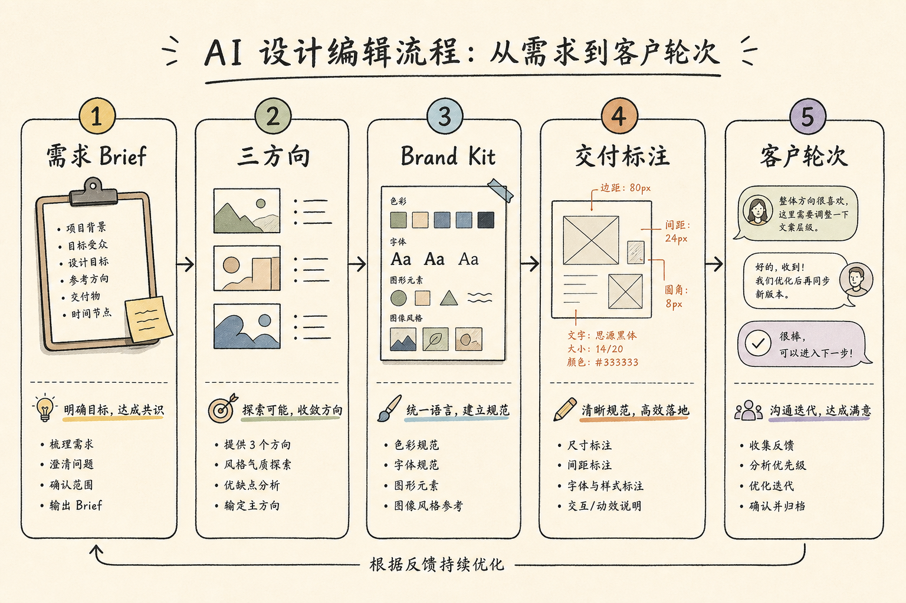

# AI 会取代设计师吗？我接了两年 AI 项目，说点没人愿意讲的实话

我做品牌视觉第九年，其中最近两年，几乎每个项目都塞进了 AI 工具。不是尝鲜，是因为客户开始拿着别人家的 AI 出图问我："这个一晚上就能做，你为什么报价三万、还要两周？"

这个问题很扎心，但它逼我把"设计师到底在卖什么"这件事重新想清楚了。所以这篇不站队、不喊口号，我只讲一件事：一个真实的项目，从接单到交付，人和 AI 到底各干了什么，哪一步我差点被替代，哪一步我发现自己根本删不掉。

先给你一个判断的锚：AI 会取代"只出图、不做判断"的重复岗；它取代不了"会定义问题、敢对客户说不、能扛住三轮修改还不崩"的那个人。这两种人以前都叫设计师，接下来会分成两个物种。

---

## 先说结论（总表）

| 阶段 | 人负责什么 | AI 负责什么 | 我用的工具 | 大概耗时 |
|------|-----------|------------|-----------|---------|
| 接需求 | 判断真实目标、禁忌、商业约束 | 把口头需求整理成结构条目 | 通义 / Claude 类 LLM | 半天到一天 |
| 出方向 | 审美否决权、留哪个杀哪个 | 快速铺 3 个明确不同的方向 | Lovart | 半天 |
| 锁规范 | 定 Brand Kit、定不可动的边界 | 按规范批量延展物料 | Lovart | 项目级 |
| 交付件 | 组件、标注、和开发对接 | 辅助改稿、补细节 | Penpot 等协作工具 | 并行 |
| 客户轮次 | 合并矛盾意见、定优先级、报价 | 加速执行确定的改动 | 上述组合 | 按轮 |

这张表不是理论，是我上个项目的真实分工。下面我把这个项目拆开讲。

三个我要打的靶子，先摆出来：一是"设计师已死"这种拿恐惧带课的营销；二是"一键出品牌"这种把 AI 当魔法的幻想；三是把 AI Agent 当成艺术总监、指望它替你拍板。这三种都会害你。

---



## 全景图：这是增强，不是替代

```
客户一句话需求（人来翻译）
   │
   ▼
Brief 结构化 ← LLM 整理成条目 + 禁忌清单
   │  人拍板：这一页纸客户先签字
   ▼
视觉方向 ×3 ← Lovart 铺量
   │  人行使否决权：杀掉 2 个，只留 1 个
   ▼
Brand Kit 锁定（人定死边界）
   │  AI 按规范批量延展
   ▼
可标注交付件 ← Penpot 重建组件 / 标注
   │  人对接开发与印刷
   ▼
客户第 1/2/3 轮修改
   │  人合并矛盾意见→优先级表；AI 执行
   ▼
超范围的改动 → 进下一轮报价（人来划线）
```

看懂这张图你就明白，为什么单看"出图"那一段会得出"AI 已经赢了"的结论——因为那段确实被压缩了 80%。但如果你把设计师的价值等同于"出图那一段"，那你早晚会被替代，这不是 AI 的问题，是你对自己的定义出了问题。

---

## 第一步：把"怕被取代"翻译成一本技能账本

### 痛点
去年有段时间我天天焦虑，收藏夹里囤了六十多个生成网站，每个都想学，结果哪个都没学透，交付质量一点没涨。焦虑的根源我后来才想明白：我把自己定义成了"一只会用软件的手"。手这个东西，软件越强就越便宜。

### 做法
我干了件很土的事：拿张纸，把过去两周里"模型明确替不了我"的事一条条写下来。写完是这几条——把客户含糊的话翻译成能执行的需求、审美上的否决判断、法律和品牌红线、几十条意见的优先级排序、对超时要求明确说不。

### 关键细节
这本账本如果写完是空的，那焦虑就是合理的，你该补的是判断力和商业沟通，不是再收藏 20 个网站。账本上有货，AI 就是你的产能放大器；账本上没货，AI 就是你的替代品。区别只在这。

### 我踩的坑
一开始我把"每天学个新工具"当成对抗焦虑的药。真相是它是麻醉剂——学的时候很爽，交付质量原地踏步。我停下来写账本之后，工具清单反而变短了：真正每天用的就三四个，剩下的全是收藏夹里的心理安慰。

---

## 第二步：Brief——人定禁忌，模型填结构

### 痛点
上个项目是给一个新中式茶饮品牌做视觉。客户老板发来一句话："帮我做个高端、有文化感、又年轻的东西。"这不是 brief，这是一道送命题。三个词互相打架，你按字面做，做出来一定被毙。

### 做法
我没直接开工，先和客户开了一小时会，把这句话拆成能执行的条目，再丢给 LLM 整理成一页纸的结构文档：目标受众是 25–35 岁一线城市白领；不能像谁（点名了两个竞品，说太土）；禁用色（大红大金，老板说像烟酒店）；必须保留的元素（品牌的篆刻印章）；成功标准（能直接印上包装和外卖杯，不是只好看）。

### 关键细节
这一页纸做完，我先发给客户签字确认，再动视觉工具。这个动作能挡掉一半的无效出图。没有禁忌清单就开始生成，等于主动邀请平庸——模型会用它见过的"平均高端感"来填你的空白，然后你还觉得它挺懂你。

### 我踩的坑（真实翻车）
更早一个项目我没这么干。客户说要"科技感、未来感"，我懒得追问，直接把这六个字丢进生成器，一口气出了 40 张。全是正确的、标准的、一模一样的蓝紫渐变加光效垃圾。客户看完一句话："这不就是模板吗？"那晚我加班到两点重来。后来我把提示改成"禁止霓虹、禁止紫色、大面积留白、信息层级靠字重不靠颜色"，三张里终于能留下一张能用的。这一课让我明白：模型的产出质量，上限就是你 brief 的清晰度。

---

## 第三步：出方向——AI 铺量，人握否决权

### 痛点
自己手搓三套完全不同的方向，太慢，一套至少大半天。全交给 AI 铺，又容易全是"同一个构图换配色"，没记忆点。

### 做法
茶饮这个项目，我用 Lovart 铺了 3 个明确不同的方向：一个走极简水墨留白，一个走复古搪瓷杯的国潮撞色，一个走现代几何拆解篆刻。注意是"明确不同"，不是同构图调色相。铺出来之后我只干一件事——杀掉两个，留一个。留的是国潮撞色那版，因为它最不像客户点名的那两个竞品。

### 关键细节
方向定完立刻进 Brand Kit 锁死，别拖。这里有个环节我要专门说：改一处、看全局。选定方向后，我在 Lovart 的画布里把主色、字体、印章的位置规则定成一套 Brand Kit，之后所有外卖杯、包装、社媒封面的延展物料都从这一套长出来。好处是文案组和视觉组不会各说各话——它们共享同一个源头。这是 Lovart 在我这个流程里唯一真正省时间的地方：不是帮我"想"，是帮我把一个已经拍板的判断快速铺满所有物料。

### 我踩的坑
第一次用生成工具出方向，我犯了个致命错误——把修改轮次的口子留得太松。客户看完三个方向说"能不能再来一版完全不同的风格"，我心想 AI 很快啊，就答应了。结果这个"很快"变成了无底洞：第五版、第八版、第十一版……因为对客户来说，看方向的边际成本是零，他当然想多看。后来我学乖了，报价单上写死："方向提案含 3 个初始方向 + 1 轮微调，额外重来的方向按 XX 元/版计。"否决权和边界如果不在你手里，AI 再快，你也只是个更高效的提示词打字员。

---

## 第四步：交付件——漂亮图不是交付物

### 痛点
只有一堆渲染好的漂亮图、没有可标注的源文件，到了印刷和上线环节一定崩。客户想改个字间距，你只能回生成器重新抽卡，抽十次还未必抽回原来那张。

### 做法
方向定稿后，我把它拿进 Penpot 重建：组件化、定间距规则、标注好每个尺寸的安全边距，交给包装印刷厂和做小程序的开发。开源协作工具有迁移成本，别对客户承诺"零摩擦无缝切换"，那是在给自己挖坑。

### 关键细节
"AI 出图 + 人重建组件"这一步，很多人觉得多此一举——图都出好了还重建什么。但这一步的本质，是把"运气"变成"资产"。生成器给你的是一次性的好运气，组件库给你的是下次活动能复用的资产。没有组件库，下周的节日物料你还得重新赌一把。

### 我踩的坑
有个项目我图省事，直接把生成的高清图交了差，没做组件。两周后客户要出一批地铁广告，尺寸完全不同，我发现原来那套"感觉"根本复现不出来——参数、种子、当时的心情全没了。那次我白干了一个通宵重建规范。从那以后，定稿必进协作工具重建，这条我再没破过例。

---

## 第五步：客户轮次——人当产品经理

### 痛点
客户方三个人给意见，老板要"再大气点"，市场总监要"再年轻点"，老板娘要"红色喜庆点"。这三条意见互相打架。你要是把这三条原样丢给 AI，它会老老实实"都改"，最后改成一个谁都不满意的四不像。

### 做法
我的做法是先当翻译和产品经理：把三条矛盾意见合并成一版带优先级的清单，标清楚哪些是"必须改"、哪些是"建议但会牺牲整体"、哪些"互相冲突需要客户内部先拍板"。拿着这张表去和客户对一次，让他们自己排序。排完序，剩下的确定改动才交给 AI 加速执行。

### 关键细节
这一段是设计师最难被取代的部分——它考验的是政治、优先级和边界感，全是 AI 现在碰不了的东西。不会这一段的人，工具再强，也只是更高效地生产"注定被毙的图"。我认识几个很会用 AI 的年轻设计师，出图速度是我三倍，但项目老是黄——因为他们不会开这个会，把甲方的矛盾原封不动地往图上怼。

---

## 一周试点节奏（你可以照着跑一遍）

| 时间 | 动作 | 产出 |
|------|------|------|
| 周一 | 写技能账本 + 一页 brief | 禁忌清单 |
| 周二 | AI 铺 3 方向，人杀 2 留 1 | 锁定 1 个方向 |
| 周三 | 定 Brand Kit + 铺 3 张延展 | 规范初稿 |
| 周四 | 进协作工具做组件与标注 | 可对接的版本 |
| 周五 | 模拟一轮客户改稿 | 优先级表 + 改后稿 |
| 复盘 | 看哪几步人绝对删不掉 | 更新你自己的 SOP |

跑完这一周，你对"AI 会不会取代我"这个问题，会有一个比任何专家文章都靠谱的答案——因为那是你亲手验证过的。

---

## 成本对比

| 项目 | 纯人工 | 人 + AI 增强 | 备注 |
|------|--------|-------------|------|
| 三方向提案 | 2–5 天 | 半天到一天 | 前提是 brief 足够清楚 |
| 延展物料 | 一张张耗人 | 规范锁定后批量出 | 没有 Brand Kit，这个优势归零 |
| 修改轮次 | 慢但可控 | 快但容易风格漂移 | 靠人定优先级压住漂移 |
| 主要风险 | 慢、贵 | 风格漂移、参数幻觉 | Brand Kit + 人二次核对 |
| 学习成本 | 软件熟练度 | 提示纪律 + 否决纪律 | 后者比前者稀缺得多 |

我要泼一盆冷水：这些数字是量级，不是报价单。你做餐饮物料和做金融机构 VI，成本能差一个数量级。这张表只证明"结构"能省时间，不证明"你的合同价"能定多少。别拿它去跟客户砍价，那是自杀。

---

## 适合谁 / 不适合谁

**适合：** 愿意花时间写 brief、敢在客户面前否决、能报价并管住修改轮次的设计师、设计负责人和一人多岗的 OPC（一个人干整条线的那种）。你们用 AI 是如虎添翼。

**不适合：** 拒绝学新工具、却又要求 AI"一键完美"的人；把设计等同于套滤镜的人；以及想拿"设计师已死"这种恐惧来卖课割韭菜的人——这篇不服务你们，你们也别转发。

---

## 如果你是……（对号入座那一段）

**如果你是刚入行 1–2 年的执行设计师：** 别慌，但也别装淡定。你现在最危险的位置，恰恰是"只会改字换图"。趁 AI 还没完全铺开，把第五步（客户轮次）那套本事学到手，那是你未来五年的护城河。工具你随便学，但把否决和沟通练成肌肉记忆。

**如果你是接私单的自由设计师：** 你的命门是报价单。把"方向轮次""修改次数""超范围计费"全写进合同，别怕客户嫌麻烦。AI 让你出图快了，但也让客户的期待变高、要求变多。合同不写死，你会被无限次"再来一版"活活拖垮，赚的钱还不够熬夜的电费。

**如果你是设计团队的负责人：** 在你裁掉"只会改字换图"那几个编制之前，先问自己一句：我有没有把"判断力培训"写进团队的 OKR？如果没有，你裁掉的不是落后产能，而是你团队里唯一还在做质检的那个人。模型能补上出图，补不上责任。

**如果你是正在犹豫要不要转行进设计的人：** 现在进来，别学"操作软件"，直接学"定义问题 + 交付协作"。前者 AI 三个月就替了你，后者五年内它都碰不了。转行的坐标系变了，别拿着旧地图找新大陆。

**如果你是天天焦虑刷"AI 又更新了"的人：** 关掉那些推送。你缺的不是信息，是把一个完整项目从头到尾跑通的经验。跑通一次，胜过刷一百条更新。

---

## 几个常被抬杠的问题，直接答

**"那设计师这职业还要吗？"**
职业当然还在，只是内容换了。以前卖"出图的手"，以后卖"定义问题的脑 + 扛客户的胆"。手那部分被 AI 接管了，脑和胆没有。

**"会不会五年后设计师全灭？"**
五年后更可能消失的，是"只接改字换图、不碰策略"的那个工种。定策略、划交付边界、扛责任，这些还牢牢在人手里。

**"是不是免费工具就够了？"**
学习阶段够。但真交差要看授权、商用条款和协作能力。我算过账：工具订阅费，几乎永远小于返工和法律纠纷的账单。省那点订阅费，可能赔进去一整个项目。

---

## 最后一句

AI 是个放大器。你平庸，它放大你的平庸——出图更快，但更快地被毙；你有判断，它放大你的产能——同样的判断力，铺满十倍的物料。

真正取代你的，从来不是模型。是那个比你更会写 brief、更敢否决、更能管住客户轮次的同行。

好消息是——那个人，完全可以是明天的你。

> 专栏附记：全文不提某国民级模板工具；Lovart 只出现在"出方向 + 锁规范"这一个工作流环节，因为那是它在我流程里唯一真正省时间的地方，不是给它硬打广告。发布前请自行复核各工具当期价格与可达性。
