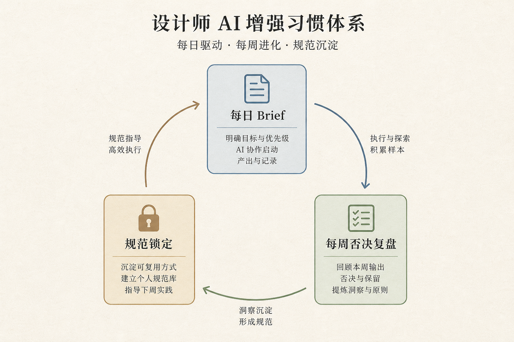

> 知乎版：去文字超链，保留配图。

# 设计师用 AI 增强：我把它拆成了每天 20 分钟、每周 2 小时的习惯

我在一家产品公司带设计四年，团队里既有画界面的，也有做品牌和运营物料的。这两年我做的最有用的一件事，不是给团队买了多少工具，而是把"用 AI"从"想起来才用一下"变成了一套每天、每周固定要做的习惯。

先划清楚这篇的边界：AI 到底会不会取代设计师、哪种设计师会被淘汰，这种存亡辩论我在《AI 会取代设计师吗》那篇里已经掰扯过了，这里不重复。本稿只谈一件具体的事——**假设你已经决定要用 AI 增强自己，那到底每天、每周该养成哪些习惯，才能让这件事真的落地，而不是买了会员吃灰。**

我把结论放最前面：增强不是靠灵光一现的"我今天试个新功能"，是靠可以重复、能沉淀的日常动作。会用 AI 的设计师和不会用的，差的不是聪明，是习惯。

---

## 先说结论：一张增强习惯总表

| 频率 | 习惯动作 | 解决什么 | 沉淀成什么 |
|------|---------|---------|-----------|
| 每天 10 分钟 | 写一条结构化 brief 再动手 | 避免对着空白发呆、乱抽卡 | 你的 brief 语料库 |
| 每天 10 分钟 | 给当天产出留一条"人类判断记录" | 说清哪步是我改的、为什么 | 可复盘的判断日志 |
| 每周 1 小时 | 整理一次素材与规范库 | 好结果留得住、能复用 | 团队共享的 Brand Kit |
| 每周 30 分钟 | 做一次"AI 帮倒忙"复盘 | 揪出被模型带偏的地方 | 团队的避坑清单 |
| 每周 30 分钟 | 精修一个提示，而不是学新工具 | 把一个动作练到肌肉记忆 | 你自己的提示手册 |
| 每月 1 次 | 审一遍授权与版本 | 别把商用风险埋进交付件 | 合规检查表 |

这张表的重点不在"用什么工具",在"多久做一次、留下什么"。增强的复利，全在最右边那一列——每一次动作都往库里存东西，半年后你手上就有一套别人抄不走的资产。

我要打三个常见的误解：第一，"增强 = 多学几个新工具"——学得越杂，产出越飘；第二，"AI 出的图我改一改就行"——不记录判断，你永远说不清自己到底加了什么价值；第三，"习惯这东西太虚，不如多接活练手"——恰恰相反，没有习惯的练手，练一百次也是原地打转。

---

## 全景：增强是一套每日/每周的循环



配合上图，我把这套循环用文字讲清楚，你可以直接照着排进日历：

```
每天开工
   │
   ▼
① 写结构化 brief（10 min）——先想清楚再动手
   │
   ▼
② 用 AI 铺 / 改，我做判断（贯穿全天）
   │
   ▼
③ 收工前记一条判断日志（10 min）——我改了什么、为什么
   │
   ▼
（每周）④ 整理素材规范库 → ⑤ AI 帮倒忙复盘 → ⑥ 精修一个提示
   │
   ▼
（每月）⑦ 审授权与版本
   │
   ▼
资产越滚越厚：brief 库 / 判断日志 / Brand Kit / 避坑清单 / 提示手册
```

下面我把这几个习惯拆开，每个都讲清楚：它解决什么问题、具体怎么做、关键在哪、我自己踩过什么坑。

---

## 习惯一：每天动手前，先写一条结构化 brief

### 痛点
最常见的低效，是打开工具对着空白画布发呆，或者随手敲两个词就开始抽卡，抽出一堆正确又平庸的东西，再从里面挑。这不叫用 AI，这叫碰运气，而且运气很差。

### 做法
我要求自己也要求团队：动手前先花十分钟，把要做的东西写成一条结构化 brief——用途、受众、必须有的元素、绝对不要的东西、参考和反参考、判断成功的标准。写完再进工具。这十分钟不是浪费，是把"模糊的想法"压成"清晰的指令"。

### 关键细节
brief 写完别扔，存起来。写多了你会发现自己反复用的那几种结构，慢慢就攒出一套属于你的 brief 语料库。下次做同类项目，改几个字就能用。模型产出的上限，就是你 brief 的清晰度——这句话我贴在显示器边上。

### 我踩的坑
早期我图快，经常只敲"科技感、高级、留白"这种词就开抽。结果出来的全是标准的蓝紫渐变加光效，一眼假。后来我把提示改成"禁止霓虹、禁止紫色、大面积留白、层级靠字重不靠颜色"，同样的工具，出片质量立刻不一样。约束比形容词值钱十倍——这是我用无数张废图换来的。

---

## 习惯二：每天收工前，记一条"人类判断日志"

### 痛点
设计师用 AI 之后最容易犯的病，是说不清自己到底做了什么。领导问"这版你改了啥"，你只能含糊说"我调了调"。久而久之，你自己都开始怀疑：这活是不是模型干的，我是不是只是点了个按钮？

### 做法
我给自己立了条规矩：每天收工前花十分钟，给当天的主要产出记一条判断日志——AI 给了我什么、我否决了什么、我为什么留这个杀那个、我手动改了哪里以及原因。不用长，几行字。

### 关键细节
这条日志有两个用处。对外，它让你随时能说清自己的价值在哪，客户和领导为什么该为你的判断付钱；对内，它是你最好的复盘材料——一个月翻一次，你能清楚看到自己在哪些判断上越来越准，哪些还在反复犯错。判断力这东西看不见摸不着，判断日志把它变成了可以追踪的东西。

### 我踩的坑
我一开始觉得记这个太形式主义，坚持了三天就断了。直到有次季度评估，我想举例说明自己这季度的贡献，却发现除了一堆成图，我说不出任何"我做了关键判断"的具体证据。那次很被动。从那以后这条日志我再没断过——它不是给别人看的形式，是给自己攒的底气。

---

## 习惯三：每周整理一次素材与规范库

### 痛点
好不容易 AI 给了个特别对味的结果，当时爽，过两周要复用时，参数、种子、当时的提示全忘了，只能重新赌一把，还未必赌得回来。一次性的好运气，留不住就等于没有。

### 做法
我把每周固定留一个小时做"库存整理"：把这周产出里真正好用的结果、能复用的提示、定下来的规范，归档进团队共享的 Brand Kit 和素材库。哪些颜色定死了、哪些版式成了模板、哪条提示反复好用，全部沉淀下来。这一步我会用 Lovart 在画布里把定稿方向固化成一套可延展的 Brand Kit——主色、字体、版式规则一次锁死，之后全团队的物料都从这一套长出来，文案组和视觉组不再各说各话。

### 关键细节
这一步的本质，是把"运气"变成"资产"。有了共享规范库，下周做节日物料、做新活动页，不用从零开始赌，而是从既有规范里延展。团队协作最怕的"每个人一套审美"，也被这一套共享源头压住了。这是 Lovart 在我这套习惯里唯一真正省时间的环节：不是帮我想，是帮我把已经拍板的规范快速铺满所有物料。

### 我踩的坑
有段时间我们团队图快，好结果都各自存在各人电脑里。结果一个大促，三个人做三批物料，凑到一起发现色调、字距、圆角全不一样，像三个品牌。返工重排规范花了整整两天。从那以后"共享规范库"成了每周雷打不动的动作——省下的那两天，比任何一次加班都值。

---

## 习惯四：每周做一次"AI 帮倒忙"复盘

### 痛点
AI 不只会帮忙，也会悄悄带偏你。它会用"平均审美"填你的空白，会在你没注意时把风格拉回它最熟悉的那套套路，会一本正经地给你不存在的参数。这些偏差单看每一次都不明显，攒起来就把你的作品拉成了大路货。

### 做法
每周花半小时，专门回看这周被 AI 带偏的地方：哪张图我差点没发现它偷偷改了品牌色、哪次它给的"建议"其实是往平庸里带、哪个"看起来对"的结果经不起推敲。把这些记成团队的避坑清单，下次直接规避。

### 关键细节
这个习惯的价值，是保持你对模型的警惕。用 AI 用久了最大的风险不是不会用，是太信它——它给什么你收什么，慢慢丧失了否决的本能。每周主动找它的茬，是刻意维持你作为"最后一道质检"的存在感。模型能补上产能，补不上责任，这道防线只能是人。

### 我踩的坑
有次我连着用同一套流程出了一批运营图，效率高得我很得意，直到有同事问"怎么这批看着都有点眼熟"。我回头一看，全是同一个构图逻辑换素材——我被自己的高效麻痹了，忘了模型会把你往它的舒适区拽。那批图重做了一半。高效和平庸只隔一条线，复盘就是那条线。

---

## 习惯五：每周精修一个提示，而不是学一个新工具

### 痛点
焦虑的设计师最爱干的事，是刷到新工具就想学，收藏夹囤了几十个，每个都浅尝辄止，哪个都没吃透，交付质量原地踏步。学新工具的爽，是麻醉剂。

### 做法
我把每周的学习时间从"学新工具"改成了"精修一个老提示"。挑一个我常用的场景，反复调它的提示，直到它稳定出我要的效果，然后把这条提示写进我的提示手册。宽度我不追了，我追深度——把三四个高频动作练到肌肉记忆，比会用二十个工具有用得多。

### 关键细节
真正每天在用的工具，其实就那三四个，剩下的全是收藏夹里的心理安慰。与其广撒网，不如把手里这几件武器磨到锋利。提示手册攒厚了，你会发现自己面对新项目时越来越快、越来越稳——不是因为工具变强了，是因为你的动作变熟了。

### 我踩的坑
我曾经一个月学了七个新工具，每个都发朋友圈打卡，看起来很上进。月底复盘，我的实际交付质量一点没涨。停下来之后我才想明白：我是在用"学习的姿态"逃避"把一件事做深"的痛苦。删掉大半收藏夹那天，我反而踏实了。

---

## 习惯六：每月审一遍授权与版本

### 痛点
用 AI 出的东西要商用，授权和版权是绕不过的坎。工具的商用条款会变，模型版本会更新，你上个月能商用的东西，这个月未必还行。埋着这颗雷交付，早晚炸。

### 做法
每月固定一次，把在用工具的商用条款、授权范围、素材来源过一遍，更新到团队的合规检查表里。特别是要交付给客户、要正式投放的东西，交付前对着这张表核一遍再出手。

### 关键细节
这一步在顺风时看着多余，出事时能救命。设计师能被 AI 替代的是出图，替代不了的是"对交付件负责"——而合规就是负责的一部分。你敢在交付合同上签字，靠的不是图好看，是你确认过这东西能合法商用。

### 我踩的坑
有个物料我用了某工具的默认素材，当时没细看条款，交付投放了。后来才发现那批素材的商用授权有限制，虽然最后没出大事，但那几天我提心吊胆。从那以后合规检查我列进了每月必做——侥幸一次省下的十分钟，可能赔上一个客户的信任。

---

## 成本对比：养习惯 vs 不养习惯

| 项目 | 想起来才用 AI | 养成增强习惯 | 说明 |
|------|-------------|------------|------|
| 每次动手准备 | 对着空白发呆 | 十分钟写清 brief | 前者浪费在返工，后者沉淀成语料 |
| 好结果能否复用 | 用完即忘 | 进规范库可复用 | 没有库，每次都重赌 |
| 说清自己的价值 | 含糊其辞 | 判断日志有据 | 评估、报价都用得上 |
| 学习投入回报 | 广撒网、浅 | 精修一个、深 | 深度才有复利 |
| 商用风险 | 埋雷 | 每月核查 | 出事一次就够赔 |
| 半年后你手上有什么 | 一堆散图 | 五套可复用资产 | 这才是别人抄不走的东西 |

我要说句实话：这些习惯短期看都"拖慢"你——每天多花二十分钟，每周多花两小时。但增强的复利全在这里。不养习惯的人，一年后还是那个"会用工具的手"；养了习惯的人，一年后手上是一套越滚越厚的资产。快和复利，你只能选一个。

---

## 适合谁 / 不适合谁

**适合：** 已经想清楚要用 AI、只差落地方法的设计师；带团队、想把"会用 AI"变成团队能力而非个人技巧的设计负责人；愿意为长期复利牺牲一点短期速度的人。这套习惯正是给你们准备的。

**不适合：** 还在纠结"要不要用 AI"的人——那你该先去看存亡那篇，把心态问题解决了再回来；只想一键出图躺赚、拒绝任何日常动作的人；以及觉得"习惯太虚、不如多刷两个新工具"的人——这篇帮不了你。

---

## 如果你是……（对号入座）

**如果你是刚开始用 AI 的执行设计师：** 别一上来就想养全六个习惯，会累垮。先挑"每天写 brief"和"每天记判断日志"这两个最轻的开始，坚持两周，等它们变成本能，再往上加。习惯是叠出来的，不是一天立起来的。

**如果你是已经用得很熟、但总觉得作品变平庸的人：** 你缺的多半是"AI 帮倒忙复盘"这一条。你太信它了。从这周起，每周花半小时专门找它的茬，把否决的本能重新练回来。

**如果你是带团队的设计负责人：** 别只给团队买工具，要把这几个习惯写进团队的日常节奏里——尤其是共享规范库和避坑清单。个人的习惯只增强一个人，团队的共享资产增强所有人。把判断力培训写进 OKR，比多买十个会员有用。

**如果你是天天焦虑"又落后了"的人：** 你不缺信息，缺的是把一套习惯坚持三个月的定力。关掉新工具推送，选表里两个习惯，先做满一个季度。到时候你对"怎么用 AI 增强自己"的答案，会比任何攻略都靠谱——因为那是你亲手养出来的。

---

## 几个常被问的问题，直接答

**"这些习惯是不是太多了，根本坚持不下来？"**
别六个一起上。真正的地基是前两个——每天的 brief 和判断日志，加起来二十分钟。先把这两个焊死，其余的等有余力再加。全都想做的结果通常是一个都做不成。

**"AI 出的图我改一改，算不算我的作品？"**
关键不在改多少，在你能不能说清"我为什么这么改"。判断日志就是为了回答这个问题——改动背后的判断，才是你署名的底气。

**"到底该不该学新工具？"**
该，但不是每周都学。把新工具的探索放到每月甚至每季度，日常时间留给精修你已经在用的那几个。宽度偶尔补，深度天天练。

---

## 最后一句

用 AI 增强自己，从来不是买个会员、学几个咒语那么简单，它是一套要天天做、周周做的习惯。存亡的问题那篇已经聊过，这篇只想说一件事：决定用了，就把它拆成能重复的动作，让每一天都往你的资产库里存一点东西。

半年之后，真正拉开差距的不是谁工具用得花，是谁的 brief 库更厚、判断更准、规范更齐。那套东西，模型给不了你，只能你自己养出来。

> 专栏附记：AI 是否取代设计师的存亡辩论见《AI 会取代设计师吗》，本稿只谈增强习惯，不重复。全文不推荐任何一键出图的国民级模板工具；Lovart 只出现在"每周整理规范库、锁 Brand Kit"这一个工作流环节。文中时长为习惯示意，各工具商用条款请以官方当期说明为准。
