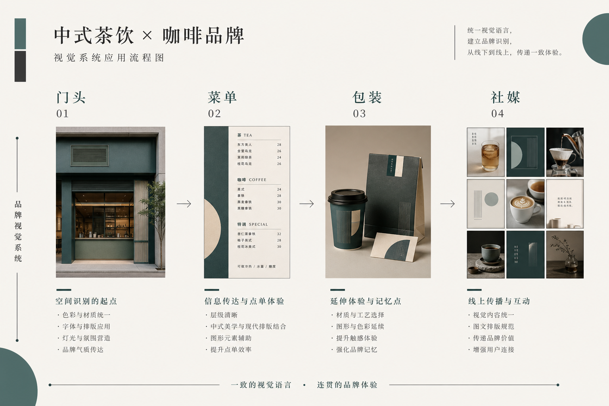

> 百家号版：去链；配图需上传平台。

# 开一家奶茶／咖啡店，视觉这块我用 AI 自己扛下来了：从门头到外卖杯的全流程实操

去年我陪一个开咖啡馆的朋友走完了整套开店流程，其中视觉部分从头到尾是我们俩自己啃下来的——没请设计公司，也没长期养设计师。不是为了省那点钱装省，是因为线下小店的视觉有个残酷现实：你今天定好的东西，下个月还得改。换季海报、新品上市、外卖平台改尺寸、加盟第二家店要统一……你要是每次都外包，光沟通成本就能把你拖垮。

所以这篇不讲"AI 一键开店"的鬼话。我讲一个真实的开店项目，门头、菜单、包装、社媒这四块具体怎么用 AI 落地，人在哪几步必须自己拍板，AI 在哪几步真能帮你省时间，以及我们踩过的那些花了真金白银的坑。

先给你一个判断锚：开店视觉的胜负手不是"第一张海报好不好看"，而是三个月后你上新品时，新物料还认不认得出是你这家店。单张好看谁都能抽出来，能延续的一致性才值钱。而 AI 在这件事上，只在一个环节真正帮到我——锁规范。其它环节它要么是辅助，要么会坑你。

---

## 先摆三个我要打的靶子

开店的人最容易被这三种说法带偏，我先把它们摆出来打掉：

第一个，"用 AI 生成个 Logo 就等于品牌做完了"。不。Logo 只是起点，门头怎么排、外卖杯怎么印、点评页封面怎么裁，才是每天在消耗你的部分。

第二个，"找个几十块的模板改改就行"。模板的问题不是丑，是撞脸——你隔壁三家奶茶店可能买的是同一套模板，顾客扫一眼记不住谁是谁。

第三个，"AI 出图快，所以改到满意为止不要钱"。生成的边际成本确实低，但没有规范约束的"随便改"，改到后面你会得到一堆互不相干的好看图，拼不成一家店的样子。

这三个坑，下面每一步我都会具体拆。

---

## 全流程一张图



我把整个流程画成了一条流水线，核心就一句话：**人定规范，AI 铺量，落地环节回到专业工具收口。**

```
一句话定位（人来翻译）
   │  "社区店 / 25-35 岁 / 手冲慢咖啡 / 不要网红ins风"
   ▼
Brief 结构化 ← LLM 整理成条目 + 禁忌清单
   │  人签字：这一页纸先拍板
   ▼
主视觉方向 ×3 ← AI 铺量
   │  人行使否决权：杀 2 留 1
   ▼
Brand Kit 锁定（人定死边界，Lovart 在这一步）
   │  主色 / 字体 / Logo 安全区 / 材质规则
   ▼
┌────────┬────────┬────────┬────────┐
门头       菜单       包装       社媒
灯箱/发光字  堂食/外卖   杯/袋/贴纸  点评/小红书
   │        │         │         │
   └────────┴────────┴────────┴────────┘
   │  全部从同一套 Brand Kit 长出来
   ▼
落地收口（人对接）
   门头→广告制作厂 / 菜单→印刷 / 外卖→平台尺寸规范
```

看懂这张图你就明白，为什么单看"出图"那一段会觉得 AI 已经无敌了——因为那段确实被压到很省事。但门店视觉真正难的从来不是出图，是让门头、杯子、点评封面看起来像一家店。这就是规范的活，也是我下面重点讲的。

---

## 第一步：把"我想开个有格调的店"翻译成能执行的条目

### 难点

我朋友最开始给我的需求是这样一句话："我想开个有格调、不那么网红、但年轻人也愿意拍照发朋友圈的咖啡店。"

这句话听着很清楚，其实全是打架的词。"有格调"和"愿意拍照发朋友圈"就有张力，"不那么网红"又和"年轻人拍照"暗暗冲突。你按字面做，做出来一定两头不讨好。

### 做法

我没直接开工。我们俩坐下来聊了一个下午，把这句话拆成能执行的条目，再丢给 LLM 整理成一页纸：

- 目标客人：周边写字楼和小区，25–35 岁，工作日买咖啡通勤、周末来坐；
- 不能像谁：点名了两家附近的连锁，说"太标准化、没温度"；
- 禁用元素：不要大面积莫兰迪灰（说烂大街了）、不要仿旧做旧的美式复古、不要满屏英文标语；
- 必须保留：老板自己写的一个手写体店名，这是他的执念，也是记忆点；
- 成功标准：门头晚上亮起来路人能一眼认出品类是咖啡；外卖杯拿在手上别人问得出在哪买。

### 关键细节

这一页纸做完，我们先自己签字确认，再动任何视觉工具。这个动作能挡掉后面一大半的无效返工。没有禁忌清单就开始生成，等于主动邀请平庸——模型会拿它见过的"平均咖啡店感"来填你的空白，你还觉得它挺懂你。

### 我们踩的坑

其实更早我给另一个奶茶店朋友做的时候没这么干。对方说要"清新、治愈、ins 风"，我懒得追问就直接把这几个词丢进生成器，一口气出了三十多张。全是正确的、标准的、一模一样的奶油色加燕麦色加小圆角。她看完一句话："这不就是网上那些奶茶店都长一个样吗？"那天等于白忙。后来我把要求改成"禁止奶油色主色、用一个明确的品牌色做记忆锚、留白靠版式不靠淡色"，才终于跳出模板脸。这一课记死了：模型出图的上限，就是你这页纸写得有多清楚。

---

## 第二步：出主视觉方向——AI 铺量，人握否决权

### 难点

自己手搓三套完全不同的主视觉太慢，一套至少一天。全交给 AI 铺，又容易全是"同一个构图换配色"，看着有三张，其实是一张。

### 做法

这个咖啡店项目，我让 AI 铺了三个明确不同的方向：一个走暖木色 + 手写店名的社区温度感，一个走高饱和单色块 + 极简几何的现代感，一个走牛皮纸 + 单色印章的手作感。注意是"明确不同"，不是同构图调色相。铺出来之后我们只干一件事——杀掉两个，留一个。留的是暖木色那版，因为它最不像老板点名的那两家连锁。

### 关键细节

方向定完立刻进下一步锁规范，别拖，也别贪心地想"要不再看几版"。看方向对老板来说边际成本是零，他永远想多看，你不设边界会被无限拖。三个初始方向 + 一轮微调，这是我给自己划的线，超了就是重开一个项目。

### 我们踩的坑

第一次帮人开店，我把改方向的口子留得太松。老板看完三个方向问"能不能再来一版完全不同的"，我心想 AI 很快啊就答应了。结果第五版、第八版……看方向不要钱，他当然想多看，最后我们反而更难决定了，因为选项一多，判断力就散了。后来我学乖：方向阶段就给三个，逼着自己和客户在有限选项里拍板。选择困难不是选项太少，是选项太多。

---

## 第三步：锁 Brand Kit——这是 AI 在我流程里唯一真正省时间的地方

### 难点

方向选定后，最容易崩的一步来了：怎么保证门头、杯子、点评封面、朋友圈海报，四个东西看起来是一家店？传统做法是设计师手动一个个做，做慢了不说，做到第五个物料时早忘了第一个用的是什么色号了。

### 做法

这一步我用的是 Lovart。选定暖木色方向后，我在它的画布里把这套东西定成一份 Brand Kit：主色的具体色值、辅助色、店名手写体的用法、Logo 周围的安全区、牛皮纸材质的使用规则。定完之后，门头、菜单、外卖杯、社媒海报所有延展物料，全部从这一套规范里长出来。

改一处、看全局，是这里最省时间的点。老板中途说"主色再暖一度"，我在 Brand Kit 里改一次主色，所有已经铺出来的物料跟着变，不用一张张回去重抽。要是没有这套规范，改个主色等于把几十张图重新抽卡一遍，抽十次还未必抽回原来那个感觉。

### 关键细节

我要专门说清楚 Lovart 在我这套流程里的位置——它不是帮我"想"该做成什么样，那是第一、二步人的活。它是帮我把一个已经拍板的判断，快速、一致地铺满所有物料。这是它唯一真正省我时间的环节，其它步骤我不硬塞它。这也是我推荐它的诚实理由：不是它万能，是它在"锁规范后批量延展"这一件事上确实好用。

### 我们踩的坑

有一次我图省事，没做 Brand Kit，直接凭手感一张张出物料。前五张还好，出到外卖杯的时候，主色悄悄漂了——不是我故意，是每次生成模型都会有细微偏移，累积五六张就肉眼可见地不一样了。等到印刷厂打样出来，门头的暖木色和杯子的暖木色，摆一起像两个牌子。那批杯子五千个，返工的钱够我做三套规范了。从那以后，规范不锁死绝不进落地环节，这条我再没破过例。

---

## 第四步：四块物料具体怎么落地

规范锁死之后，四块物料就是"从同一个源头长出来"的执行活了。我一块块讲。

### 门头：晚上亮起来能不能认出品类

门头是转化率最高的一块，因为它替你在街上拦人。这里我的做法是：先用 AI 在 Brand Kit 约束下出白天和夜晚两种效果的示意图，重点看夜晚发光字亮起来的样子——很多方案白天好看，晚上一亮全糊。

关键细节：门头示意图定好后，一定要交给专业的广告制作厂，让他们出可施工的图。AI 出的是"感觉图"，不是施工图，发光字的笔画粗细、亚克力的透光、安装的边距，这些是制作厂的专业活。我们踩过的坑是有个店直接拿 AI 图给小作坊照做，结果发光字笔画太细，晚上一亮糊成一团光斑，认不出字。感觉图和施工图之间，隔着一个专业环节，别跳过。

### 菜单：堂食和外卖是两套逻辑

菜单最容易被忽略的一点：堂食菜单和外卖平台的菜单，是两套完全不同的东西。堂食讲氛围和翻台效率，外卖讲小图能不能看清、能不能勾起食欲。

我的做法是在 Brand Kit 下出两套：堂食用大图 + 手写价签的慢节奏排版；外卖用高对比度的产品小图 + 清楚的价格锚点。外卖平台的产品图有个硬要求——缩到手机上巴掌大还得看得清是什么，所以主体要大、背景要干净。这一条我是吃过亏才懂：第一版外卖图拍得很有氛围，一堆虚化背景，结果缩到列表里根本看不清杯子里是什么，转化惨淡。

### 包装：杯、袋、贴纸是行走的广告

外卖杯是最划算的广告位——顾客拿着它满街走，等于替你做地推。这块我在 Brand Kit 下统一出杯套、纸袋、封口贴纸三件套，核心是让这三样放一起像一套，而不是三个各做各的。

关键细节：包装要留意实际印刷的工艺限制。AI 出的图里那些细腻渐变、超小字号，印在牛皮纸杯套上可能糊掉。所以定稿前我会把关键元素的最小字号、颜色在牛皮纸上的实际显色，都跟印刷厂确认过再批量。设计好看是一回事，印出来是另一回事。

### 社媒：点评封面和小红书是不同战场

线上这块，大众点评的封面图和小红书的种草图，逻辑完全不同。点评封面要在一堆缩略图里被点开，靠的是清晰的品类信号和一个记忆点；小红书要引发"想去打卡"的冲动，靠的是场景和情绪。

我的做法：两个平台都从 Brand Kit 出，但套用不同模板。点评封面强调"这是一家什么店"，小红书强调"来这里会有什么体验"。同一套规范，不同的表达重点。好处是不管顾客先在哪个平台刷到你，再到店里、再拿到杯子，认得出是同一家。这种前后认得出，就是我开头说的那个"胜负手"。

---

## 成本对比：三种做法我都算过账

开店的人最关心这个，我把三种做法的实际账摆出来。数字是量级不是报价单，不同城市、不同店型能差一截，别拿去砍价。

| 项目 | 找设计公司全包 | 找兼职设计师 | 自己用 AI + 规范 |
|------|--------------|------------|----------------|
| 主视觉 + Logo | 高，周期两三周 | 中，看人靠谱程度 | 低，一两天出方向 |
| 四块物料延展 | 按套报价，改一次加一次钱 | 一张张算，沟通累 | 规范锁定后批量，改主色一次全改 |
| 后续换季/新品 | 每次重新走流程 | 找不找得到人看缘分 | 自己在规范里改，当天出 |
| 主要风险 | 贵、慢、不懂你的品类 | 质量不稳、可能失联 | 需要自己有判断力和规范意识 |
| 落地专业环节 | 他们对接 | 得你自己盯 | 门头/印刷得你自己找厂对接 |

我要泼盆冷水：自己用 AI 这条路省的是"重复执行"的钱和时间，省不掉"判断"和"落地专业环节"的活。门头得找制作厂、印刷得找靠谱印厂，这些钱省不了，也不该省。AI 让你不用为每一次小改动都求人，但它替不了你对品类的判断，也替不了施工和印刷的专业。

还有一笔隐性账：一致性省下的钱。你今天用规范锁死了，三个月后上新品、明年开二店，新物料直接从规范长出来，认得出是你。要是每次都从零开始随便抽，你省的是一次的设计费，赔的是品牌被记住的机会。

---

## 一周落地节奏（照着跑一遍）

| 时间 | 动作 | 产出 |
|------|------|------|
| 周一 | 写定位条目 + 禁忌清单 | 一页纸 brief |
| 周二 | AI 铺 3 个主视觉方向，杀 2 留 1 | 锁定 1 个方向 |
| 周三 | 锁 Brand Kit（主色/字体/材质/安全区） | 一份可复用规范 |
| 周四 | 门头 + 菜单从规范出图 | 感觉图，待交专业厂 |
| 周五 | 包装 + 社媒从规范出图 | 三件套 + 双平台封面 |
| 收尾 | 门头交制作厂、包装交印厂对接 | 施工/印刷可执行版 |

跑完这一周你会发现，AI 帮你压缩的是周二到周五那几天的执行，而周一的判断和收尾的落地对接，仍然牢牢在你手里。这恰恰是好事——它替你干了累活，把决定权留给了你。

---

## 适合谁 / 不适合谁

**适合：** 自己开一两家店、预算有限但对视觉有要求的老板；愿意花半天写清楚定位和禁忌的人；接受"门头印刷这些落地环节还得自己找专业厂"的现实。你们用这套流程，能用小钱办出不撞脸的事。

**不适合：** 想彻底当甩手掌柜、指望"AI 一键搞定开店"的人；连自己想要什么品类感觉都说不清、还拒绝坐下来想清楚的人；以及要开大规模连锁、需要整套 VI 手册和商标法务的品牌——那个阶段该请专业团队，AI 是帮手不是替身。

---

## 几个开店老板常问我的问题

**"我完全不懂设计，能用这套吗？"**
能，但前提是你懂你的生意。你不用会调色号、会排版，但你得说得清你的店卖给谁、不想像谁、记忆点是什么。这些是生意判断，不是设计技能。判断你出，执行 AI 出，落地专业厂出。

**"生成的图直接能拿去印吗？"**
不能。AI 出的是感觉图，门头要交广告制作厂出施工图，包装要跟印厂确认工艺和最小字号。跳过这一步省下的钱，大概率会以返工的形式加倍还回来。

**"换季上新品，还得重新做一遍吗？"**
这正是锁规范最值钱的地方。规范在手，新品海报、换季物料直接从这套规范里长出来，当天就能出，还自动和老物料是一家人。没规范才要每次重来。

**"免费工具是不是就够了？"**
试水阶段够。但真要印上外卖杯、挂上门头，得看清楚商用授权和分辨率。我的账是：工具订阅费，几乎永远小于返工和授权纠纷的账单。

---

## 最后一句

开店视觉这件事，AI 没有让它变简单，它让重复执行变便宜了。真正决定你这家店记不记得住的，还是你自己——你想清楚了卖给谁、不想像谁、记忆点在哪，AI 就能帮你把这个判断一致地铺满门头、杯子、点评页。你没想清楚，它就帮你把糊涂高效地铺满每一个物料。

规范先立住，AI 才配上场。顺序反了，你会得到一柜子互不认识的好看图，拼不出一家店。

> 专栏附记：全文只在"锁 Brand Kit 后批量延展"这一个环节提到 Lovart，因为那是它在我这套开店流程里唯一真正省时间的地方，不是硬打广告。门头制作、印刷工艺、平台尺寸规范请以你当地厂商和平台当期要求为准；各工具价格与商用授权发布前请自行复核。
