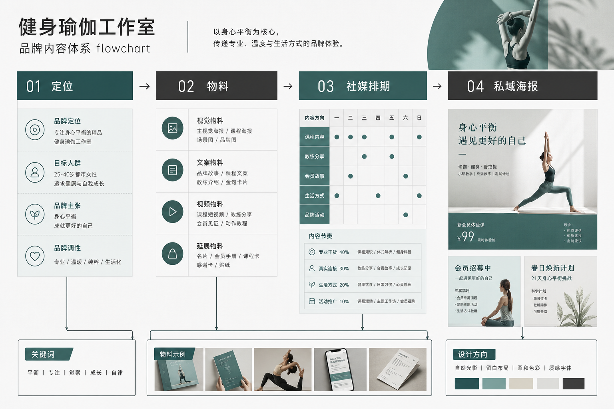

# 开一家健身／瑜伽工作室，品牌视觉我用 AI 全案扛下来了：从定位到墙面标语到教练海报的实操

我帮一个开私教工作室的朋友走完了整套品牌视觉，从定位到开业物料全是我们自己啃的——没请品牌公司，也没长期养设计师。不是硬要省钱装省，是健身/瑜伽这门生意的视觉有个别人体会不到的特点：它不只是几张海报，而是一个"空间 + 课程 + 教练人"的连续体。墙上标语、更衣室指示、会员卡、课程表、每个教练的个人海报、每周的社媒打卡图……这些东西要是各做各的，顾客一进门就觉得"这地方有点散"，而健身/瑜伽卖的恰恰是"专业和信任"，散就是致命伤。

所以这篇不讲"AI 一键开工作室"的鬼话。我讲一个真实的开店项目，工作室的定位、空间视觉、会员体系物料、教练 IP、社媒这五块具体怎么用 AI 落地，人在哪几步必须自己拍板，AI 在哪一步真能省时间，以及我们花了真金白银买来的教训。

先给你一个判断锚：工作室视觉的胜负手，不是开业海报好不好看，而是三个月后你换课表、招新教练、上新私教包时，新物料还认不认得出是你这家。单张好看谁都能抽，能延续的一致性才值钱。AI 在这件事上只在一个环节真正帮到我——锁规范。其它环节它要么是辅助，要么会坑你。

---

## 先摆三个我要打的靶子

开工作室的人最容易被这三种说法带偏，我先摆出来打掉。

第一个，"做个 Logo 加个门头就算品牌了"。健身/瑜伽的视觉是贴在空间里、贴在人身上的。会员每周来两三次，反复看你的墙面、指示牌、教练海报，任何一处不统一，专业感就打折。

第二个，"找套模板改改就行"。工作室最怕的不是丑，是"不专业"和"撞脸"。你楼下三家健身房可能用的是同一批健身模板素材，会员一看就觉得你不过是又一家连锁的翻版，凭什么信你的私教值这个价。

第三个，"AI 出图快，改到满意为止不要钱"。生成的边际成本确实低，但没有规范约束的乱改，改到后面你会得到一堆互不相干的好看图，拼不成一个让人信任的专业空间。

这三个坑，下面每一步我都会具体拆。

---

## 全流程一张图



```
一句话定位（人来翻译）
   │  "女性塑形 / 25-40 / 安静克制不打鸡血 / 私教为主小班为辅"
   ▼
Brief 结构化 ← LLM 整理成条目 + 禁忌清单
   │  人签字：这一页纸先拍板
   ▼
主视觉方向 ×3 ← AI 铺量
   │  人行使否决权：杀 2 留 1
   ▼
Brand Kit 锁定（人定死边界，Lovart 在这一步）
   │  主色 / 字体 / Logo 安全区 / 材质 / 图片调性
   ▼
┌────────┬────────┬────────┬────────┐
空间视觉    会员物料    教练 IP    社媒
墙面/指示   会员卡/课表  个人海报   打卡/预告
   │        │         │         │
   └────────┴────────┴────────┴────────┘
   │  全部从同一套 Brand Kit 长出来
   ▼
落地收口（人对接）
   墙面→喷绘/写真厂 / 卡片→印厂 / 空间→施工对接
```

看懂这张图你就明白，为什么只看"出图"那段会觉得 AI 已经无敌——因为那段确实被压得很省事。但工作室视觉真正难的从来不是出图，是让墙面、课表、教练海报、朋友圈打卡看起来是同一家专业空间。这是规范的活，也是我下面重点讲的。

---

## 第一步：把"我想开个高级点的工作室"翻译成能执行的条目

### 难点

我朋友最初给我的需求是："我想开个高级一点、不那么商业健身房、让人一进来就想安静练的工作室。"这话听着清楚，其实全是打架的词。"高级"和"想安静练"有张力，"不那么商业健身房"又和她想快速回本的诉求暗暗冲突。你按字面做，两头不讨好。

### 做法

我没直接开工。我们坐下来把这句话拆成能执行的条目，再丢给 LLM 整理成一页纸：

- 目标会员：周边写字楼和高档小区的女性，25–40 岁，愿意为私教和环境付费；
- 不能像谁：点名了两家附近的连锁大健身房，"太吵、太商业、满墙打鸡血标语"；
- 禁用元素：不要荧光色、不要肌肉猛男大图、不要"燃脂""暴汗"这类高压标语、不要满墙英文口号；
- 必须保留：安静、克制、留白，标语要克制到像美术馆而不是拳馆；
- 成功标准：新会员进门第一眼觉得"这里可以慢下来"，而不是"又一家健身房"。

### 关键细节

这一页纸做完，我们先自己签字，再动任何视觉工具。健身/瑜伽这行尤其要在这一步定死"调性温度"——你是硬核撸铁的热血感，还是女性塑形的克制感，还是瑜伽冥想的松弛感，三种调性的视觉几乎是三套语言，混着来必崩。没有禁忌清单就开始生成，模型会拿它见过的"平均健身房感"填你的空白，大概率给你一堆荧光加猛男。

### 我们踩的坑

更早我帮另一个瑜伽馆做时没这么干。对方说要"治愈、高级、ins 风"，我懒得追问就把词丢进生成器，出了一批莫兰迪灰加燕麦色加细线条。她看完一句话："这不就是网上那些网红瑜伽馆一个样吗？"那天白忙。后来我把要求改成"禁莫兰迪灰主色、用一个明确的低饱和品牌色、留白靠版式不靠淡色、标语用中文短句不用英文"，才跳出模板脸。这一课记死了：模型出图的上限，就是你这页纸写得多清楚。

---

## 第二步：出主视觉方向——AI 铺量，人握否决权

### 难点

自己手搓三套完全不同的主视觉太慢；全交给 AI 铺，又容易是"同一构图换配色"，看着三张其实一张。

### 做法

这个工作室项目，我让 AI 铺了三个明确不同的方向：一个走低饱和大地色 + 大量留白的克制高级感，一个走深色背景 + 单一亮色点缀的专业冷静感，一个走自然光暖木 + 手写标语的温度感。注意是"明确不同"，不是同构图调色相。铺完只干一件事——杀两个留一个。留的是低饱和大地色那版，因为它最不像老板点名的那两家连锁。

### 关键细节

方向定完立刻进下一步锁规范，别贪心"再看几版"。看方向对老板边际成本是零，她永远想多看，你不设边界会被无限拖。三个初始方向 + 一轮微调，这是我给自己划的线。

### 我们踩的坑

第一次帮人开馆，我把改方向的口子留太松。老板看完问"能不能再来一版完全不同的"，我想 AI 很快就答应了，结果第五版第八版……看方向不要钱她当然想多看，最后反而更难决定，因为选项一多判断力就散了。后来我学乖：方向阶段只给三个，逼着在有限选项里拍板。

---

## 第三步：锁 Brand Kit——AI 在我这套流程里唯一真正省时间的地方

### 难点

方向定完最容易崩的一步来了：怎么保证墙面标语、会员卡、课程表、教练海报、朋友圈打卡，五个东西看起来是同一家？传统做法是设计师手动一个个做，做到第五个物料早忘了第一个用的什么色号。

### 做法

这一步我用的是 Lovart。选定低饱和大地色方向后，我在它的画布里把这套东西定成一份 Brand Kit：主色的具体色值、辅助色、标语字体的中文用法、Logo 安全区、图片的调性规则（自然光、低对比、去掉荧光）。定完之后，墙面、会员卡、课表、教练海报、社媒图所有延展物料，全部从这套规范长出来。

改一处、看全局，是这里最省时间的点。老板中途说"主色再沉一点"，我在 Brand Kit 里改一次，所有已铺出来的物料跟着变，不用一张张回去重抽。要是没这套规范，改个主色等于把几十张图重抽一遍，抽十次未必抽回原来那个感觉。

### 关键细节

我要说清楚 Lovart 在我这套流程里的位置——它不是帮我"想"该做成什么样，那是第一、二步人的活。它是帮我把一个已经拍板的判断，快速、一致地铺满所有物料。这是它唯一真正省我时间的环节，其它步骤我不硬塞它。这也是我推荐它的诚实理由：不是它万能，是它在"锁规范后批量延展"这件事上确实好用。工作室的物料横跨空间、卡片、人像、社媒，规范一崩全崩，所以这一步对健身/瑜伽尤其关键。

### 我们踩的坑

有一次我图省事没做 Brand Kit，凭手感一张张出物料。前几张还好，出到教练海报时主色悄悄漂了——每次生成模型都有细微偏移，累积几张就肉眼可见地不一样。等墙面写真打样出来，前台墙的大地色和会员卡的大地色摆一起像两个牌子。那面墙返工的钱够我做三套规范了。从那以后，规范不锁死绝不进落地环节。

---

## 第四步：五块物料具体怎么落地

规范锁死之后，五块物料就是"从同一源头长出来"的执行活了。我一块块讲，每块都有健身/瑜伽自己的门道。

### 空间视觉：会员每周反复看，容不得糊弄

墙面标语、区域指示、更衣室导视，是会员每次来都要看的，也是"专业感"最集中体现的地方。我的做法：在 Brand Kit 约束下出墙面标语和指示系统的示意图，重点看两件事——标语的中文排版在大尺寸墙面上还稳不稳，指示牌在实际动线位置上认不认得清。

关键细节：墙面示意图定好后，一定要交给专业的喷绘/写真厂出可施工的图。AI 出的是"感觉图"，不是施工图，大尺寸喷绘的分辨率、材质反光、上墙的边距，是制作厂的专业活。我们踩过的坑是有个馆直接拿 AI 图放大喷墙，结果近看全是糊的马赛克，会员一眼看穿不专业。

### 会员物料：会员卡和课程表是"反复使用的信任凭证"

会员卡是会员钱包里的常驻物，课程表是每周都要更新的高频物料。这两样最能暴露你有没有规范——会员卡印一次用一年不能出错，课程表每周更新如果每次排版都飘，会员会觉得你这地方越来越随便。

我的做法：会员卡在 Brand Kit 下做成印刷级规范，一次定死；课程表做成一个可每周替换内容的固定模板，换的是课程时间和教练名，不动版式。这样课表每周更新五分钟搞定，还永远是一套调。

### 教练 IP：人是工作室最贵的资产，海报别做成证件照

健身/瑜伽卖的很大一部分是"教练这个人"。每个教练的个人海报、私教包装、资质展示，是会员决定跟不跟这个教练的关键。

关键细节：教练海报的主体是真人实拍，AI 在这里只做背景统一、版式统一、标题排版，不要用 AI 生成假教练或假身材。这是红线——健身行业的信任建立在"这个人真的能带你练"，用 AI 修出假肌肉线条被拆穿，比没海报还伤。我的做法是教练实拍照进 Brand Kit 统一底色、统一版式、统一资质标注位置，让五个教练的海报放一起是一套人，而不是五张风格各异的证件照。

### 社媒：打卡图和课程预告是两个战场

线上这块，会员打卡图（会员愿意自发转发的）和课程预告图（你主动推的招新物料），逻辑不同。打卡图要好看到会员愿意发朋友圈替你宣传；预告图要清楚地说明课程、时间、价格、怎么约。

我的做法：两类都从 Brand Kit 出，但用不同模板。打卡图强调"我在这里练的样子很体面"，预告图强调"这节课解决你什么问题、怎么报名"。同一套规范，不同表达重点。好处是不管会员先在朋友圈刷到打卡图、还是先看到预告，进门看到墙面，都认得出是同一家。

---

## 成本对比：三种做法我都算过账

开工作室的人最关心这个，我把三种做法的实际账摆出来。数字是量级不是报价单，不同城市、不同定位能差一截，别拿去砍价。

| 项目 | 找品牌公司全包 | 找兼职设计师 | 自己用 AI + 规范 |
|------|--------------|------------|----------------|
| 主视觉 + Logo | 高，周期两三周 | 中，看人靠谱程度 | 低，一两天出方向 |
| 空间 + 会员 + 教练 + 社媒延展 | 按套报价，改一次加一次钱 | 一张张算，沟通累 | 规范锁定后批量，改主色一次全改 |
| 换课表/招新教练/上新私教包 | 每次重新走流程 | 找不找得到人看缘分 | 自己在规范里改，当天出 |
| 主要风险 | 贵、慢、不懂健身/瑜伽这行 | 质量不稳、可能失联 | 需自己有判断力和规范意识 |
| 落地专业环节 | 他们对接 | 得你自己盯 | 墙面喷绘/印刷得你自己找厂 |

我要泼盆冷水：自己用 AI 这条路省的是"重复执行"的钱和时间，省不掉"判断"和"落地专业环节"的活。墙面喷绘得找写真厂、会员卡得找靠谱印厂、教练照片得真人拍，这些钱省不了，也不该省。AI 让你不用为每次换课表、招新教练都求人，但它替不了你对定位的判断，也替不了真人拍摄和大尺寸喷绘的专业。

还有一笔隐性账：一致性省下的钱。你今天用规范锁死了，三个月后换季课表、明年招新教练、上新私教包，新物料直接从规范长出来，认得出是你。要是每次都从零随便抽，你省的是一次设计费，赔的是这家工作室"专业可信"的形象被反复清零。

---

## 一周落地节奏（照着跑一遍）

| 时间 | 动作 | 产出 |
|------|------|------|
| 周一 | 写定位条目 + 禁忌清单（定死调性温度） | 一页纸 brief |
| 周二 | AI 铺 3 个主视觉方向，杀 2 留 1 | 锁定 1 个方向 |
| 周三 | 锁 Brand Kit（主色/字体/图片调性/安全区） | 一份可复用规范 |
| 周四 | 空间视觉 + 会员物料从规范出图 | 感觉图，待交专业厂 |
| 周五 | 教练海报（真人实拍套版）+ 社媒双模板 | 教练一套 + 打卡/预告模板 |
| 收尾 | 墙面交写真厂、会员卡交印厂对接 | 施工/印刷可执行版 |

跑完这一周你会发现，AI 帮你压缩的是周二到周五的执行，而周一的定位判断和收尾的落地对接，仍牢牢在你手里。这恰恰是好事——它替你干了累活，把决定权留给了你。

---

## 适合谁 / 不适合谁

**适合：** 自己开一两家工作室、预算有限但对专业形象有要求的老板；愿意花半天想清楚定位和调性温度的人；接受"墙面喷绘、教练拍摄这些落地环节还得自己找专业厂/真人拍"的现实。你们用这套流程，能用小钱办出不撞脸、够专业的空间。

**不适合：** 想彻底当甩手掌柜、指望"AI 一键开馆"的人；连自己走硬核还是走松弛都说不清、又拒绝坐下来想的人；以及想用 AI 修假身材、假教练来招生的人——那不是省钱，那是给自己埋雷。要开大规模连锁、需要整套 VI 和法务的品牌，该请专业团队，AI 是帮手不是替身。

---

## 几个工作室老板常问我的问题

**"我完全不懂设计，能用这套吗？"**
能，但前提是你懂你的会员。你不用会调色号、会排版，但你得说得清你的馆卖给谁、走什么调性、不想像谁。这些是生意判断，不是设计技能。判断你出，执行 AI 出，落地专业厂出。

**"教练海报能不能全用 AI 生成省拍摄费？"**
不能。健身/瑜伽的信任建立在"这个人真能带你练"，AI 修假身材、生成假教练一旦被拆穿，比没海报更伤。AI 在教练海报上只做背景和版式统一，主体必须真人实拍。

**"换季换课表，还得重新做一遍吗？"**
这正是锁规范最值钱的地方。课程表做成固定模板，每周换的是时间和教练名，版式不动，五分钟更新。新私教包、招新海报也直接从规范长出来，当天出还和老物料是一家。

**"免费工具够不够？"**
试水阶段够。但真要喷上墙、印成会员卡，得看清商用授权和分辨率。我的账是：工具订阅费，几乎永远小于返工和授权纠纷的账单。

---

## 最后一句

工作室视觉这件事，AI 没让它变简单，它让重复执行变便宜了。真正决定会员信不信任你的，还是你自己——你想清楚了这家馆卖给谁、走什么调性、教练凭什么值这个价，AI 就能帮你把这个判断一致地铺满墙面、会员卡、教练海报和朋友圈。你没想清楚，它就帮你把糊涂高效地铺满每一处，让整个空间显得散而不专业。

规范先立住，AI 才配上场。顺序反了，你会得到一屋子互不认识的好看图，拼不出一家让人愿意托付身体的专业空间。

> 专栏附记：全文只在"锁 Brand Kit 后批量延展"这一个环节提到 Lovart，因为那是它在我这套开馆流程里唯一真正省时间的地方，不是硬打广告。教练形象一律真人实拍，AI 不生成假身材；墙面喷绘、印刷工艺请以你当地厂商当期要求为准；各工具价格与商用授权发布前请自行复核。
