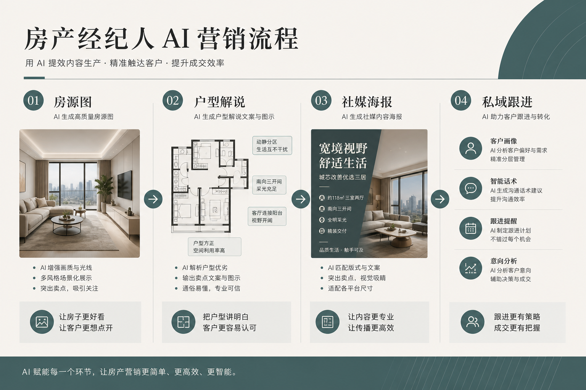

> 百家号版：去链；配图需上传平台。

# 房产经纪人怎么用 AI 做营销物料：从房源海报到户型图到朋友圈，一套流程自己扛下来

我带过一批一线房产经纪人做营销这块——有链家贝壳体系里的，也有独立门店和二手房中介。他们的处境几乎一模一样：一个人要同时干销售、带看、跟客、还要天天发朋友圈刷存在感，可门店给的物料模板又老又撞脸，找设计师做一张房源海报既慢又贵，等图做好房子可能都卖了。于是大多数人退而求其次，随手用手机自带模板套一套，发出去的东西跟隔壁三个同事长一个样，客户刷过去根本记不住是谁发的。

所以这篇不讲"AI 一键做营销"的鬼话。我讲一个真实的经纪人日常，房源海报、户型图、经纪人个人 IP、社媒这四块具体怎么用 AI 落地，哪几步人必须自己拍板，AI 在哪几步真能帮你省时间，以及房产这行最容易踩、踩了就出大事的那条合规红线。

先给你一个判断锚：房产营销物料的胜负手不是"某一张房源海报好不好看"，而是三个月后客户翻你朋友圈时，能不能一眼认出这些图都是你发的、这个人靠谱专业。单张好看谁都能套出来，能让客户记住"你"这个经纪人的一致性才值钱。而 AI 在这件事上，只在一个环节真正帮到我——锁规范。其它环节它要么是辅助，要么会坑你，尤其是那条房源真实性的红线。

---

## 先摆三个我要打的靶子

经纪人做营销最容易被这三种想法带偏，我先摆出来打掉。

第一个，"用 AI 把房源照片修得漂亮点，卖相好才有人问"。修光线、修构图可以，但一旦修到"实景对不上"——把西晒修成采光通透、把老破小修成精装、把窗外的高架桥 P 没了——这就不是美化是造假。客户到现场一看货不对板，轻则拉黑你，重则投诉举报，房产虚假房源是被明令整治的重点。

第二个，"找个模板套套，能发就行"。模板的问题不是丑，是撞脸。你们门店二十个经纪人套的是同一套模板，客户在朋友圈同时刷到三个同事发同一套路的图，谁都记不住。你花时间发的圈，替整个门店做了个寂寞。

第三个，"AI 出图快，所以随便生成、改到满意为止"。生成快是真的，但没有规范约束的"随便改"，你会得到一堆互不相干的好看图——今天蓝色明天橙色，字体天天变，客户看你朋友圈像看三个人的号，建立不起"这个经纪人专业稳定"的印象。

这三个坑，下面每一步我都会具体拆。

---

## 全流程一张图



我把经纪人的营销物料流程画成一条流水线，核心就一句话：**人定规范和真实素材，AI 铺量做延展，涉及真实房源和合规的环节人牢牢把关。**

```
经纪人定位（人来想清楚）
   │  "我主打哪个片区 / 哪类房 / 什么人设：踏实型还是专家型"
   ▼
房源信息 + 真实素材（人来采集，不能造假）
   │  实拍照 / 真实户型 / 真实价格与产权信息
   ▼
Brief 结构化 ← LLM 整理成条目 + 禁忌与合规清单
   │  人签字：这一页纸先拍板（含真实性红线）
   ▼
个人视觉规范锁定（人定死边界，Lovart 在这一步）
   │  主色 / 字体 / 头像位 / Logo安全区 / 免责与产权信息位
   ▼
┌────────┬────────┬────────┬────────┐
房源海报    户型图      个人IP      社媒
挂牌/降价   美化排版    头像/名片   朋友圈/短视频/贝壳
   │        │         │         │
   └────────┴────────┴────────┴────────┘
   │  全部从同一套规范长出来，真实素材不动
   ▼
合规收口（人对接）
   房源真实性核验 / 价格产权信息 / 平台发布规范
```

看懂这张图你就明白，为什么单看"出图"那一段会觉得 AI 已经无敌了——因为那段确实被压到很省事。但房产营销真正难的从来不是出图，是让所有物料既是一套、又句句真实、还不踩合规。这就是规范和真实素材的活，也是我下面重点讲的。

---

## 第一步：把"我想显得专业点、多来客户"翻译成能执行的条目

### 难点

经纪人最初的需求常是一句话："我想让朋友圈显得专业点、有信任感、多来点客户。"这话听着清楚，其实全是打架的词。"专业"和"接地气好聊"有张力，"多来客户"又容易滑向"标题党式的低价噱头"，而低价噱头恰恰最伤专业感。按字面做，做出来两头不讨好，然后推倒重来。

### 做法

我从不直接开工。先坐下来把这句话拆成条目，丢给 LLM 整理成一页纸：

- 主打片区与房型：某某板块的次新两居和三居，刚需和刚改客户为主；
- 人设定位：踏实靠谱型，不做"豪宅顾问"人设装点门面，因为你手上没那个盘；
- 不能像谁：点名那种满屏"急售""血亏""笋盘"红黄大字的同行，客户一看就觉得像骗子；
- 禁用元素：不要浮夸红黄大促感、不要虚假紧迫感话术、不要 P 图到失真；
- 合规红线：房源照片一律实拍，价格产权信息以真实为准，效果图标注"仅供参考"；
- 成功标准：客户刷到你的圈第一反应是"这个经纪人挺靠谱、片区挺熟"，而不是"又一个卖房打广告的"。

### 关键细节

这一页纸做完先自己签字，再动任何视觉工具。这一步省的钱最隐形也最大——它挡掉了后面一大半的无效返工，更挡掉了合规风险。没有这份清单就开始生成，AI 会拿它见过的"平均中介感"填空，给你一堆红黄大字加夸张话术，你还得推倒重做，运气差还发出去惹了麻烦。

### 踩过的坑

早期我帮一个新经纪人做，对方说要"吸睛、有冲击力、让人一眼想点"，我没多追问就把词丢进去，出了一批满屏"急售""捡漏"的高饱和图。他发出去客户咨询是多了点，但来的全是砍价党和同行，真正的优质客户反而觉得他不专业绕着走。后来把要求改成"禁噱头话术、用一个稳重的品牌色、信息清楚为先"，客户质量才上来。这一课记死：房产营销的第一步不是找个会出图的工具，是把人设和禁忌想清楚，省下反复重做和惹麻烦的成本。

---

## 第二步：锁个人视觉规范——经纪人省时间的真正发动机（Lovart 在这一步）

### 难点

方向定完最容易崩、也最费时间的一步来了：怎么保证房源海报、户型图、名片、朋友圈九宫格、短视频封面，全都是一套调、一眼认得出是你？传统做法是每次套个新模板临时拼，套到第五张早忘了上一张用的什么色、什么字，越发越散，客户根本形不成对你的稳定印象。

### 做法

这一步我用 Lovart。定好踏实专业的方向后，在它的画布里把主色值、辅助色、字体、你的实拍头像位、门店 Logo 安全区、还有房源图上那些固定要出现的信息位（价格、面积、产权年限、"图片实拍""效果仅供参考"这类免责标注位）锁成一份个人 Brand Kit。之后房源海报、户型图、名片、朋友圈模板、短视频封面，全部从这套规范长出来。

改一处、看全局，是这里最省时间的点。你想把主色从蓝换成更沉稳的墨绿，在规范里改一次，所有已经做好的物料模板跟着变，不用一张张回去重做。没有规范，改个主色等于把几十张图重做一遍——那笔时间，才是经纪人营销里真正的隐性大头。

### 关键细节

说清楚 Lovart 在我这套流程里的位置：它不帮你"想"该做成什么人设，那是第一步人的活；它更不碰房源的真实性，那是你的红线。它帮你把已经拍板的判断和真实素材，快速、一致地铺满所有物料，并且让你以后自己能改。这是它真正省经纪人时间的环节——不是帮你出一张惊艳图，是帮你把"每套新房源都得重新拼一遍图"这个无底洞给堵上。这也是我诚实推荐它的理由：省时间的关键不在单张图漂亮，在于规范让你摆脱了对模板和临时拼凑的依赖。

### 踩过的坑

有次帮一个经纪人图省事没做规范，凭手感一张张套模板出房源图。前几张还行，出到第五套房源时配色和字体悄悄漂了，客户在朋友圈划过去，那些图看着不像一个人发的。他自己都说"感觉我这号有点乱"。重新统一花的时间，够我帮他做两套规范。从那以后规范不锁死绝不批量，这条铁律我再没破。

---

## 第三步：四块物料具体怎么落地

规范锁死后，四块物料就是"从同一个源头长出来"的执行活了，这里 AI 帮你把重复劳动的时间省下来。我一块块讲，房源真实性这条线贯穿始终。

### 房源海报：卖点清楚、信息真实、不撞脸

房源海报是经纪人发得最多的物料。它的命根子是"信息一眼清楚 + 真实"。我的做法：在 Brand Kit 下把挂牌海报、降价通知、新上房源做成几套固定模板，改的是房源照片、价格、面积、卖点，不动版式。

关键红线：**海报上的房源照片必须是这套房的真实实拍。** AI 可以帮你把实拍照统一调下光线、裁下构图、排下版式、加下信息栏，但绝不能把不是这套房的图拿来充数，更不能 P 掉采光问题、改掉真实户型、把周边不利因素抹掉。房产虚假房源是监管重点，客户到现场货不对板，你丢的不只是这单，是整个口碑。价格、产权、税费信息也一律以真实为准，别为了好看含糊处理。

### 户型图：可以美化排版，不能改真实结构

户型图是客户判断"能不能住"的关键。原始户型图往往是开发商的黑白线稿或系统截图，丑、糊、信息乱。这块 AI 确实能帮上忙：在 Brand Kit 约束下把户型图重新排成清爽的彩色版，标清朝向、面积、功能分区、动线，配上你的品牌色和信息栏。

关键红线：**美化的是表现，不能动真实结构。** 承重墙、开间进深、真实面积、朝向，一寸都不能为了好看去改。我见过有人把小两居的户型图"优化"得显大，客户拿着尺子去量对不上，直接投诉。户型图可以做得清楚好看，但它是"如实呈现"不是"美颜"。

### 个人 IP：头像、名片、人设物料要真人真实

经纪人卖的很大一部分是"你这个人"。头像、名片、朋友圈的自我介绍卡，直接决定客户信不信你。这块我在 Brand Kit 下统一出头像框、名片、人设介绍卡，核心是让它们放一起是"一个稳定专业的人"。

关键红线：头像必须是你本人的真实照片，AI 只做背景统一、光线统一、版式统一，绝不用 AI 生成假人脸、假合影、假业绩证书。你的从业年限、成交套数、服务片区，只写真实可核验的。房产是长决策生意，客户会反复观察你，人设一旦被发现有假，之前的信任全归零。

### 社媒：朋友圈、短视频、平台各是一套逻辑

线上这块，朋友圈、抖音小红书短视频、贝壳这类平台的房源展示，逻辑各不同。朋友圈要日常、真实、有人味，不能全是硬广；短视频封面要在信息流里被点开，靠清楚的房源卖点和一个记忆点；平台房源图要合规、清晰、符合平台尺寸和真实性规范。

我的做法：三个场景都从 Brand Kit 出，但套不同模板。朋友圈九宫格做几套（新上房源型、带看日常型、成交喜报型——喜报也必须是真实成交），短视频封面强调"这套房解决你什么居住需求"，平台图严格按平台真实性和尺寸规范来。好处是不管客户先在哪刷到你，再看到你名片、再加你微信，都认得出是同一个靠谱经纪人。这种前后认得出，就是我开头说的那个胜负手。

---

## 单独说那条红线：房源真实 = 底线，AI 只碰"表现"不碰"事实"

经纪人最容易在这里出致命问题，我必须单拎出来讲。

房产成交金额大、决策周期长，客户对"真实"极度敏感，监管对虚假房源也盯得极紧。于是有人动歪脑筋：用 AI 把西晒房修成采光通透、把老破小修成精装样板间、把不存在的江景合成上去、把周边的坟场高架 P 掉、甚至用 AI 生成根本不存在的"笋盘"来钓客。

这条路省的是找真房源、拍真实图的功夫，赔的是三样：一是客户，到现场货不对板当场拉黑，还到处说；二是口碑，房产极度依赖转介绍和老客户，一个"照骗"传出去这个片区都知道；三是合规，虚假房源、虚假宣传是被明令整治的，平台封号、行业处罚甚至法律责任都在等着。

我的铁规矩：**房源照片、户型、价格、产权信息一律真实，AI 只碰光线、构图、排版、信息栏这些不涉及"事实真实性"的部分。** 效果类图必须标注"仅供参考"。省时间可以省在重复排版上，绝不能省在"真实"上。房产这门生意，卖的就是信任和信息真实，一旦造假破了，多少漂亮图都救不回来。

---

## 成本对比：三种做法我都算过账

经纪人最关心这个，我把三种做法的实际账摆出来。数字是量级不是报价单，不同城市、不同门店能差一截。

| 项目 | 找设计师/外包做图 | 套门店通用模板 | 自己用 AI + 规范 |
|------|-----------------|--------------|----------------|
| 个人视觉 + 头像名片 | 高，周期长 | 免费但撞脸严重 | 低，一两天出方向 |
| 房源海报/户型图延展 | 每张按次收费，房子等不起 | 套一套，人人一样 | 规范锁定后批量，改一次全改 |
| 新房源/降价/喜报出图 | 每次重新找、重新等 | 临时拼，越拼越乱 | 自己在规范里改，当天发 |
| 房源真实照片 | 仍需真人实拍 | 仍需真人实拍 | 仍需真人实拍（不能省） |
| 主要风险 | 贵、慢、房子先卖了 | 撞脸、没辨识度 | 需自己有人设判断和合规意识 |

我要泼盆冷水：自己用 AI 省的是"重复出图"的时间，省不掉"人设判断""真实房源采集""合规把关"这几块。真房源得你去跑、实拍图得你去拍、价格产权得你核准，这些活省不了也不该省。AI 让你不用为每套新房源都重拼一遍图，但它替不了你对片区和客户的判断，更替不了房源真实这条底线。

还有一笔隐性账：一致性省下的时间。规范锁死后，你换片区、上新盘、做年度总结，新物料直接从规范长出来，客户认得出是你。每次从零随便套模板，省的是一次拼图的功夫，赔的是"这个经纪人专业稳定"的印象反复清零。

---

## 一个月的落地节奏

| 时间 | 动作 | 省在哪 |
|------|------|--------|
| 第一周 | 写人设条目 + 禁忌与合规清单，方向拍板 | 省掉后续大半返工和合规风险 |
| 第二周 | 锁个人视觉规范（主色/字体/头像位/信息位） | 省掉每次重新统一的时间 |
| 第三周 | 房源海报/户型图/名片/社媒做成固定模板 | 省掉日常出图的重复劳动 |
| 第四周 | 真实房源实拍集中拍一批，进模板 | 该花的实拍功夫一次到位 |
| 之后 | 新房源/降价/喜报只在规范里改内容 | 长期自己能改，当天就发 |

跑完这一个月你会发现，真正省时间的不是"找了个会出图的工具"，而是"把人设想清楚了 + 规范立住了 + 真实素材备齐了 + 自己能改了"。前期这点投入，是为了堵住后面每天都在漏的返工窟窿，也是为了把合规风险挡在门外。

---

## 适合谁 / 不适合谁

**适合：** 想做个人品牌、不想跟门店同事撞脸的一线经纪人；愿意花几天想清楚人设、并且接受"真房源还得自己跑、实拍图还得自己拍"的人。你们用这套，能用小成本做出有辨识度又不踩线的营销。

**不适合：** 想彻底甩手、指望"AI 一键搞定获客还全自动"的人；想用 AI 假房源、假实景、假业绩钓客的人——那不是省事，是给自己埋雷；以及需要整个门店统一 VI 和法务合规体系的品牌方，那个阶段该配专业团队。

---

## 几个经纪人常问我的问题

**"用 AI 是不是就能不请设计师、彻底省了做图的事？"**
省的是"重复出图"和"临时拼凑"的时间，不是"人设判断"和"真实房源采集"的功夫。你主打什么片区、什么人设得自己想清楚，真房源真实拍得自己跑，这两块 AI 替不了。它帮你省的是"每套房都得重拼一遍图"的那笔长期账。

**"房源照片用 AI 修一下、P 得好看点，可以吗？"**
调光线、裁构图、排版式可以，改事实绝对不行。把采光、户型、周边环境 P 到与实景不符，就是虚假房源，客户到现场就翻车，还踩合规红线。效果类图一律标"仅供参考"。

**"新上房源、降价，还得每次重新做图吗？"**
这正是锁规范最省时间的地方。房源海报、户型图、喜报都做成固定模板，换房源改内容不动版式，你当天自己就能发，不用等人、不用临时拼。

**"用免费模板不就够省了吗？"**
试水够。但免费通用模板最大的问题是全门店撞脸，客户记不住你。真要做个人品牌，一套属于你自己的规范，比一百个免费模板值钱。工具那点订阅费，远小于客户记不住你、房源等不起的损失。

---

## 最后一句

房产经纪人的营销，AI 没让它变简单，它让重复出图变便宜了。真正决定客户记不记得住你、信不信你的，还是你自己——你想清楚了主打谁、人设是什么、房源全用真实的，AI 就能帮你把这个判断一致地铺满房源海报、户型图、名片和朋友圈，还让你随时自己改。你想投机取巧——在人设上装、在房源上造假——它就帮你把浮夸和造假高效地铺满每一张图，最后用更大的代价还回来。

规范先立住，房源真实守得牢，AI 才配上场。这才是经纪人营销真正该走的路。

> 专栏附记：全文只在"锁个人视觉规范后批量延展"这一个环节提到 Lovart，因为那是它在这套流程里真正帮经纪人省时间的地方，不是硬打广告。房源照片、户型、价格、产权信息一律真实，AI 不碰事实真实性；效果类图请标注"仅供参考"，房源发布请守平台真实性与当地房产广告合规口径；印刷、门店 VI、各工具价格与商用授权请以当期为准，别拿本文当报价单。
