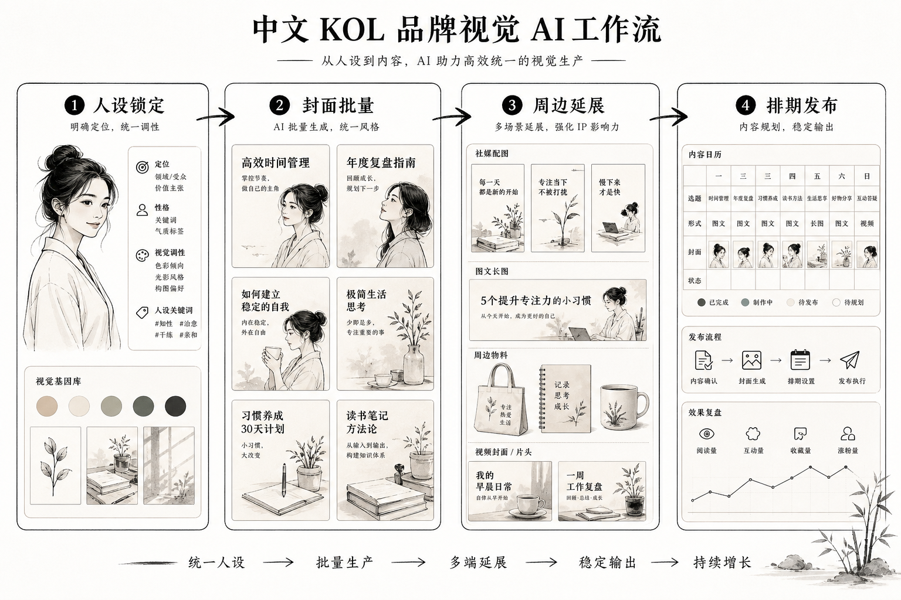

> 知乎版：去文字超链，保留配图。

# KOL 怎么用 AI 做品牌视觉：把"人设一致"这件事流程化，从头像到封面到周边少返工

我陪过一批做内容的博主走完从"随便发发"到"当成品牌经营"的这一步——小红书的、B 站的、抖音的、公众号的都有，粉丝从几万到几十万不等。他们卡在同一个地方：内容能做，但视觉一团乱。头像换来换去，视频封面每期风格飘，联名周边一出来跟主页完全不是一套，粉丝私信问"你是不是换号了"。更要命的是，做视觉这件事把他们本该用来做内容的时间吃掉了一大半——一个人既要选题、拍摄、剪辑，还要天天跟封面较劲，越做越累。

所以这篇不讲"AI 一键做人设"的鬼话。我讲一个真实的博主日常，头像与人设物料、视频封面、联名周边、跨平台视觉这四块具体怎么用 AI 落地，哪几步人必须自己拍板，AI 在哪几步真能帮你少返工，以及做真人 KOL 最不能碰的那条红线——用 AI 伪造"你自己"。

先给你一个判断锚：KOL 品牌视觉的胜负手不是"某一期封面爆没爆"，而是粉丝滑过你任意一条内容时，能不能瞬间认出"这是你"。单张爆款封面运气好谁都能撞一次，能让人一眼认出你、记住你的一致性才是复利。而 AI 在这件事上，只在一个环节真正帮到我——锁规范。其它环节它要么是辅助，要么会坑你，尤其是那条真人 KOL 不能伪造自己的红线。

---

## 先摆三个我要打的靶子

博主做视觉最容易被这三种想法带偏，我先摆出来打掉。

第一个，"每期封面都追当下最火的风格，哪个火用哪个"。追热点没错，但你的封面今天极简明天赛博、下周又复古，粉丝滑动时形不成任何记忆点。爆款靠运气，辨识度靠稳定，这两件事别搞反。

第二个，"用 AI 生成个好看的虚拟人设图当门面，比真人上镜省事"。如果你走的是真人 KOL 路线，粉丝关注的就是"你这个真实的人"。用 AI 生成假形象、假合影、假生活场景当真事发，一旦被扒，对信任是毁灭性打击，这条我后面单列。

第三个，"AI 出图快，封面反正随便改改就行"。生成快是真的，但没有规范约束的"随便改"，你会得到一堆互不相干的好看封面——版式、字体、色调天天变，主页点开像十个不同的博主拼的，攒不出一个统一的个人品牌。

这三个坑，下面每一步我都会具体拆。

---

## 全流程一张图



我把 KOL 的品牌视觉流程画成一条流水线，核心就一句话：**人定人设和真实素材，AI 铺量做延展，涉及"你本人"和商业合规的环节人牢牢把关。**

```
人设定位（人来想清楚）
   │  "我是谁 / 讲什么 / 给谁看 / 什么调性：松弛感还是专业感"
   ▼
真实素材 + 视觉基因（人来定，真人不能造假）
   │  本人实拍形象 / 标志性元素 / slogan
   ▼
Brief 结构化 ← LLM 整理成条目 + 禁忌清单
   │  人签字：这一页纸先拍板
   ▼
个人视觉规范锁定（人定死边界，Lovart 在这一步）
   │  主色 / 字体 / 头像位 / 封面版式 / slogan用法
   ▼
┌────────┬────────┬────────┬────────┐
头像人设    视频封面    联名周边    跨平台
头像/名片   缩略图模板  徽章/T恤    多平台适配
   │        │         │         │
   └────────┴────────┴────────┴────────┘
   │  全部从同一套规范长出来，本人形象真实
   ▼
合规收口（人对接）
   商业合作披露 / 版权授权 / 周边打样印刷
```

看懂这张图你就明白，为什么单看"出封面"那一段会觉得 AI 已经无敌了——因为那段确实被压到很省事。但 KOL 品牌视觉真正难的从来不是出一张封面，是让头像、封面、周边、各平台放一起都是"同一个你"。这就是规范的活，也是我下面重点讲的。

---

## 第一步：把"我想有辨识度、显得专业"翻译成能执行的条目

### 难点

博主最初的需求常是一句话："我想让我的主页有辨识度、看着专业、又不能太端着。"这话听着清楚，其实全是打架的词。"有辨识度"和"跟风热门风格"冲突，"专业"和"不端着"又有张力。按字面做，做出来四不像，然后每期推翻重来——这就是最大的一笔返工浪费。

### 做法

我从不直接开工。先坐下来把这句话拆成条目，丢给 LLM 整理成一页纸：

- 我是谁、讲什么：某个垂直领域的内容，给某类具体人群看；
- 调性定位：松弛真诚型，不装专家，因为你的粉丝就吃这一口；
- 不能像谁：点名那种封面满屏夸张大字、颜色乱撞、标题党感很重的同类博主；
- 禁用元素：不要浮夸大字压脸、不要每期换主色、不要跟风用当下最火但跟我调性无关的滤镜；
- 视觉基因：确定一个记忆锚——可能是一个固定的品牌色、一个标志性配饰、一句反复出现的 slogan；
- 成功标准：粉丝在信息流里不看头像、只看封面就能认出是我。

### 关键细节

这一页纸做完先自己签字，再动任何视觉工具。这一步省的时间最隐形也最大——它挡掉了后面每期封面的反复纠结。没有这份清单就开始做，AI 会拿它见过的"平均网红封面感"填空，给你一堆大字压脸的模板脸，你还得推倒重做。视觉基因这条尤其关键，一个记忆锚定下来，你的辨识度就有了地基。

### 踩过的坑

早期我帮一个博主做，对方说要"高级、有质感、还要够吸睛点击率高"，我没多追问就把词丢进去，出了一批冷淡风的高级封面——结果点击率反而掉了，因为跟她一贯的热闹真诚人设完全不搭，老粉都觉得陌生。后来把要求改成"保留她那句口头禅当 slogan、固定用她的亮黄品牌色、版式统一"，辨识度和点击才一起回来。这一课记死：KOL 视觉的第一步不是找个会出封面的工具，是把人设和视觉基因想清楚，省下每期重来的功夫。

---

## 第二步：锁个人视觉规范——KOL 少返工的真正发动机（Lovart 在这一步）

### 难点

方向定完最容易崩、也最费时间的一步来了：怎么保证头像、每期视频封面、联名周边、各平台主页，全都是一套调、一眼认得出是你？传统做法是每期临时做封面、周边找人另做，做到后面早忘了主色和字体，主页越攒越乱，粉丝形不成稳定印象。

### 做法

这一步我用 Lovart。定好人设和视觉基因后，在它的画布里把主色值、辅助色、字体、你的实拍头像用法、封面的标准版式、slogan 的固定用法、Logo 或标志性元素的安全区，锁成一份个人 Brand Kit。之后头像、视频封面模板、周边、各平台物料，全部从这套规范长出来。

改一处、看全局，是这里最少返工的点。你想把品牌色从亮黄调成更沉的芥末黄，在规范里改一次，所有封面模板、周边样式跟着变，不用一期期回去重做。没有规范，改个主色等于把几十张封面和几款周边重做一遍——那笔返工，才是 KOL 做视觉真正的隐性大头。

### 关键细节

说清楚 Lovart 在我这套流程里的位置：它不帮你"想"该做成什么人设，那是第一步人的活；它更不能替你伪造"你本人"，那是红线。它帮你把已经拍板的人设和真实素材，快速、一致地铺满所有物料，并且让你以后自己能改。这是它真正帮 KOL 少返工的环节——不是帮你出一张爆款封面，是帮你把"每期封面、每款周边都得从零折腾"这个无底洞给堵上。这也是我诚实推荐它的理由：少返工的关键不在单张封面惊艳，在于规范让你从每期的视觉内耗里解放出来，把时间还给内容本身。

### 踩过的坑

有次帮一个博主图省事没做规范，凭手感一期期做封面。前几期还行，做到后面字体和色调悄悄漂了，她主页从上往下滑，早期和近期像两个人的号。她自己都说"我这主页看着好散"。重新统一花的时间，够我帮她做两套规范。从那以后规范不锁死绝不批量，这条我再没破。

---

## 第三步：四块物料具体怎么落地

规范锁死后，四块物料就是"从同一个源头长出来"的执行活了，这里 AI 帮你把重复劳动的时间省下来。我一块块讲，"真人不造假"这条线贯穿始终。

### 头像与人设物料：真人真实，统一处理

头像是粉丝对你的第一印象，也是各平台反复出现的核心资产。名片、合作媒体包、简介卡这些人设物料，直接影响品牌方和粉丝对你的判断。这块我在 Brand Kit 下统一出头像框、简介卡、媒体包，核心是让它们放一起是"一个稳定清晰的人"。

关键红线：如果你是真人 KOL，头像必须是你本人的真实照片，AI 只做背景统一、光线统一、版式统一。绝不用 AI 换脸、生成假形象来"美化"成另一个人。粉丝关注的是真实的你，一旦头像和真人差距大到"照骗"，线下见面或直播露脸时的落差会直接反噬信任。虚拟人设 KOL 是另一条赛道，那要从一开始就明说是虚拟形象，不能真假混着骗。

### 视频封面：模板固定，换的是内容不是版式

封面点不点得开直接决定播放，这是 KOL 最高频的物料。它的命根子是"辨识度 + 点击欲"两者兼顾。我的做法：在 Brand Kit 下把封面做成几套固定模板（干货型、故事型、盘点型），每套版式、字体位置、品牌色都定死，每期换的是主图和标题文字。

关键细节：封面主图如果是你出镜，用真实截图或实拍，AI 只做统一调色和抠图排版；标题大字要一眼看懂"这条能给我什么"。辨识度来自版式和品牌色的稳定，点击来自标题和选题的锋利，两件事分开做。我特别提醒：别每期追新滤镜新风格，你以为在追热点，其实在稀释自己的辨识度。固定模板 + 灵活标题，这才是能滚起来的组合。

### 联名与周边：一次定规范，多款不跑偏

粉丝到一定量，接联名、出周边是自然的事——徽章、T恤、贴纸、帆布包。周边最容易出的问题是"每款各做各的，放一起不像一个品牌的东西"。这块我在 Brand Kit 下统一出周边样式，核心是让不同款周边共享同一套视觉基因（主色、标志性元素、slogan），放一起是一个系列。

关键红线：周边涉及印刷打样和版权。AI 出的是效果图不是生产稿，实际印刷的颜色、材质、最小字号都要跟厂家确认再批量。用到的字体、素材要确认商用授权，联名对方的元素要拿到授权再用。周边是要卖给粉丝、还印你名字的东西，版权和品控上别省这一步。

### 跨平台：一套基因，各平台适配

你大概率不止一个平台——小红书、B站、抖音、公众号封面尺寸和调性都不同。跨平台最容易崩的是"每个平台各做一套，粉丝跨平台关注时认不出是同一个你"。

我的做法：所有平台都从同一套 Brand Kit 出，但按各平台尺寸和展示逻辑套不同模板。小红书封面竖屏、重氛围和标题；B站横屏、重信息；抖音竖屏、重冲击力。同一套视觉基因，不同的表达。好处是不管粉丝先在哪个平台刷到你，跨到另一个平台也一眼认得出。这种跨平台还认得出，就是我开头说的那个胜负手。

---

## 单独说那条红线：真人 KOL 不能用 AI 伪造"你自己"

做真人 KOL 最容易在这里出致命问题，我必须单拎出来讲。

真人 KOL 的全部价值，建立在"粉丝相信这是真实的你"。于是有人动歪脑筋：用 AI 生成"更好看的自己"当头像和封面主图，用 AI 合成根本没去过的旅行地、没吃过的探店、没有过的合影，甚至用 AI 换脸做成"你"在某个场合出现。

这条路省的是真实拍摄和真实经历的功夫，赔的是三样：一是信任，粉丝一旦发现你发的"生活"是 AI 编的，人设当场崩塌，这种崩塌几乎不可逆；二是变现，品牌方做投放前会核查真实性，假素材一旦被查，合作直接黄；三是合规，商业推广不标注、用 AI 伪造代言或体验，涉及虚假宣传，平台和监管都在收紧。

我的铁规矩：**涉及"你本人"和"真实经历"的内容一律真实，AI 只碰背景统一、调色、抠图、排版这些不涉及"事实真实性"的部分。商业合作必须按平台规则显著标注。** 少返工可以省在重复排版上，绝不能省在"真实的你"上。KOL 这门生意，卖的就是真实和信任，一旦造假破了，多少精致封面都救不回来。

---

## 成本对比：三种做法我都算过账

博主最关心这个，我把三种做法的实际账摆出来。数字是量级不是报价单，不同体量、不同领域能差一截。

| 项目 | 请设计师长期跟 | 每期临时套模板 | 自己用 AI + 规范 |
|------|--------------|--------------|----------------|
| 个人视觉 + 头像人设 | 高，还得反复沟通 | 免费但撞脸、飘 | 低，一两天出方向 |
| 视频封面延展 | 每期按张收费 | 临时拼，越拼越散 | 规范锁定后批量，改一次全改 |
| 联名/周边出款 | 每款重新设计 | 各做各的不成系列 | 从规范长出来，成系列 |
| 本人出镜素材 | 仍需真人拍摄 | 仍需真人拍摄 | 仍需真人拍摄（不能省） |
| 主要风险 | 贵、响应慢 | 没辨识度、越攒越乱 | 需自己有人设判断和合规意识 |

我要泼盆冷水：自己用 AI 省的是"重复出图"的时间，省不掉"人设判断""真实素材拍摄""版权与合规把关"这几块。人设你得自己定、出镜素材得真人拍、周边版权得自己核，这些活省不了也不该省。AI 让你不用为每期封面、每款周边都从零折腾，但它替不了你对内容和人设的判断，更替不了"真实的你"这条底线。

还有一笔隐性账：一致性省下的复利。规范锁死后，你换选题方向、接新联名、开新平台，新物料直接从规范长出来，粉丝认得出是你。每期从零随便追风格，省的是一次做图的功夫，赔的是"这个博主辨识度很强"的印象反复清零——而辨识度，正是 KOL 最值钱的资产。

---

## 一个月的落地节奏

| 时间 | 动作 | 省在哪 |
|------|------|--------|
| 第一周 | 写人设条目 + 禁忌清单 + 定视觉基因 | 省掉后续每期封面的反复纠结 |
| 第二周 | 锁个人视觉规范（主色/字体/头像位/封面版式） | 省掉每期重新统一的时间 |
| 第三周 | 封面/头像/周边/各平台做成固定模板 | 省掉日常出图的重复劳动 |
| 第四周 | 本人出镜素材集中拍一批，进模板 | 该花的真实拍摄一次到位 |
| 之后 | 每期只在规范里换主图和标题 | 长期自己能改，时间还给内容 |

跑完这一个月你会发现，真正省时间的不是"找了个会出封面的工具"，而是"把人设想清楚了 + 规范立住了 + 真实素材备齐了 + 自己能改了"。前期这点投入，是为了堵住后面每期都在漏的返工窟窿，把精力从视觉内耗里解放出来做内容。

---

## 适合谁 / 不适合谁

**适合：** 把账号当品牌经营、想要强辨识度的真人博主；愿意花几天想清楚人设和视觉基因、并且接受"出镜素材还得自己真实拍"的人。你们用这套，能用小成本做出跨平台一眼认出的个人品牌。

**不适合：** 想彻底甩手、指望"AI 一键做人设还全自动涨粉"的人；想用 AI 伪造形象、假经历、假合作来立人设的真人博主——那不是省事，是给自己埋雷；以及有 MCN 全套视觉和法务支持的头部账号，那个阶段有专业团队兜底，流程会更重。

---

## 几个博主常问我的问题

**"用 AI 是不是就能不请设计师、彻底省了做视觉的事？"**
省的是"重复出图"和"每期临时拼"的时间，不是"人设判断"和"真实素材拍摄"的功夫。你是谁、讲什么、视觉基因是什么得自己定，出镜素材得真人拍，这两块 AI 替不了。它帮你省的是"每期都从零折腾封面"的那笔长期账。

**"头像用 AI 生成一个更好看的版本，可以吗？"**
真人 KOL 不建议。粉丝关注的是真实的你，头像和真人差太远，直播或线下露脸时的落差会反噬信任。AI 只做背景和光线统一，别换脸、别生成另一个人。想做虚拟形象是另一条路，但要从头就说清是虚拟的。

**"每期封面还得重新设计吗？"**
这正是锁规范最少返工的地方。封面做成几套固定模板，每期换主图和标题不动版式，你当天自己就能出，还自动带着你的辨识度。

**"接商业合作，视觉上要注意什么？"**
两点：一是必须按平台规则显著标注是合作/广告，别偷偷带货；二是对方的品牌元素要拿到授权再用，周边和联名尤其要核版权。视觉可以从你的规范出，但合规披露和授权这条线一步都不能省。

---

## 最后一句

KOL 做品牌视觉，AI 没让它变简单，它让重复出图变便宜了。真正决定粉丝认不认得出你、信不信你的，还是你自己——你想清楚了你是谁、视觉基因是什么、出镜素材全用真实的，AI 就能帮你把这个判断一致地铺满头像、封面、周边和各平台，还让你随时自己改。你想投机取巧——在人设上装、在真实上造假——它就帮你把浮夸和虚假高效地铺满每一张图，最后用信任的崩塌还回来。

规范先立住，"真实的你"守得牢，AI 才配上场。这才是 KOL 品牌视觉真正该走的路。

> 专栏附记：全文只在"锁个人视觉规范后批量延展"这一个环节提到 Lovart，因为那是它在这套流程里真正帮 KOL 少返工的地方，不是硬打广告。涉及本人形象和真实经历的内容一律真实，AI 不做换脸和伪造；商业合作请按平台规则显著标注，周边与联名请核实字体、素材及合作方元素的授权；印刷打样、各工具价格与商用授权请以当期为准，别拿本文当报价单。
