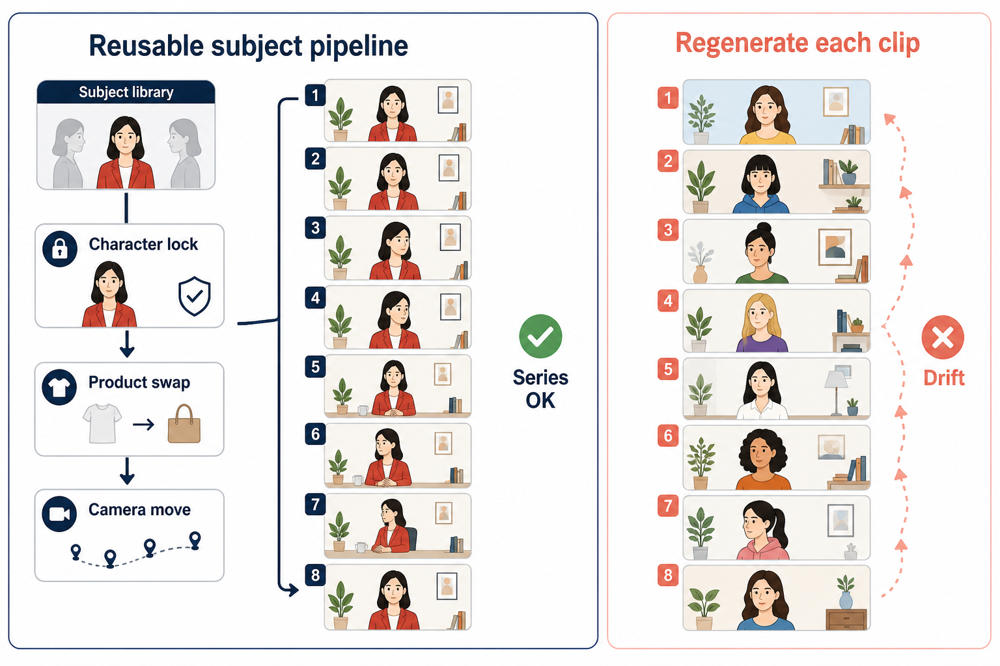
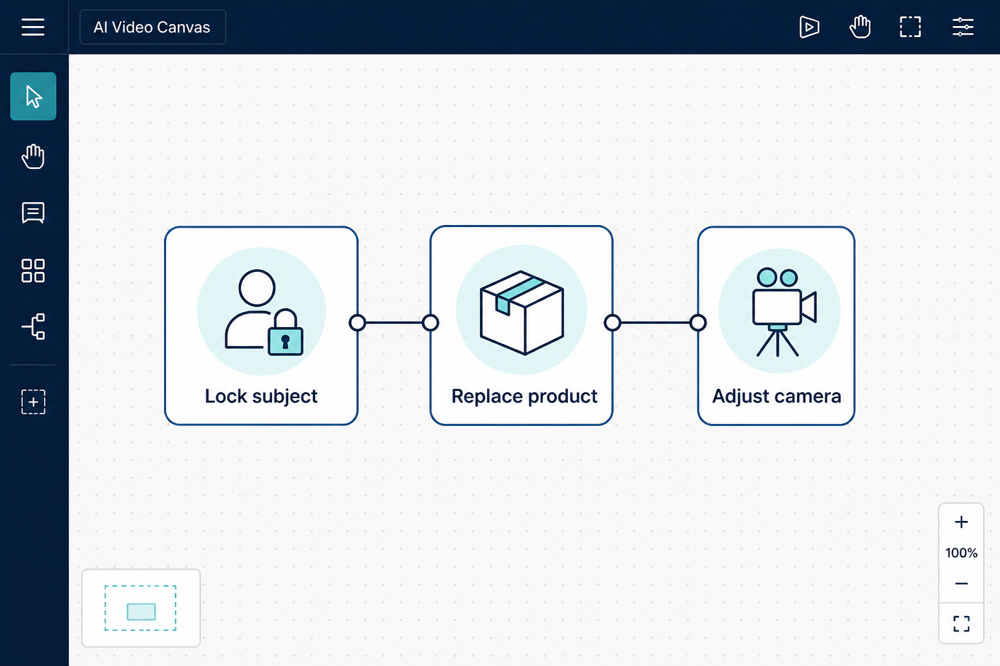

> 百家号版：零外链；信息完整。

# LibTV vs 可灵：别再问谁更清晰，先决定你要拍一条片还是做一套片

> 可灵适合把一条长镜做得有冲击力；LibTV适合把人物、镜头和改稿过程留在自己手里。两边都能出好画面，但解决的不是同一个麻烦。

**先说下我是谁。** 做了十几年市场营销，后来一个人扛品牌视觉和短视频栏目。我试过的 AI 视频工具不少，评判标准很土：客户改第七次时，我还能否保住已经对的部分。下面按交付形态谈 LibTV 和可灵，不比单张截图谁更唬人。

## 先给结论：按交付形态选，不按截图选

把 LibTV 和可灵放在一起比“谁画质第一”，很容易把选择做歪。单张封面和十秒样片最会骗人：镜头动得漂亮、光影有戏，谁都愿意点赞；可一旦任务变成连续八条、同一角色反复出现、客户每条都要改两轮，真正决定你能不能按时交付的就不是某一帧有多惊艳，而是你能不能把正确的部分留下来。

我的结论很明确：  

| 你要交的活 | 优先 LibTV | 优先可灵 |
|---|---|---|
| 一支靠长镜头、氛围和运动感取胜的概念短片 | ⚠️ 可以做，但前期搭建未必划算 | ✅ 更适合冲镜头感 |
| 八到二十条系列内容，同一角色、产品反复出现 | ✅ 主体库和复用流程更省返工 | ❌ 单条好看不等于跨条稳定 |
| 客户会反复说“镜头别动，人物换个动作” | ✅ 可以拆开改，保住已有部分 | ⚠️ 常要重抽整段 |
| 今天只要一条预告，明天就发完 | ❌ 不该为了这一次建复杂流程 | ✅ 直接冲成片效率更高 |
| 要把流程交给同事继续做 | ✅ 节点和素材关系能留下 | ⚠️ 经验更容易留在操作者脑里 |
| 你在练镜头语言，接受大量试错 | ⚠️ 学习曲线更陡 | ✅ 更快看到镜头反馈 |

一句话：**要系列一致性和反复迭代，走 LibTV；要单条长镜的冲击力和即时灵感，先用可灵。**

这不是“工具各有优劣”的客套话。我的意思是：如果你把一支需要连续生产的栏目交给只擅长单条炫技的方式，后面一定会被一致性追着还债；如果你只是赶一条发布会开场，又花半天整理主体库和节点，那是在给一次性任务套长期系统。

> 📷 示意：左为锁定主体后的系列复用，右为每条独立重生后的漂移。发知乎时上传本图。

## 可灵最有价值的地方：它会逼你先把“这一镜要什么感觉”说清楚

我不想把可灵写成一个只会出炫技片段的工具。它真正吸引人的地方，是你在描述运动、景别、光线和情绪时，会很快得到一段有镜头感的反馈。对做灵感验证的人来说，这很重要。很多人脑中只有“一个人走进雨夜街头”这句模糊的话，跑几轮之后才知道自己要的是低机位跟拍、还是俯视拉远；要的是克制的冷光，还是广告片式的高反差。

我做过一条香氛概念片的试镜：只要一段人物从窗边走向桌面的长镜，镜头要从侧后方慢慢推进。前七次里，有三次运动节奏很对，虽然人物细节并不完全一致，但足够让我确定“这支片的镜头语言该往哪儿走”。这类任务拿可灵去冲是合理的，因为目标不是建立资产，而是找到一个有冲击力的瞬间。

但第八次以后，需求变了。客户想让同一个人物再拍四条：开盒、喷洒、望向镜头、拿起产品。此时如果还沿用“每条都重新描述、重新抽”的思路，账就开始变难看。我的记录是：为了让四条片的人物发型、服装和脸部气质接近，我一共保留了三十九段候选，最后只有七段能进剪辑；其中两段因为手部和产品关系不对，被迫放弃。单条看没有灾难，拼成系列就会露馅。

**判断句：可灵擅长把一个镜头做得像一个镜头；但当你的任务变成“同一个世界要持续存在”，你不能只靠每次重新许愿。**

## LibTV 的价值不在“更复杂”，而在于改第七次时不必回到第一天

我以前也误会过节点工作流，总觉得它像是给喜欢研究工具的人准备的。后来做系列内容才明白，节点不是为了让操作看起来专业，而是为了在变化发生时分清：哪些东西该动，哪些东西绝对不能动。

用 LibTV 做一个角色系列时，我会先把角色、服装、产品和基础画面关系整理成可调用的主体；再把镜头动作、环境和节奏当成可调部分。这样客户说“产品换成银色、人物还是这个人、镜头保持推进”时，我不会把所有条件塞回一句提示词里祈祷。我要改的是产品和局部视觉，已有的人物和镜头主干仍然留着。

我拿一个九条短剧切片做过计数。第一条建立角色和画面关系时花了大约一百零五分钟，比直接生成慢；后面八条平均每条四十分钟左右，其中有五条经历过两次局部修改。要是第一条只看出片速度，LibTV明显不占便宜；可到第六条时，前期建库的时间已经被省回来了，因为我没有再从零找脸、找衣服、找画面基调。

相反，我曾用纯重生方式做过六条同主题口播过场。前两条很顺，第三条开始人物年龄感漂移，第五条产品比例突然不对。我没有保存一个可复用的关系，只能一条条回退、重抽、再从相似候选里找能接上的画面。最后六条一共跑了四十八次，真正保留十一次。那不是模型突然变差，是我让每一条都独立抽签。

**判断句：当改稿次数超过两轮，能留下“已经对的部分”比第一次出片快十分钟更值钱。**

> 📷 示意：三个可独立改的区域。发知乎时上传本图。

## 最容易翻车的误判：拿单条样片的胜负，替代整批交付的判断

许多比较文章只放两段最好看的视频，然后宣布谁赢了。这种比法对看热闹有用，对接项目没有用。你真正需要问的是四件事：

第一，角色或产品是否会重复出现？只出现一次，长镜质量的权重最高；出现五次以上，一致性的权重会迅速超过单条惊喜。  

第二，客户会不会改？如果客户只验收一次，冲镜头值得；如果客户习惯先定人物、再改场景、最后换文案，保留局部修改能力就很关键。  

第三，视频要不要交接？一个人做完即止，可以把经验留在自己脑中；多人接力时，能被看懂、被复制的过程比“我这次刚好抽到好结果”可靠得多。  

第四，你是在做作品集，还是在做栏目？作品集允许每一条风格不同，甚至不同才有趣；栏目需要观众一眼认出这是同一个内容体系，随机性就会变成噪音。

我见过一个典型翻车：团队先用长镜风格做出了两条很吸睛的宣传片，于是决定把同样的方法扩成十二集。到了第六集，角色、服装、场景色调都有细小漂移；单集单看都能过，连播之后像十二个不同团队做的。最后他们花两天回头统一参考素材，原先省下的制作时间一次性吐了回去。

反过来也有。一个独立创作者只要一条二十秒的世界观短片，我却建议他先建人物库、搭镜头节点。他照做半天后发现：根本没有第二条，观众也不会拿前后片段比较。那次“严谨”没有带来收益，只延误了发布。  

**我的底线判断：一条片看可灵，十条片看 LibTV；别把十条片的问题，交给一条片的解法。**

## 这两类任务，我会怎样分工

如果是概念片、海报动起来、歌曲氛围片，我通常先在可灵里把镜头感跑出来：重点观察推进速度、人物动作是否有情绪、环境有没有戏。这个阶段我允许大部分结果报废，因为我要的是方向，不是资产。

当镜头方向定下来，项目又要延展成系列，我会停止无止境重抽。先把可用的角色定妆、产品角度、场景色调整理出来，再进入 LibTV 这类可控流程，让后续画面在同一套关系里变体。这里的关键不是把任何工具当万能解，而是承认不同阶段需要不同的产出。

如果项目还需要先把品牌主视觉、道具排版和参考画面定下来，我会把视频前的视觉决策单独完成。Lovart 可以在前期把版式、颜色和素材方向做成能讨论的视觉稿；进视频时，喂进去的是已经被确认的参考，而不是一边生视频一边猜品牌长什么样。它在这里只是前置的视觉整理工具，不替代视频流程。

## 💡 怎么高效用它们

单条概念片：可灵里把镜头感跑到「方向对了」就停，允许大量报废。系列片：先把角色定妆、产品角度、场景色调收进可复用关系，再进 LibTV 做变体，客户改产品时不动人物主干。品牌还没定妆时，先用 Lovart 把主色、禁忌和主视觉说清楚，再把确认稿交给视频工位——顺序反了就会在镜头里反复猜品牌。

## 给你一个不绕弯的选择法

- 你只需要一条能抓住注意力的长镜，且允许多抽几次 → 先用可灵，把时间花在镜头语言上。  
- 你要持续发系列，人物、商品、场景得前后统一 → 直接投入 LibTV，先建可复用关系。  
- 你有一条概念片和一组后续内容 → 用可灵找镜头灵感，再用 LibTV做规模化延展。  
- 你最在意的是“这条第一次就惊艳” → 可灵的优先级更高。  
- 你最怕的是“第七条改稿把前六条都拖下水” → LibTV 的优先级更高。  

最后不说“看需求”，因为那句话没有告诉你怎么判断。**你只要数两件事：这套内容要不要复用到五条以上，以及客户会不会在首稿后继续改。两个答案只要有一个是“会”，就不要只为单条长镜效果做选型。**  

可灵给你的是一段镜头的爆发力；LibTV给你的是一套视频生产过程的可控性。先选你真正需要交付的东西，画面才不会在最需要稳定时变成一场抽奖。

## 适合谁 / 不适合谁

**适合用 LibTV 作为主流程的人：** 同一角色或产品要在五条以上视频里反复出现；客户习惯二稿、三稿后仍保留人物和镜头主干；需要把流程交给同事接力，而不是锁在自己脑子里。

**适合先用可灵的人：** 只要一条靠长镜头和氛围取胜的概念片；今晚就要发、允许大量重抽换方向；暂时不打算做系列栏目。

**不适合硬上 LibTV 的情况：** 一次性热点片、只出现一次的角色、客户只验收一版就结束——前期建主体库的时间收不回来。

**不适合只靠可灵的情况：** 八条以上的系列口播或商品片、品牌要求前后脸和服装一致——单条重生会在连播时露馅。
