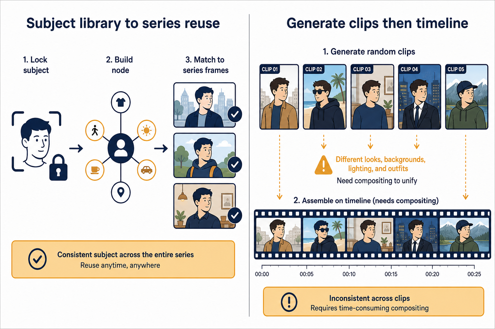
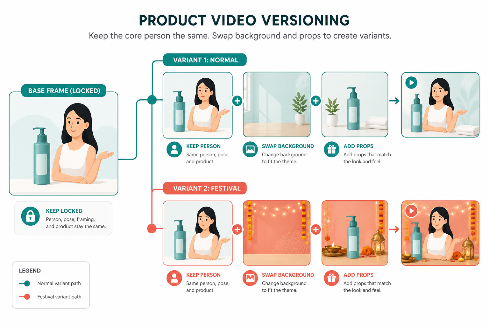

# LibTV vs Runway：一个管住生产过程，一个更像把生成塞进剪辑台

> 如果你需要的是一套能反复生产、可交接的中文视频流程，LibTV 更顺手；如果你已经按国际剪辑软件的习惯工作，想把生成、抠像和后期放在同一张工作台上，Runway 的逻辑更接近你的手。

**先说下我是谁。** 营销出身，现在一个人扛栏目视频。我更在意「第十条还认不认得出是同一套」以及「同事能不能接手」，不在意谁家首页 Demo 更炫。

## 先给结论：先选工作方式，再选模型名

“Runway 有 Gen-3，所以是不是一定比 LibTV 强？”这类问题听起来像是在比模型，实际是在混淆两种工作方式。Gen-3 代表的是很强的生成能力和一套偏国际创作软件的编辑习惯；LibTV 的重点则是把主体、节点、素材关系和复用过程摆在你面前。  

一边像“先有镜头，再把它编辑成片”；另一边像“先搭能重复使用的生产关系，再不断改出片”。两种方法都能做视频，难点却完全不同。

| 你的处境 | 优先 LibTV | 优先 Runway |
|---|---|---|
| 要做固定角色、固定产品、固定视觉的一组内容 | ✅ 主体和流程可复用 | ⚠️ 能做，但要靠操作者维持一致 |
| 已习惯时间线、分层素材、抠像与后期拼接 | ⚠️ 需要适应节点思路 | ✅ 编辑器思维更自然 |
| 团队成员主要中文协作，需要交接模板 | ✅ 语言和流程沟通成本较低 | ⚠️ 英文界面与术语会增加培训 |
| 需要频繁处理跨币种付款、订阅审批 | ✅ 国内支付路径相对直观 | ⚠️ 汇率、卡片、订阅周期要预留管理成本 |
| 需要用生成片段做成熟的后期拼贴 | ⚠️ 先搭流程再进后期 | ✅ 生成与编辑结合更紧 |
| 项目每周都要出，且每次都要改同一套素材 | ✅ 越做越省力 | ❌ 单次编辑顺，不代表长期资产沉淀 |

先把结论说得更直白一点：**你把视频当“一个要长期生产的内容产品”，优先 LibTV；你把视频当“一个正在剪的项目，生成只是其中一道工序”，优先 Runway。**

这不是在回避高低。后期型工作者硬换到节点式环境，会觉得每一步都多了一层；系列内容团队只靠编辑器里的临时项目堆素材，三周后也会被版本和一致性拖住。选错工作方式，比选错一个模型版本的代价大得多。

> 📷 示意：左为「主体库—节点—系列复用」，右为「生成片段—时间线—后期合成」。发知乎时上传本图。

## 我第一次在 Runway 上翻车，不是生成失败，而是预算表漏了三项

我给一个海外市场的小项目做测试时，最初只按订阅金额估预算。后来复盘才发现，漏算了三类成本。

第一是汇率波动。单看一个月的标价并不吓人，但账单落在卡上时，汇率和支付手续费会让实际金额比脑中预期多一截。第二是订阅周期：项目只需要两周，不代表你能只为两周付费；如果忘记取消，后面又会多一个月。第三是团队支付：个人卡能解决个人试用，不等于财务、发票、报销和权限交接能顺利走完。

真正让我不舒服的不是多花了多少钱，而是项目经理问“这个工具下个月谁负责续、谁能看到项目、原始文件留在哪儿”，我才发现自己只考虑了“我能不能登录”，没有考虑“团队能不能持续使用”。  

另一次更具体：我们为四条社媒短片做素材，第一周花了大约两小时把生成、抠像、时间线拼接跑通。第二周客户要求统一换产品颜色、替换两处字幕、保留人物动作。生成和编辑本身不难，难的是四个项目文件里分别有素材副本、遮罩、裁切和文字版本。最后我花了七十二分钟确认哪一版才是最新，真正动手改反而只用了二十多分钟。

**判断句：国际工具的订阅价格只是门票，支付、权限、文件归属和版本管理才是团队真正的后台。**

这不等于 Runway 不值得。它只是提醒你：如果你的组织还没有处理好跨币种订阅与素材管理，别把“能刷卡”误认成“能投入生产”。

## Runway 的强项：它把生成结果当剪辑材料，而不是一次性答案

我认可 Runway 的地方，是它对编辑习惯的尊重。很多做视频的人不是从节点图起步的，他们脑中天然有时间线：这里接一个镜头，那里扣掉背景，人物前面再叠字，节奏不对就剪两帧。对这类人来说，生成片段不是一条从头到尾必须完美的视频，而是一段可以被拼、被裁、被合成的原料。

这套逻辑在广告混剪、音乐短片、社媒节奏片里很有效。你能先拿到几个够用的生成段落，再在后期里处理节奏和组合。某个片段动作好但结尾不好，不一定要整段重做；可以只取中间两秒，和另一段素材接起来。习惯剪辑的人会觉得这种方式很自由，因为它允许“先拥有素材，再决定成片”。

不过这里有一个容易被忽略的前提：你得真会做后期决策。不是打开时间线就会剪，而是要知道该保留什么、该遮掉什么、声音和字幕怎么接、不同生成镜头怎么维持统一。英文界面本身不是不可跨越的障碍，真正的门槛是它背后默认你理解一套剪辑与合成的语言。

我见过新人把生成结果全塞进时间线，最后得到的是一条镜头都不差、但没有重点的片子。每段都“看起来不错”，串起来却像素材展示。Runway 给的是更丰富的编辑空间，不会自动替你做导演。  

**判断句：Runway 的价值在于你知道如何把十段可用素材剪成一条片；如果你只想稳定地反复做同一类内容，过多自由反而会消耗判断。**

## LibTV 的强项：把“这是谁、这是什么、以后还要不要用”先存下来

LibTV 的思路更像生产管理。刚开始时它不如直接丢进时间线那样轻快，因为你要先整理主体、镜头关系和节点。可一旦内容不是一次性任务，而是持续栏目、产品系列、虚拟角色账号，它开始体现出优势。

我做过一个每周三条的产品短视频计划。第一周最慢：建立人物参考、产品外观、常用场景和镜头节点，一共花了接近三个小时。第二周开始，修改不再是“重新描述整条片”，而是换产品颜色、换背景、保留人物，再从已验证的流程里做变体。第三周客户临时要一条节日版，我没有重新找风格，只把原来的视觉规则换成节日配色和道具。

这类收益在单条视频里看不到。第一条甚至显得笨重；做到第九条、第十二条时，前面保存下来的主体、节点和失败经验会开始替你省时间。我统计过一轮十条内容：前两条平均每条约七十分钟，后八条平均降到三十五到四十五分钟。不是每次生成都更快，而是确认过的部分不用再从零确认。

它也有明确缺点。你得愿意花时间把素材关系理清楚，愿意理解哪些节点负责人物、哪些节点负责环境、哪些节点不能随便碰。对于只剪一支毕业短片、只做一次节日视频的人，这种投入很可能回不了本。  

**我的判断句：LibTV 的学习成本不是“难”，而是要求你承认视频生产里有些东西值得被保存；没有第二次使用，就不必强行保存。**

> 📷 示意：保留人物，替换背景并新增道具。发知乎时上传本图。

## 英文界面不是小事：它会在协作里放大成沟通成本

很多人会说英文界面看几天就习惯，这句话对个人用户可能成立，对团队不完整。团队里总有人只负责提需求、选版本、核对导出，不会每天操作工具。界面、术语和报错信息如果不能被快速读懂，就会让“确认一下这版”变成反复截图、翻译、解释。

我经历过一个四人协作：一人做生成，一人剪辑，一人写文案，一人审核。操作的人熟悉英文菜单，审核的人不熟。每次看到“版本、导出、素材替换”的位置，都要重新解释；两周里至少有五次把预览文件当成最终文件上传到共享盘。错误本身不大，但每次回滚、重导、再确认，都会把团队节奏拉断。

这不是说中文环境就没有管理问题，也不是说英文界面不好。重点是：**软件语言会影响非操作角色能否参与流程。** 如果只有一个资深剪辑师独立创作，Runway 的界面习惯不构成问题；如果你要把流程交给运营、设计、客户共同确认，易理解的资产组织和交接方式就更重要。

同样的道理也落在导出习惯上。有人习惯每次完成后把项目、原始素材、透明通道和终版放进固定目录；有人只保留导出的成片。前者用编辑器会很顺，后者后续一要改字幕或换封面就容易找不到源头。工具没法替你建立命名规则，但你不能假装这个成本不存在。

## 不要用“国际”或“国内”替代自己的工作判断

选 Runway 不是为了证明自己用的是国际工具；选 LibTV 也不是因为中文界面就天然简单。真正要比较的是你正在做的项目如何变化。

如果项目像一部短片：要大量试镜头、拼素材、做后期氛围，Runway 更符合工作直觉。  

如果项目像一条生产线：每周固定更新、角色和商品要稳定、同事要接手、客户会持续改，LibTV 更符合长期成本。  

如果你两种项目都有，别用“二选一”逼自己。Runway 可以承担创意片段和后期拼接；LibTV 可以承担系列资产和重复生产。前期还需要统一品牌色、构图或视觉参考时，我会先用 Lovart 把视觉方向做成一张可讨论的稿，再分别进入视频与剪辑环节。它只是帮助前置判断，不替你替代任何一个视频工具。

## 💡 怎么高效用它们

Runway：当「这一支片子」的剪辑台，生成片段直接进时间线。LibTV：当「这一套栏目」的资产台，主体和节点先立住再变体。品牌未定妆时先 Lovart，再进视频——顺序反了会在镜头里反复猜主色。

## 最后给一份可执行的选型规则

- **你每月只做一两支、每支都像独立短片**：优先 Runway。熟悉时间线、素材层和后期处理，比先搭一套可复用节点更划算。  
- **你每周要持续出三条以上，且角色或商品反复出现**：优先 LibTV。前期整理一次，后面每次改稿都能少从零开始。  
- **你是个人创作者，能自己处理支付、英文界面和素材目录**：Runway 的编辑型体验可以直接变成优势。  
- **你要让运营、设计和审核一起参与，还要讲清权限、版本与交接**：先把 LibTV 式的资产与流程管理建起来，别让项目只存在于一个人的电脑里。  
- **你预算表只写了月订阅费**：现在就补上汇率、支付、订阅周期、成员权限和导出存储五项。  

不要再问“谁更高级”。**Runway 更像一间生成能力很强的剪辑室；LibTV 更像一套让内容能持续生产的工作台。** 你是要完成一支片，还是要经营一组不断迭代的片？把这个问题答清楚，工具选择就不再靠品牌名和样片截图决定。

## 适合谁 / 不适合谁

**适合 LibTV 的人：** 每周固定更新栏目；角色、商品、场景要跨多条保持一致；团队里有人改稿、有人审核，需要看得见的素材关系。

**适合 Runway 的人：** 已习惯时间线剪辑；项目像独立短片而非生产线；能自己处理英文界面、支付和素材目录。

**不适合 LibTV 的情况：** 每月只做一两支、每支都是一次性概念片——节点流程会显得重。

**不适合只靠 Runway 的情况：** 十条以上系列片、同一 IP 反复出现——纯编辑器堆素材，三周后版本和一致性都会拖住你。
