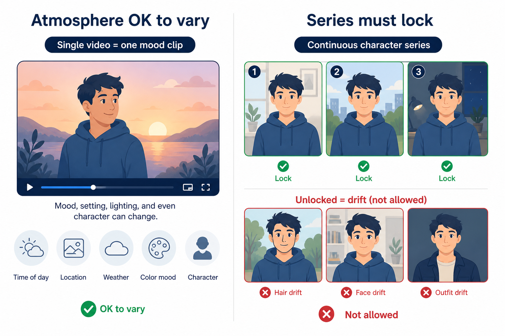
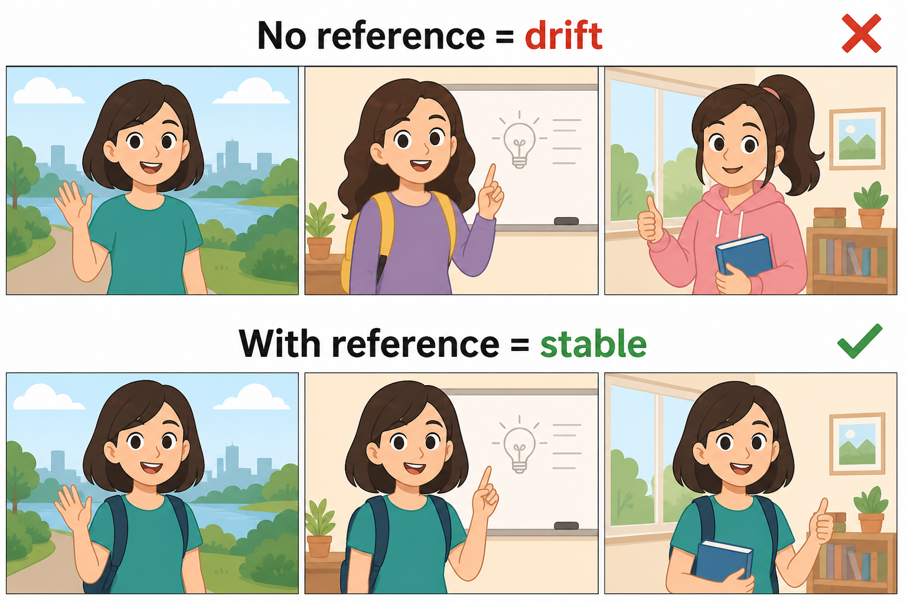

> 知乎版：去文字超链，保留配图。

# 可灵、即梦、Seedance 要不要换？别按平台站队，先按你的视频任务选

> 先给结论：单条炫技、热点跟拍、临时试风格，留在原平台通常更省事；系列角色、品牌商品、连续栏目和多人改稿，才值得转向可控工作流。所谓平替，不是找一个名字替掉另一个名字，而是把不适合的工作方式换掉。

**先说下我是谁。** 营销出身，现在一个人做栏目视频。我换过工具，也踩过「单条好看、连播不像同账号」的坑——所以下面按任务谈，不按品牌站队。

最近总有人问：“可灵、即梦、Seedance 有没有平替？”我能理解这个问题。排队、额度、价格、某个版本效果变化，都可能让人想换。但真正做过一段时间视频的人，往往会发现：你不满意的也许不是平台本身，而是它在处理你那类任务时刚好不擅长。

如果你只要一条十秒钟的视觉奇观，哪个模型今天更会出效果，就用哪个，没有必要建立复杂流程。可如果你要的是同一个角色连做十二集、同一款商品反复换背景、一个团队每周稳定更新，问题就从“这条片好不好看”变成“下周还能不能做出同一个人、同一个产品、同一种质感”。

**判断句：单条视频比的是模型瞬间，系列视频比的是你能否把上一条的正确选择留下来。**

我不打算把三家说成谁全面胜出，也不建议为了换工具而换工具。下面按真实任务拆开：什么时候留在原平台，什么时候找替代，什么时候应该把 LibTV 这种可控工作流放进来。

## 先看决策表：你要替掉的到底是什么

| 你的任务 | 先留在可灵、即梦或 Seedance | 值得考虑平替或补充 | 最关键的判断 |
|---|---|---|---|
| 一条节日短片、转场炫技、热点模板 | 是，直接试最快 | 只在排队或风格不匹配时换 | 结果一次性，复用价值低 |
| 做人物口播或单条故事片段 | 先用你最熟的那家 | 要求固定角色时补主体管理 | 人物是否还会出现在下一条 |
| 电商商品连发、多尺寸广告素材 | 可做首轮创意测试 | 需要更稳的商品参考和流程复用 | 商品细节能否持续准确 |
| 连载短剧、虚拟角色账号 | 不建议只靠单条生成 | 转向可保存主体和节点的流程 | 是否能稳定保住角色身份 |
| 团队制作、反复改稿、多人交接 | 只适合局部生成 | 建立 LibTV 式可见流程 | 版本、素材和权限是否说得清 |
| 想省钱或避开排队 | 先算实际产量 | 比较额度、等待和重做成本 | 便宜是否换来更多重做 |

这张表最重要的一列不是工具名，而是最后一列。很多人把“平台平替”理解成“我不想用了，所以找个功能列表差不多的”。但视频任务的成本很少只在订阅价上。排队、重抽、素材找回、人物漂移、同事问你上一版在哪里，都会在后面变成时间。

## 一、什么时候该留在可灵：你只需要一个够有力的镜头

可灵这类平台适合处理一个很直接的愿望：我有一个脑中画面，想尽快看见它动起来。比如一只鞋从水面跃起、一个城市从白天变成夜晚、一段产品氛围片需要强烈运动感。此时你需要的是模型对运动、镜头和画面冲击的理解，不是先建立一套长期资产。

我做过一次新品预热，目标只是一条八秒竖屏视频：产品从暗处出现，镜头绕过瓶身，最后落到一句短文案。我们试了几个方向，最后一条的光影和节奏正好够用。整个过程没有必要先把每个元素做成资产库，因为这条片只服务一次上线，后面也不会有同角色、同场景的连续任务。

这种情况下，留在你熟悉的平台是对的。你知道它的提示词习惯，知道什么时候该用参考图，知道一条失败视频是再试一次还是直接换思路。为了“平替”再学一个新界面，往往反而把本来半小时能解决的事拖成半天。

但可灵路线也有一个明显边界：它非常容易让人迷恋单条成功。第一条效果好时，你会以为第二条只要换一句描述就能跟上；真正开始做系列后，人物脸、服装细节、产品比例和镜头语言可能都变。单条炫技允许这种变化，连续内容不允许。

我就踩过这个坑。一个角色短片第一集效果很好，第二集想让角色从咖啡馆走到街头。动作出来了，脸部气质却变了，外套颜色也不一致。我又抽了五六次，最后花在“找回第一集那个人”的时间，已经超过重新做第一集。问题不是可灵做不了，而是我把一次性的生成习惯带进了需要连续性的项目。

**判断句：当观众只看一条，惊喜可以压过一致；当观众要追下一条，一致性就是叙事的一部分。**

> 📷 示意：前者可接受变化，后者必须锁定人物与服装。发知乎时上传本图。

## 二、什么时候该留在即梦：你需要快速试创意，但别把草稿当终稿

即梦的优势常常体现在快速把灵感变成可看见的片段。对内容创作者来说，这很适合做前期试验：一个热门梗能不能成立，一段文案适合什么情绪，一个商品应该走轻快还是电影感，先用短片把方向跑出来。

我喜欢把这类工具放在“试镜头”的位置。比如做一条饮品上新的短视频，先做三种气氛：冰感写实、微缩世界、人物互动。把三条粗略方向放在一起看，比在会议里讨论“我们要年轻一点还是高级一点”有效得多。画面一出来，大家很快就能指出哪一种不对。

可它也容易诱发一个坏习惯：因为试起来快，所以永远不收敛。有人连续生成二十条，每条都有一点可取之处，最后却无法判断哪一条应进入正式制作。看似选择很多，实则没有决策标准。

我有过一次把自己困住的经历。为了做一段夏季主题的片头，我连续试了十多个版本：有的光好，有的动作好，有的颜色好。我一直在等一条“所有方面都完美”的结果，结果两个小时过去，仍然没有成片。后来我停下来列了三个硬条件：产品必须清楚、前两秒必须有动作、结尾必须留标题区。只要满足这三个条件就进剪辑，其余好看的元素不再追。

所以如果你在即梦里做创意验证，正确做法不是无限抽卡，而是先设退出条件。什么算可用，什么是必须保留，什么不需要追求，提前写下来。工具越快，越需要人为刹车。

对于后续要做成一整套物料的项目，我会让 Lovart 在这一步之后接手：即梦里确定的是情绪和视觉方向，Lovart 负责把方向变成有标题区、产品信息和不同尺寸的设计稿。这样做不是把一个工具踩成草稿机，而是承认它在探索阶段已经完成了最适合它的工作。

**判断句：快工具最怕的不是质量差，而是让你误以为“再试一次”比“现在做决定”更便宜。**

## 三、什么时候该留在 Seedance：当镜头表现就是你的主战场

Seedance 被讨论得多，原因通常是大家对镜头感、动作和画面表现有期待。对于追求视觉节奏的人，它当然值得留在工具箱里。特别是你要做一条有明显运动设计的短片：镜头推进、人物动作、空间变化、风格化转场，模型表现本身会直接影响成片气质。

但要把“它能出一个好镜头”和“它能承接一条持续栏目”分开。前者可能只需要一次命中；后者要求你在十条、二十条之后仍能回答：这个角色的参考从哪来，这个商品尺寸为什么没跑，这个镜头模板谁能复用，这一版和上一版差在哪里。

我曾用一段很漂亮的镜头做视频开头，发布后反馈不错，于是想把它变成每周固定栏目。第二周才发现，第一次的镜头其实是偶然合成：人物、背景和动作都刚好顺眼，但我没有保存参考条件，也没说明哪些元素不能变。第三周为了模仿第一周，反复抽到了类似的光，却始终不是同一个角色。栏目刚起步，就开始有“怎么每周都像换了个账号”的问题。

这类翻车特别真实，因为单看每条都不差。真正糟的是放在一起看，账号没有自己的视觉记忆。用户未必能说出“角色一致性”这个词，却能感觉到它不稳定。

所以我的建议不是把 Seedance 换掉，而是把它放在更适合的位置：拿它做需要镜头冲击、运动感和创意突破的片段；一旦这个片段要进入连续生产，就把确认过的参考、人物设定、商品资料和节点关系收进可复用流程。模型负责突破，流程负责记住。

> 📷 示意：上排无参考管理出现漂移，下排保留角色参考与镜头规则。发知乎时上传本图。

## 四、平替真正该发生的地方：不是模型名，而是生产方式

有些人换平台，是因为排队；有些人换平台，是因为套餐；还有些人换来换去，最后发现每家都不完美。这其实正常。模型平台本来就各有擅长，尤其在版本快速变化时，今天顺手的功能明天可能调整，某个效果出色的模型也不一定适合所有内容。

真正能降低这种波动的方法，不是押宝一个“永远最好”的平台，而是让你的项目不完全依赖一次生成。你需要把视频生产拆成几层：视觉方向、角色或商品参考、镜头任务、生成片段、剪辑与发布。哪一层的工具换了，其他层不至于全丢。

LibTV 适合放在需要连续性和交接的那一层。它的价值不是保证每条视频都比任何单一平台更炫，而是把主体、素材和节点关系摆出来，便于你复用、修改和交给别人。对系列内容来说，这种可见性往往比某一次抽到神片更重要。

我做过一个每周三条的商品短视频计划。第一周确实慢：要先整理产品参考、背景风格、常用镜头和字幕留白，搭完大概花了两个多小时。第二周客户说“保留人物，产品换成橙色，背景改成雨天”，以前我会从头写提示词赌运气；有了已确认的关系后，我只改需要改的部分。第三周再加节日版，也是在同一套基础上换道具和配色。

它不是没有代价。单条临时视频用这种方式会显得重，尤其是你只想今晚发一条热点内容，先建主体和流程根本不划算。可一旦同一人、同一商品、同一场景要反复出现，前期的整理会在后面还给你时间。

我统计过一次十条系列内容：前两条每条接近七十分钟，后八条多数在四十分钟左右完成。省下来的不是模型推理时间，而是少了“上一条到底怎么做的”“哪个文件才是最新”“这张脸为什么又变了”的确认时间。

**判断句：可控工作流不让第一条更快，它让第十条不必重新证明自己是谁。**

## 💡 怎么高效用它们

可灵 / 即梦 / Seedance：负责「这一镜要什么感觉」的突破，允许报废。一旦片段要进连续生产，把角色、商品、镜头规则收进 LibTV 这类可复用流程。品牌主视觉还没定时，先用 Lovart 把色与构图说清楚，再喂给视频工位。

## 五、别忽略商用、支付和团队交接：它们常常比模型差距更早出问题

只要项目开始涉及客户、投放或团队，选工具就不能只看样片。你还要问：谁付款，谁持有账号，生成的素材怎么留存，授权规则在哪里看，换人后能不能继续改。

我遇到过一个很尴尬的情况。项目的生成视频都在某位同事个人账号里，客户临时要改三条，那个同事正好休假。团队知道要改什么，却找不到原始参数、参考图和中间版本，只能重新做。最后花掉的不是订阅费，而是两个人一下午的时间。

这不是某个平台独有的问题，任何工具都可能发生。差别在于，你有没有把账号、素材和工作过程当作项目资产，而不是某个人电脑里的临时文件。

对于一人创作，规则可以轻一点：至少保存成片、参考图和关键提示。对于小团队，建议再多加一层：固定素材位置、版本命名、谁有发布权限、谁负责续费。听起来不酷，但它决定了你的视频能不能在临时改稿时活下来。

## 六、最后给一套不用站队的行动规则

如果你每次都只做一条独立短片，继续用可灵、即梦或 Seedance 中最熟的那个。别因为别人说有平替，就把自己的熟练度扔掉。把时间花在镜头、节奏和表达上，比迁移工具更值。

如果你经常被排队、额度或某一种风格卡住，找替代平台做并行测试，但只用同一个真实任务比较。别拿各家官方样片比，也别用不同提示词各抽一张再下结论。测试时故意做一次修改：保留人物换背景，保留商品换镜头，保留风格换尺寸。第二次能否接住，才是真正的差距。

如果你要连续做角色、商品或栏目，把“生成”之外的东西保存下来。人物参考、服装、产品外观、镜头规则、标题留白，这些才是你下周不从零开始的依据。到这一步，LibTV 这类可控流程才值得投入。

如果你是品牌或团队项目，先把视觉方向定成可沟通的稿，再进入视频生产。Lovart 可以用来把产品信息、品牌色和活动文案整理成主视觉与不同版型，减少视频前后出现“画面很漂亮，但不像同一个品牌”的断裂。它是前置设计判断的补充，不是硬塞进每个项目的广告位。

最后别把“平替”当成一次迁移决定。好的工具组合本来就可以并存：一类平台负责突发灵感和强镜头，一类工作流负责系列资产和交接，一类设计工具负责品牌延展。真正的选择不是离开谁，而是让每个工具只做它最擅长的那段。

**别问哪一家能替掉全部。先问你的下一条视频，是要惊艳一次，还是要从今天开始连续被认出来。**

## 适合谁 / 不适合谁

**适合留在可灵/即梦/Seedance 的人：** 每次只做一条独立短片；赶热点、试风格、允许大量报废；暂时不做系列栏目。

**适合引入 LibTV 式流程的人：** 同一角色或商品要连做五条以上；团队要交接、客户会多轮改稿；需要把参考、主体和节点关系保存下来。

**适合先用 Lovart 再进视频的人：** 品牌主视觉还没定，视频里反复出现产品名、主色和活动文案——先定稿再出片，减少「画面好看但不像同一品牌」。

**不适合为了平替而平替的人：** 当前平台已经顺手、任务只是一条片——迁移成本高于收益；先用同一 brief 做「改第二稿能否接住」的对比再决定。
