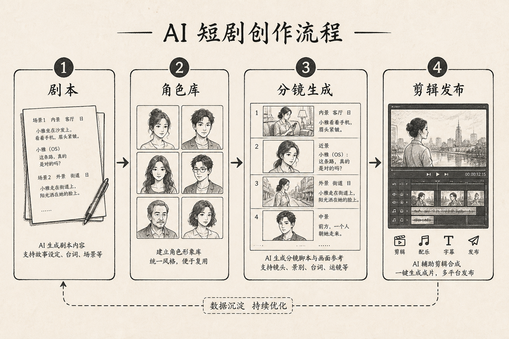

> 知乎版：去文字超链，保留配图。

# 想做 AI 短剧，有哪些平台可选：别看谁功能多，先照着这套框架算你自己的账

> 一句话：短剧平台没有"最强"，只有"最配你这条更新节奏和这点预算的"。选错方向，比选错工具贵得多。

"想做 AI 短剧，有哪些平台可选"——每次有人这么问，我都想先按住他。因为大多数人问这句话的时候，脑子里想的是"给我一个最强的平台名单"，然后照着名单挨个注册、挨个试用，一个月过去了还没做出第一条片。

我想说的第一句话就是：**AI 短剧根本没有"最强平台"这回事。** 有的平台一体化、上手快，但灵活性差、单价高；有的开源自由、成本低，但要你自己动手拼、自己扛硬件。哪个"好"，完全取决于你要更多少、角色多复杂、预算多少、要不要出海。**选平台是一道算账题，不是一道排名题。**

这篇是对我早期那篇工具链文章的重写升级。上一篇我讲的是"用哪几个工具、怎么串"，这篇往前挪一步，讲**在动手之前，你该怎么判断走哪条路线**。因为工具串得再顺，方向选错了，照样白忙。

先摆出三个我要打的错误判断：一是以为"平台功能越多越好"，功能多不等于适合你；二是只看单次生成的标价，不算硬件、学习和返工这些藏在后面的账；三是还没想清楚自己要"日更小短剧"还是"精品连续剧"，就急着注册一堆平台。

---

## 先看一张图：短剧从剧本到成片，到底要跨过哪几关

在谈"选哪条路线"之前，你得先知道一条短剧要经过哪些环节。任何平台，本质上都是在替你解决这条流水线里的某几关：



一条短剧要跨过的关，大致是：剧本拆分 → 角色与视觉定稿 → 逐镜头视频生成 → 跨镜头角色一致性 → 配音 → 精剪收尾 → 发布搬运。

不同的平台方案，区别就在于**它替你包了几关、剩下几关要你自己接**。一体化平台包得多，你省心但少自由；开源栈包得少，你自由但要自己拼。看懂这条流水线，你才知道每种方案到底在替你做什么、又把什么留给了你。

---

## 三条路线：先对号入座，再谈平台

我把市面上的选择归成三条路线。你先看自己是哪一类，再往下看对应的平台组合。

```
你想做的是什么？
   │
   ├─ 剧情简单、要日更、预算极紧
   │      └─►【路线 A：一体化云平台为主】上手快，先把量跑起来
   │
   ├─ 精品连续剧、角色要跨集稳定、要出海双语
   │      └─►【路线 B：定稿 + 主体库 + 开源收尾】质量与一致性优先
   │
   └─ 工作室/长期账号、在意成本与数据主权
          └─►【路线 C：开源工具栈为主 + 云平台补生成】成本可控、资产自有
```

这棵树的核心判断就一句：**你是要先把"量"跑起来，还是要把"质"和"一致性"焊死，或者要把"长期成本和资产主权"攥在自己手里。** 三者很难同时满，先认清自己最在意哪一头。

---

## 路线 A：一体化云平台为主——先让量跑起来

**适合谁：** 剧情简单的口播类、信息流风格短剧；一个人、预算极紧、最迫切的是"先更起来别断"。

**平台特征：** 从生图到生视频到简单剪辑打包在一个界面里，注册即用，不用装环境、不用自备显卡。好处是几乎零上手成本，坏处是单次生成按次计费、越用越贵，而且深度控制有限——你很难精细控制运镜和跨镜头一致性。

**真实体验：** 我带过一个完全没有技术背景的朋友走这条路线。她的目标很朴素：先更满三十条，看看账号能不能起来。一体化平台让她当天就出了第一条，这一点开源栈做不到。但做到第十几条时，问题来了——同一个主角在不同集里脸对不上，画面风格也在飘。到这一步，就该考虑往路线 B 迁了。

**踩的坑：** 别在这条路线上追求精品。一体化平台的强项是快和省心，不是可控和一致。你要是在它身上死磕角色一致性，会既花冤枉钱又达不到效果。

**💡 如果你还没做出过任何一条片：** 老老实实先走路线 A。先用最低摩擦的方式跑通"从想法到成片"的完整体验，建立手感和信心，再谈升级。别一上来就啃开源栈，那是劝退新手的最快方式。

---

## 路线 B：定稿 + 主体库 + 开源收尾——把质量和一致性焊死

**适合谁：** 要做横屏精品、连续剧集、需要跨集角色稳定、甚至要出中英双语版的人。

这条路线的组合是我目前的主力，也是上一篇工具链文章的升级版。它的关键不是"用了哪几个软件"，而是**把最容易返工的一致性问题，用可复用的角色资产提前焊死**。

**组合与各关分工：**

| 环节 | 用什么 | 它解决的核心问题 |
|------|--------|----------------|
| 角色与视觉定稿 | Lovart | 开工前把脸、表情、服装、风格锁成可复用规范 |
| 逐镜头视频生成 | LibTV 节点式工作流 | 可控运镜、可单独重跑某一镜 |
| 跨镜头/跨集一致性 | LibTV 主体库 | 角色注册一次，几十个镜头引用同一张脸 |
| 配音 | VoxCPM | 文字设计音色，跨语种保持同一角色声线 |
| 口播/花絮补料 | Cap | 轻量录屏，快速出正片之外的物料 |
| 精剪收尾 | LosslessCut | 无损切割，去掉预热帧、黑场、AI 味 |

**真实体验：** 这条路线前期重、后期轻。第一集我要花大半天定角色、注册主体库、设计音色，看起来慢。但从第二集起，角色档案和主体库直接沿用，我一集比一集快。做到第五集，单集时间已经压得很低，而且脸和声音在整季里都稳。

**数字：** 我拿两条三分钟的片子做过对比。硬靠提示词凑一致性的那条，后期一致性返工大约吃掉四成工时；先定稿再用主体库锁住的那条，返工降到一成上下。前期多花的那半天，换回的是整季的稳定。

**踩的坑：** 别指望极端镜头也完美。强背光、超远景、大动作这几种情况一致性会掉，遇到就用景别绕过去，别死磕。还有唇形对不上是通病，多用中远景规避，别硬修。

**💡 如果你要做长线连续剧：** 把第一集当成"全季的地基"。角色档案和主体库建得越扎实，后面每一集越省。这条路线的红利是累积的——投入在第一集，回报在后面每一集。

---

## 路线 C：开源工具栈为主——成本可控、资产自有

**适合谁：** 工作室、长期运营的账号、对成本敏感、且在意素材数据不上传第三方的人。

**路线特征：** 生图、配音、剪辑尽量用开源本地方案，只在视频生成这种最吃算力的环节按需借用云平台。好处是长期成本低、版权和数据自主；坏处是要自备显卡、要花时间搭环境、遇到问题得自己排查。

**真实体验：** 我认识的一个小工作室走的就是这条路线。他们的账算得很清：三个人长期做，一体化平台每月的生成费用累起来相当可观，而一台中端显卡的一次性投入，几个月就摊平了。更重要的是客户素材不外传，这是他们接品牌单的硬条件。

**踩的坑：** 别低估学习和运维成本。开源栈省的是订阅费，花的是你的时间。如果你就一个人、还在起步期，这条路线的时间成本可能比省下的钱更贵——那种情况下老老实实走路线 A 或 B。

**💡 如果你是团队长期作战：** 这条路线的账才算得过来。团队能把学习成本摊薄、能把显卡用满，长期下来成本优势明显。单人起步期不建议。

---

## 成本对比：把三条路线的账摊开算

这是选路线时最该看、却最常被跳过的部分。我把单集三分钟短剧的成本拆成三张账来对比。

### 显性成本（单集/月）

| 环节 | 路线 A 一体化云 | 路线 B 定稿+主体库+开源收尾 | 路线 C 开源栈为主 |
|------|----------------|--------------------------|------------------|
| 剧本/分镜 | 平台内置或免费模型 | 免费模型 | 免费/本地模型 |
| 角色与视觉 | 平台按次计费 | Lovart 订阅 | 本地生成（吃显卡） |
| 视频生成 | 按次计费，量大越贵 | LibTV 免费额度/按算力 | 云平台按需借用 |
| 配音 | 平台按次 | VoxCPM 免费（需 GPU） | VoxCPM 本地免费 |
| 剪辑 | 平台内置 | LosslessCut 免费 | LosslessCut 免费 |
| 月成本量级 | 用得越多越高 | 一份订阅 + 少量算力 | 电费 + 一次性硬件摊销 |

### 隐性成本（更该算的一笔）

| 成本类型 | 路线 A | 路线 B | 路线 C |
|---------|--------|--------|--------|
| 上手学习 | 极低 | 中等（要建角色资产流程） | 高（搭环境、排故障） |
| 硬件投入 | 无 | 视频走云，可无显卡 | 需自备中端以上显卡 |
| 一致性返工 | 高（易飘脸） | 低（主体库锁住） | 中（取决于自建方案） |
| 长期费用曲线 | 越用越贵 | 平稳 | 前高后低 |
| 数据/版权自主 | 弱（素材上云） | 中 | 强（可全本地） |

**一句话读懂这两张表：** 路线 A 前期便宜、后期越更越贵，且一致性返工是隐形黑洞；路线 B 用一份订阅换来平稳的成本和低返工，适合大多数认真做的人；路线 C 前期硬件投入大、学习陡，但长期和团队场景下最省、资产最自主。

**别只盯着"单次生成多少钱"这一个数。** 真正决定总账的，是一致性返工率和长期费用曲线这两笔藏在后面的账。

---

## 选型速查：对号入座

| 你的处境 | 走哪条路线 | 关键动作 |
|---------|-----------|---------|
| 没做过任何一条片 | 路线 A | 先用最低摩擦跑通全流程，建手感 |
| 要精品连续剧、角色跨集稳 | 路线 B | 第一集重投入建角色资产 + 主体库 |
| 要出海双语 | 路线 B | 选跨语种保持音色的配音方案 |
| 工作室长期作战、在意成本 | 路线 C | 算清硬件摊销，视频生成按需借云 |
| 素材不能外传 | 路线 C | 尽量本地开源，只在必要处用云 |
| 一个人、预算紧、想做精品 | A 起步，验证后迁 B | 先跑量建信心，再升级到一致性方案 |

---

## 迁移建议：路线不是终身制，是随阶段升级的

最后说个很多人忽略的点：这三条路线不是让你一次选定就绑死。**它是随你的阶段升级的。**

我自己的路径就是这样：起步期走 A，用最低摩擦跑通体验、建立信心；账号有了起色、开始追求角色跨集稳定，就迁到 B，用可复用的角色资产把质量和一致性焊死；等哪天成了长期作战、成本和数据主权变成硬约束，再把重复的生成和剪辑往 C 上沉淀。

每次迁移前，我只做一件事——拿一条真实的片子在新路线上跑一遍试点，用实际耗时和成本说话，而不是看平台官网怎么吹。

**想做 AI 短剧，能选的平台确实很多，但"选哪个"从来不是重点。** 重点是先想清楚你现在要跑量、要一致性、还是要长期低成本，再照着账去挑。会算这笔账的人，做第一条片就走对了方向；不会算的人，注册了一堆平台，还卡在"到底用哪个"的原地打转。

---

## 读者最常问我的几个问题

**问：能不能只用一个平台从头做到尾，别搞这么多环节？**
能，但只在路线 A 成立。一体化平台确实能一站式跑完，代价是你放弃了对运镜和跨镜头一致性的精细控制，而且量一大费用就顶上来。真要做连续剧集，"只用一个平台"迟早会卡在角色对不上脸这一关。我的建议是：起步期可以只用一个，一旦追求质量，就必须把角色定稿和主体库这两关拆出来单独做。

**问：我没有显卡，是不是就只能走一体化云平台？**
不是。路线 B 完全可以做到"视频生成走云、其余环节本地"，配音这类吃显卡的环节即便没有独立显卡，用中端笔记本也能凑合跑。真正需要自备显卡的是路线 C 那种全本地方案。没显卡不该成为你做精品的借口，只是让你在路线 C 上要多掂量。

**问：一致性到底能做到多稳？会不会还是一眼假？**
角色一致性目前能稳定在九成上下，前提是你老老实实先定稿、再用主体库锁住。真正露馅的往往不是脸，而是三个地方：强背光镜头、超远景、大幅度动作。这几种情况一致性会掉，处理办法是用景别绕过去，而不是硬生成。唇形对不上也是通病，多用中远景能明显缓解。

**问：出海双语版，是不是要把整条片重做一遍？**
不用。画面可以复用，真正要换的只有配音和字幕。所以出海的关键不在视频平台，而在配音方案——选一个能跨语种保持同一角色声线的方案，同一个主角说中文和说英文听起来还是同一个人，双语版的成本就只是重配音，而不是重做片。这也是我把出海需求直接归到路线 B 的原因。

**问：预算特别紧，又想做出点质量，怎么办？**
先走路线 A 把量跑起来、验证账号能不能起，别一分钱掰两半地去啃开源栈。等账号有了正反馈、开始有一点收入，再把省下的钱投到路线 B 的角色资产上。顺序错了最伤——一上来就追精品，往往是又费钱又没量，最后两头空。

---

**给执行者的下一动作：**

1. 先判断自己属于三条路线里的哪一类，别急着注册平台。
2. 用一条真实剧本在候选路线上跑一次试点，记录实际耗时和成本。
3. 起步期优先跑量建信心，别一上来追精品把自己劝退。
4. 一旦开始做连续剧集，尽早把角色资产和主体库这一步补上——它是后面所有集的地基。
