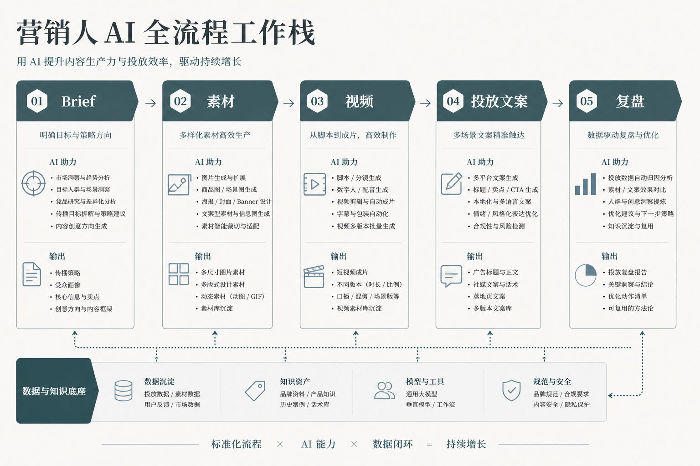

# 营销人的 AI 工具栈：我把从 brief 到复盘的一条投放线，重排成了七个环节

我做增长营销第八年，前四年在甲方做品牌，后四年跳到操盘手的位置，天天盯投放后台。这行最折磨人的不是没创意，是节奏——老板早上拍一个新卖点，下午就要出一批素材上测，晚上还得看数据决定明天加不加预算。以前一个活动从想法到素材上线，我这边最快也要两三天，慢的话一周，等我把物料磨出来，热点早凉了。

去年我把整条投放线拆开重排了一遍。现在同样一个活动，从确定卖点到第一批素材跑进后台，我最快半天就能走完。我先把话说死：这套东西省的不是"想创意"的时间，创意还得人来想；它省的是"从想法到能投的素材"这段搬运工时间，以及"哪条素材值得加钱"这段判断时间。谁把 AI 当成许愿机、指望它替你想策略，谁就会做出一堆好看但不转化的废图。

这篇我要打三个靶子。第一，"素材便宜了，多铺就行"——铺一百条没数据判断的素材，等于烧一百次钱；第二，"投放靠工具、靠爆款模板"——模板给你的是平均分，拉不开差距的恰恰是你对人群和卖点的判断；第三，"AI 一条龙全自动"——真正决定成败的定位、卖点排序、预算分配，全是 AI 现在碰不了的活。

---

## 先说结论：这七个环节各省在哪（总表）

| 环节 | 以前占我多少时间 | 重排后 | 变化来自哪 |
|------|---------------|-------|----------|
| 定位与卖点 brief | 半天到一天，反复扯 | 一两小时定稿 | 固定 brief 模板 + LLM 整理成一页 |
| 视觉素材铺量 | 一张张等设计排期，最卡 | 半天出一批 | 规范锁定后成批出主图/海报 |
| 短视频与口播 | 剪辑外包，来回三天 | 一天出多条 | 脚本模板 + 数字人/配音自动化 |
| 投放文案与变体 | 一条条憋，憋不出量 | 几十条变体一次生 | LLM 按卖点批量出标题与正文 |
| 落地页与承接 | 求前端排期，等一周 | 一两天上线 | 页面模板 + 组件化承接 |
| A/B 与预算分配 | 凭感觉加减预算 | 按数据卡阈值 | 变体规则 + 数据看板 |
| 复盘与迭代 | 事后补个总结 | 当天出结论 | 复盘模板固化，回喂下一轮 |

看懂这张表你会发现：真正被 AI 大幅压缩的是中间四行——素材、视频、文案、落地页这些"产出"环节。头尾三行——定卖点、分预算、做复盘——省的是流程时间，靠的是模板和纪律，不是模型。很多人只盯着"出素材快"，把省下来的时间又全填进"再多铺一批"里，最后素材堆成山，转化率没动，广告费白烧——这就是典型的用手更快，用脑子的地方原地踏步。

---

## 全景：这是一条投放产线，不是一台印钞机



配合上图，我用文字再把这条线走一遍，方便你照着搭：

```
一个卖点 / 一场活动
   │  用 brief 模板逼出人群、场景、忌讳
   ▼
一页投放 brief（LLM 整理，团队确认）
   │  这一步挡掉一半跑偏
   ▼
视觉素材成批出（主图/海报/信息流图）
   │  规范先锁死，再铺量
   ▼
短视频 + 口播脚本（脚本模板 → 剪辑/配音自动化）
   │  一条脚本长出多个平台版本
   ▼
投放文案变体（同卖点几十条标题正文）
   │  留判断权，杀掉自嗨的
   ▼
落地页承接（页面模板 + 组件）
   │  素材点进来有地方接
   ▼
A/B 跑数据 → 按阈值加减预算
   │  数据说话，不靠感觉
   ▼
当天复盘 → 结论回喂下一轮 brief
```

营销操盘手和纯做设计、纯做文案的人最大的区别是：你得对结果负责。图好不好看不重要，转化率涨没涨才重要。AI 能顶掉的是"把想法变成素材"这段搬运活，剩下"想清楚给谁看、说什么、花多少钱"这几件事，一件都替不了。下面我把每一步拆开，讲我踩过的坑。

---

## 第一步：把"老板一句话"翻译成"一页 brief"

### 卡在哪
以前老板甩过来一句"这个新品要主打高端",我就得开始猜：高端给谁看？对标谁？哪些词绝对不能提？猜错方向，后面素材、文案、落地页全跟着错，一整批重来。而这段猜的时间，既不出活也不计功。

### 做法
我做了一份固定投放 brief 模板，只有几个必填空：卖点一句话、目标人群画像、投放平台、竞品参照、绝对忌讳（词/画面/对标对象）、成功的判断指标（是拉新还是转化还是拉回流）。团队七嘴八舌的碎话，我丢给 LLM 整理成一页 brief，回发确认，再动手。

### 关键细节
这页 brief 是整条产线的地基。它把"高端"这种一百种解读的模糊词，逼成"给 30–40 岁一线城市女性、对标某轻奢品牌、忌讳出现价格数字、目标是加粉"这种能执行的边界。以后有人说"这不是我要的",我把 brief 拍出来对——要么执行错了我改，要么当初没写清，那就是新需求，重新排期。

### 我踩的坑
早期我嫌走模板慢，凭一句话就开干。有次给一个国货美妆做母亲节活动，老板说"要温情",我做了一整套暖黄色亲子调，结果人家想要的是"独立女性、不煽情"那种温情。一整批素材加文案全废，活动只剩两天。从那以后我认死理：能填 brief 的绝不靠猜，能确认的绝不靠脑补。

---

## 第二步：视觉素材，规范先锁死再铺量

### 卡在哪
投放最卡的一环，永远是等素材。设计排期永远排不过来，一个信息流广告要十几张不同尺寸、不同卖点角度的图，一张张等，热点等到凉。而自己乱铺，出来的又是"同一张图换个背景色",看着有十张，其实是一张，平台跑起来数据全一个样。

### 做法
卖点定稿后，我先在画布里把这次活动的视觉规范固化下来：主色辅色、字体字重、留白规则、logo 安全区、主图和信息流图的版式模板。规范锁死之后，我用 Lovart 按这套规范一次铺一批真正不同角度的素材——不是换配色，是卖点切入、构图逻辑、情绪都拉开：一版打功效、一版打场景、一版打价格锚点。铺完我只干一件事：按 brief 杀掉跑偏的，留下能上测的。

### 关键细节
这里 Lovart 帮我省时间的地方，不是替我想卖点，是把我已经想清楚的三四个卖点角度，半天内都铺成能直接进后台的成品图。"改一处、看全局"是关键：老板中途说主色再沉一点，我改规范里一个色值，整批素材跟着变，不用一张张回去重抠。想给谁看、突出哪个卖点——这个判断始终攥在我手里，也是投放真正吃饭的本事。

### 我踩的坑
有次赶一个大促，我图快跳过了规范，直接一张张出信息流图。前几张还统一，到第十几张我自己都记不清标题字号了，一批图投出去，用户一眼觉得"这家怎么忽大忽小不像一个品牌"。我回炉重排规范，白搭一天，还耽误了投放窗口。规范这东西前期花两小时定，后面省两天；省那两小时，后面拿两天还。

---

## 第三步：短视频与口播，一条脚本长出多平台版本

### 卡在哪
现在不投短视频等于不投。可短视频最重：找人出镜、拍、剪、配音、加字幕，外包一来一回三天起，改一版又三天。等视频剪好，投放节奏早断了。

### 做法
我先用脚本模板把口播写死结构：三秒钩子、卖点展开、行动号召。脚本用 LLM 按这次 brief 生成多条不同钩子的版本，出镜和配音走数字人加 AI 配音自动化，字幕自动生成。一条核心脚本，我让它长出竖版、横版、不同时长的多个平台版本，而不是每个平台重拍一遍。

### 关键细节
本质是把"重拍"变成"重排"。脚本结构和口播是判断，交给我和 LLM 一起磨；出镜、配音、字幕、多规格这些体力活，交给自动化。这样我一天能出十几条可测的视频，而不是等外包三天出一条。哪个钩子好，让数据说，不是我拍脑袋。

### 我踩的坑
第一次用数字人口播，我贪省事直接套了个默认形象，结果那形象跟我们品牌调性完全不搭，观众评论区全在问"这谁啊"，完播率惨淡。后来我明白：自动化能省的是制作，省不了的是"这个形象、这个语气配不配这个品牌"的判断。这一步偷懒，省下的时间会从数据里加倍还回来。

---

## 第四步：投放文案，批量出变体、留否决权

### 卡在哪
信息流投放要靠量取胜——同一个卖点得有几十条不同角度的标题和正文去测。人工一条条憋，憋到第十条就开始重复自己，根本喂不饱平台的测试量。

### 做法
我把 brief 里的卖点、人群、忌讳喂给 LLM，让它按不同角度批量出标题和正文变体：有的打恐惧、有的打好奇、有的打身份认同、有的直接报价。一次出几十条，我再逐条筛：删掉夸大违规的、删掉自嗨没利益点的、删掉跟品牌调性打架的，留下能投的那批。

### 关键细节
批量生成解决的是"量"，筛选解决的是"质"。判断权必须攥在自己手里——AI 不知道哪句话在你这个行业是违规红线，不知道哪个说法上次已经被平台限流过。它负责把量铺够，我负责把雷排掉。合规这条线，一次都不能外包。

### 我踩的坑
有回我图快，LLM 出的文案我扫了一眼觉得都挺顺，直接批量上了。里面一条用了绝对化用词，被平台判违规，整个计划连坐降权，那天预算基本白烧。从那以后我加了一道死规矩：所有 AI 出的文案，投之前必过一遍违禁词表和平台规则，人工确认，一条都不漏。

---

## 第五步：落地页承接，别让点进来的人流失

### 卡在哪
素材再好，用户点进来落地页加载慢、信息对不上、找不到按钮，前面的钱全打水漂。以前做落地页要排前端，一等一周，活动都结束了页面还没上线。

### 做法
我给常见活动类型建了落地页模板：促销页、留资页、新品预约页各一套，用组件化的方式拼。素材主打什么卖点，落地页第一屏就承接什么，文案、主图、按钮跟广告端保持一致。定稿后一两天就能上线，不用每次从零求排期。

### 关键细节
核心是"广告端说什么，落地页就接什么"。用户是被某个具体卖点吸引点进来的，落地页第一屏必须立刻接住那个卖点，否则他三秒就走。模板解决的是速度，一致性解决的是转化——两者都不能少。

### 我踩的坑
早期我把落地页和广告素材当两件事做，广告打"限时五折",落地页第一屏却是品牌故事，用户点进来找不到那个五折，跳出率高得吓人。后来我把落地页也纳进同一份 brief，广告和落地页用同一套卖点和视觉，跳出立刻降下来。承接这一步断了，前面所有环节都白干。

---

## 第六步：A/B 与预算，让数据替你做加减法

### 卡在哪
一批素材投出去，哪条值得加钱、哪条该关，早期我全凭感觉——看着顺眼的多给点，其实顺眼跟转化没半点关系。凭感觉分预算，等于把钱押在自己的偏好上。

### 做法
我给每次投放定死几个判断阈值：跑够多少曝光再看数据、点击率低于多少直接关、转化成本高于多少不加价。素材按变体规则跑 A/B，到了阈值，该关关、该加加，全按数字来，不掺个人喜好。数据摊在看板上，团队一起看，谁也别替素材"求情"。

### 关键细节
这一步最反人性——你得亲手关掉自己最得意的那条素材，只因为它数据不行。判断标准必须事前定死、白纸黑字，否则一到现场，人总会为自己的作品找借口。预算分配是营销里最贵的判断，恰恰是 AI 帮不上、只能靠纪律的地方。

### 我踩的坑
有条素材是我自己最满意的创意，数据其实一般，我舍不得关，硬加了三天预算，想着"再等等就起量了"。结果三天白烧，钱花在了我的自尊心上。那以后我认一条：素材是拿来测的，不是拿来爱的，阈值到了就砍，感情留给下班以后。

---

## 第七步：复盘当天做，结论回喂下一轮

### 卡在哪
投放跑完，很多人要么不复盘，要么拖到月底补个漂亮总结给老板看。可这种事后总结对下一次毫无帮助——你没记下"哪个卖点角度点击高、哪个人群转化好",下次还得从头猜。

### 做法
我做了一份固定复盘模板：这次哪个卖点跑赢、哪个人群成本最低、哪条素材/文案是黑马、哪些是明显的坑。当天投放一结束就填，填完直接回喂进下一轮的 brief——上次赢的角度这次接着放大，上次的坑这次绕开。

### 关键细节
复盘的价值不在"总结好看",在"能不能让下一轮少走弯路"。当天做，趁数据和记忆都热乎，结论才准。回喂进 brief，整条产线才真正转起来——每一轮都比上一轮更聪明，而不是每次都从零开始猜。

### 我踩的坑
以前我把复盘当成给老板的交差材料，写得花团锦簇，全是"整体表现良好"这种废话，没一条能指导下次。后来我把复盘改成只写给下一个自己看：赢在哪、坑在哪、下次怎么办，三句话说清。难看没关系，有用就行。

---

## 成本对比：这条产线到底省在哪

| 项目 | 纯人工老流程 | 产线 + AI | 说明 |
|------|------------|----------|------|
| 从卖点到 brief | 半天到一天 | 一两小时 | 前提是模板够狠 |
| 一批信息流素材 | 等排期，2–4 天 | 半天成批出 | 没有视觉规范，优势归零 |
| 短视频多平台版本 | 外包 3 天起/条 | 一天多条 | 脚本判断仍靠人 |
| 投放文案变体 | 一条条憋，量不够 | 几十条一次出 | 合规必须人工过 |
| 落地页上线 | 求排期，一周 | 一两天 | 靠模板 + 一致性 |
| 预算分配 | 凭感觉加减 | 按阈值卡 | 靠纪律，不靠模型 |

我得泼一盆冷水：这张表是量级示意，不是投放报价。你投九块九的引流品和投高客单的耐用品，逻辑能差一个数量级。这张表只证明"结构"能省时间，不证明你的投产比该是多少。更要命的是——素材产能提十倍，如果卖点没想清、预算乱分，等于把钱烧得更快。提效的前提，永远是先想清楚给谁看、说什么。

---

## 适合谁 / 不适合谁

**适合：** 一人扛整条投放线的操盘手、缺设计和剪辑排期的中小团队、需要高频出素材做 A/B 的信息流投手。你们的卡点本来就不在"想不想得出创意",而在"素材产能跟不上测试节奏",这套产线正好解你们的困。

**不适合：** 指望"买个工具就自动爆量"的人；不肯写 brief、不肯定阈值、舍不得关自己得意素材的人；以及把 AI 当策略大脑、自己不做人群和卖点判断的人——素材铺得越快，你错得越快。

---

## 如果你是……（对号入座）

**如果你是刚接手投放、还在手忙脚乱的新人：** 别急着追求一天出一百条素材。先把一个活动从 brief 到复盘完整跑通一遍，把每一步的模板、阈值、复盘表沉淀成自己的东西。跑通一次的经验，比盲目铺量强得多。

**如果你是天天加班出素材、投产比却不动的人：** 你的问题多半不在产能，在判断。回头看你上个月关得太晚的素材和没做的复盘，那才是吃掉预算的黑洞。先把阈值和复盘定死，再谈提速。

**如果你是从甲方品牌转投放操盘的人：** 你会画大饼、懂调性，但可能不习惯"数据到了就砍"的冷酷。这套产线里最难的不是工具，是接受素材是拿来测的、不是拿来爱的。

**如果你是天天焦虑"又出新投放黑科技"的人：** 关掉那些推送。你缺的不是又一个新工具，是把一条完整投放线搭起来的耐心。工具三个月换一茬，brief 模板和预算纪律能吃好几年。

---

## 几个常被问的问题，直接答

**"素材便宜了，是不是多铺就能赢？"**
铺量只解决"有没有得测",赢不赢看你有没有想清楚卖点和人群。一百条没判断的素材，等于一百次乱枪，钱烧得比谁都快。

**"这条线里最该先改哪一步？"**
先改 brief 和预算阈值这两头。中间的素材、视频、文案环节 AI 帮你提速最明显，但如果头尾不清——不知道给谁看、不知道何时砍预算——中间提得越快，钱亏得越猛。

**"免费工具够不够用？"**
学习和小规模测试够。但真规模化投放要看商用授权、导出规格和批量协作。我算过账：工具订阅费，几乎永远小于一次违规降权或一次授权纠纷的代价。

---

## 最后一句

营销人的工具栈，从来不是"谁的工具多谁赢",是"谁把从卖点到复盘这条线排得更顺、判断守得更死谁赢"。AI 把你从搬运素材的体力活里解放出来，省下的那口气，你是拿去想清楚给谁看、把预算押在数据上、让每一轮都更聪明，还是拿去无脑多铺一批自嗨素材——这才是提效和烧钱的分水岭。

工具给你的是产能，brief 和预算纪律给你的是活着投下去的命。两个都攥住，明天的你才扛得住更快的节奏。

> 专栏附记：全文不推荐任何一键出图的国民级模板工具；Lovart 只出现在"锁视觉规范 + 成批出投放素材"这一个工作流环节，因为那是它在我这条产线里真正省时间的地方，不是硬打广告。文中耗时与倍数均为量级示意，非投放依据；发布前请自行复核各工具当期价格、商用条款与平台投放规则。
