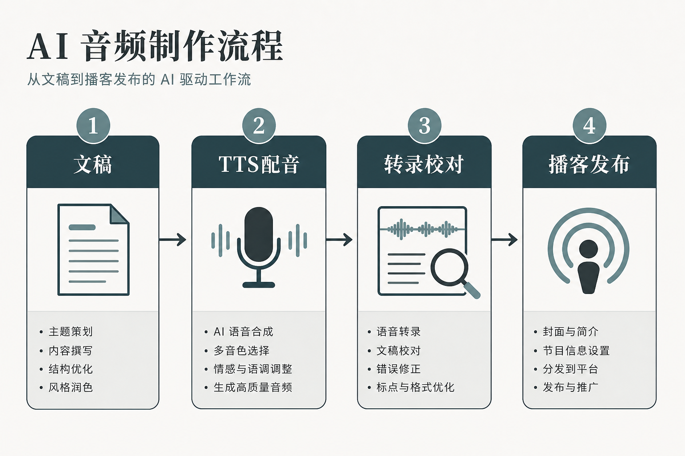

> 百家号版：去链；配图需上传平台。

# 一个人做完一集音频：从文稿、配音到字幕和切片，我终于不再被“录音”卡住

> 不是把一段文字丢进配音工具就算完成。真正能持续更新的 AI 音频流程，得把文稿、声音、校对、字幕和分发当成一件事做。

我以前一直把“做播客”和“做音频口播”归到有闲再做的计划里。不是没选题，也不是不会写，而是每次想到后面那串麻烦就往后拖：录一遍，嫌声音干；再录一遍，发现嘴瓢；剪完才发现字幕把专有名词听错；最后还要从一条长音频里找切片。等这一圈走完，原本新鲜的选题已经不想讲了。

后来我不再追求一次录出完美人声，而是把任务拆成四段：先把“能听懂”的稿子写出来，再生成一个可编辑的声音版本，用转录结果反查口播，最后把同一份内容拆成播客、长视频和短视频口播。AI 在这里不是替我假装成一个电台主播，它更像一个愿意反复工作的后期助理：我负责判断要说什么、哪里停、哪里不该说；它负责把重复劳动压到可控范围。



## 先说结论：别从“选哪个配音工具”开始

很多人一上来就问，哪种 AI 音色最像真人。这个问题不算错，但顺序反了。音色只是最后 20% 的体验，前面 80% 取决于文稿是否适合听、句子有没有节奏、字幕有没有经过人工复核。

我现在的最小流程是：

```text
选题卡 → 口播文稿 → 分段标记 → TTS 试音 → 合成长音频
  ↓                                      ↓
人工听读 ← Whisper 转录校对 ← 音频导出
  ↓
播客完整版 / 横版讲解 / 竖版短切片 / 图文摘要
```

它的重点不在“零人工”。恰恰相反，人工要卡在四个地方：开头 30 秒、数字与人名、情绪转折、最终发布前的字幕。其余事情可以交给工具轮转。

我给自己定了一个很土的标准：一条 8 到 12 分钟的内容，从定稿到能发，最好控制在 90 分钟内；如果要超过两个小时，就说明我把太多修辞和音效塞进去了。对大多数靠周更、日更维持曝光的人来说，稳定产出比“这一期像广播剧”更重要。

> 📷 **配图待补**

## 第一步：把文章改成耳朵能接受的文稿

书面稿可以绕，口播稿不能。读者看到一段复杂长句，眼睛能回看；听众在洗碗、通勤、健身时，错过一个转折就很难追回来。我过去最常犯的错，是把公众号正文原封不动送去配音。成品字字都念对了，听起来却像在朗读一份项目说明。

现在我会先做一次“听读改写”。每段尽量只保留一个意思；把括号、斜杠和连续的并列项拆开；把抽象判断换成具体画面。比如“该方案显著降低了内容制作门槛”这种句子，口播时不如说“以前一条音频卡在录和剪，现在我把时间留给选题和最后十分钟的校对”。后一句不一定更华丽，但耳朵能抓住。

我的文稿里会插三种标记：

- `/` 是短停顿，通常放在转折前后；
- `[重读]` 给真正需要被记住的关键词；
- `[删]` 留给试音后发现多余的句子。

别怕删。写文章时，铺垫常常有价值；做口播时，铺垫超过两句就可能把人听走。尤其是自媒体内容，开头别急着交代自己的完整背景，先让听众知道：这一期替他省掉什么麻烦。

我会用一小段真人试读来检查稿子，哪怕只读前 45 秒。读到必须换气的位置、忍不住重读的位置、自己都想跳过的位置，都会暴露问题。AI 声音不会替你发现“这句话太像文字”，它只会更平静地把问题念完。

## 第二步：TTS 不负责演戏，负责给你一个可修改的底稿

常见 TTS、开源语音合成服务和商业配音平台各有位置。预算紧、需要快速试稿时，我会先用可批量导出的常见 TTS 做粗版；需要更稳定的情绪、品牌固定主播或更细的发音控制，再考虑付费音色服务。不要因为某个样音惊艳，就把它定成整个账号的声音。

我的做法是先选两到三个“候选声”，让它们都读同一段 120 到 180 字的文稿：一段是信息密度高的说明，一段有数字和英文名，一段带有情绪转折。只听欢迎词没有意义，真正容易翻车的是“2026、API、品牌名、引号里的短语”这些地方。

### 我踩过的第一个坑：同一音色，前后像两个人

有一次我把一篇近 3000 字的稿子切成十几段生成。前半段声音沉稳，后半段突然变尖，速度还快了一截。文本没变，听感却像中途换了主播。后来才发现，分段时我给了不同的风格描述，部分段落又重新选了模型版本。单听每一段都不差，拼起来就露馅。

补救方法很朴素：固定音色、模型版本、语速和采样设置；每次先生成一段 20 秒“标尺音频”，后续片段都和它对照；同一集不要为了“防单调”随意换人。单调更容易靠文稿停顿和剪辑解决，声音漂移则会直接伤害信任感。

如果要做系列栏目，我建议建立一张声音卡：音色名称、语速、停顿风格、常见误读词、禁用读法、适用内容类型。它不需要写成复杂规范，十几行就够。你下一周再做同系列内容时，才不会重新从“这个声音好像不错”开始。

> 📷 **配图待补**

## 第三步：别把配音当最终音频，先让它过一次转录

这一步看起来绕：既然文稿是我写的，为什么还要把 AI 配好的音频再转回文字？因为嘴上说出来的内容和屏幕上的原稿不是一回事。TTS 可能把多音字、英文缩写、产品名读错；剪辑时删了一句，字幕还留着；你以为停顿自然，转录结果却暴露出一段没有主谓宾的残句。

Whisper 适合做这里的“第二双眼睛”。我通常把导出的 WAV 或 MP3 再跑一次转录，拿到带时间轴的文本，然后和原稿左右对照。它不必 100% 准确，价值在于快速把可疑位置标出来：罕见人名、数字、英文、带口音的中文、口头连接词，都是优先检查项。

### 第二个坑：错字进字幕，比声音读错更伤人

我有次做行业工具分享，音频里一个产品名称被读得含混，字幕又按同音字识别成了另一个词。音频里听众未必立刻察觉，但短视频画面上的错字非常刺眼。评论区第一个人没有讨论内容，只问“这个工具到底叫什么”。那条内容后来只能改字幕重发。

从那以后，我给字幕校对做了一个固定清单：品牌名、嘉宾名、数字、年份、金额、英文缩写、地名、引用原话。不是全文逐字听三遍，而是把最容易造成误解的东西先拎出来。10 分钟音频，认真校 8 到 15 分钟，通常比删掉重发省得多。

若你采访真人，最好把对方的姓名、职务、机构和专业词整理成词表；若你讲产品，提前把产品名、功能名和读音放进脚本注释。Whisper 是很好的起点，但它不是发布责任人。

## 第四步：用 Podcastfy 做“可听版本”，别拿它替你做选题

Podcastfy 这类文章转播客工具适合什么？适合把已有的研究、教程、长文先变成一个可听的摘要版本，帮助你验证结构是否顺。它尤其适合团队内部：一篇长资料能否用十分钟讲清楚，听一遍比开会讨论半小时更快。

但我不建议把原文直接交给工具，生成后不改就发。文章为了完整，会保留背景、引用和重复解释；播客需要有人带着走。正确的顺序是：先做“问题—结论—证据—下一步”的口播提纲，再让工具协助生成双人讨论式或单人旁白式初稿，最后人工删掉假装自然的寒暄和过度追问。

这里有一个判断：如果一段对话换成任何行业都成立，比如“这确实是一个很有意思的话题”“你刚才提到了一个关键点”，那就删。它听上去像播客，实际上没有信息。

我会把 Podcastfy 当成结构试镜工具，而不是主持人。它能告诉我哪里太长、哪里需要一个追问、哪里适合插入例子；真正决定节目气质的，还是你挑的案例、你愿意承认的犹豫，以及你不愿意迎合的判断。

## 第五步：一条音频，拆成三种发布物

做完一集 10 分钟音频，不要只上传一个音频文件就结束。内容的价值往往在后面才开始释放。我会从同一套已校对的时间轴里拿出三个版本：

1. **播客完整版**：保留完整叙事，适合订阅用户或通勤场景；
2. **横版讲解版**：用重点字幕、章节卡和少量画面，让信息更容易跟上；
3. **竖版短切片**：每段只讲一个明确问题，控制在 30 到 90 秒，前两秒先给结论或冲突。

短切片不是把长音频机械切三段。真正该剪的，是有独立张力的句子：一个踩坑、一条反常识判断、一个前后成本差异。比如“我以为选最像真人的声音就够了，后来发现真正让人出戏的是前后音色不一致”——它本身就能成为一条短视频的开头。

如果画面需要配合品牌物料、封面或章节卡，我会先写清楚视觉要表达什么，再交给 Design Agent 执行。像 Lovart 这样的工具在这里更适合做固定版式的延展：同一栏目保留统一的标题区、色彩和信息层级，而不是每一集重新抽一张“看起来很 AI”的背景图。声音有固定人格，画面也该有。

## 成本账：外包配音并不总是贵，AI 也不等于免费

下面的数字是我按一条约 10 分钟、约 1800 到 2200 字的普通口播做的预算框架，不是市场报价。地区、声音要求、修改次数和商用授权都会改变成本，拿它判断“该走哪条路”比拿它砍价更合适。

| 项目 | 外包真人配音 | AI 配音流程 |
|---|---:|---:|
| 初版声音 | 通常按分钟或项目计费，常见为数百元起 | 订阅或按量计费，试稿边际成本低 |
| 首次交付 | 1—3 天较常见 | 10—30 分钟可得到可听初版 |
| 改一处读法 | 沟通、排期后返录 | 改文本后重生成对应片段 |
| 情绪与即兴 | 擅长，尤其是人物故事与广告表演 | 容易稳定但也容易平 |
| 长期一致性 | 固定配音员可稳定，档期是风险 | 参数固定后更易批量复用 |
| 隐性成本 | 沟通稿、返工轮次、档期 | 选音色、校对字幕、音频拼接 |

所以我不会粗暴地说“AI 比外包便宜”。如果你一年只做两条品牌片，而且需要表演、人物关系和复杂情绪，真人配音很可能更划算，至少不会把制作人拖进无数轮文本调参里。反过来，如果你每周要更新知识口播、课程拆条或节目预告，AI 的优势很明显：不是替掉人，而是把“等人、约档、返录”换成自己能掌控的修改速度。

我的经验是，先用 AI 证明栏目能连续做 8 期，再决定要不要请固定配音员升级。还没跑通选题和节奏时，花大价钱录出一条精致样片，往往只是把焦虑录得更清楚。

## 口播节奏怎么救：别用语速掩盖信息密度

音频最隐蔽的翻车，不是读错，而是让人听累。有的人一发现内容长，就把语速调快；有的人担心单调，就在每个句尾加夸张上扬。两种做法都会让听众疲劳。

我给知识型口播留三个节奏阀门。第一，重要判断前留半拍，让听众知道这句话值得接住；第二，连续出现三个以上名词时，拆成短句并给一个具象例子；第三，每 60 到 90 秒换一次听感，但不必一定换音色，可以是问题、案例、反问、短音乐或一句“这一段你只要记住……”。

还有一个很有效的自测：拿成品在走路时听。如果你走到红绿灯还没听懂这段在讲什么，那不是听众注意力差，是稿子没有给路标。口播是陪伴式信息，不是考试阅读。

## 如果你是自媒体、培训或播客，分别怎么用

### 如果你是自媒体创作者

先选一个固定栏目，不要一口气铺十种声音。适合从“每周一个问题”开始：例如一条工具实测、一条创作复盘、一条行业误区。用同一音色、同一开头格式连续发 4 周，再看完播率和评论里大家卡在哪。短视频切片负责拉新，完整音频负责建立熟悉感。

不建议一开始就做角色扮演式多声部节目。多角色需要更严的音色管理、脚本对话和剪辑节奏，工作量会翻倍，内容价值却未必更高。

### 如果你是培训讲师或知识付费团队

最适合把已经验证过的课件、常见问答和复习资料转成音频。学生不一定会再打开一份 30 页讲义，但可能愿意在路上听 12 分钟回顾。关键是把“课件语言”改成“带路语言”：先说学完能解决什么，再按案例带步骤，最后留一个可执行练习。

不建议用克隆音色替代老师所有核心录制。课程里真正建立信任的部分——经验判断、现场纠偏、关键案例——仍然值得真人出现。AI 更适合做复习音频、预习引导和题目讲解的批量版本。

### 如果你是播客主理人

先用转录和时间轴把后期变轻。嘉宾访谈不需要被 AI 重新配成“完美普通话”，保留人的停顿、笑声和犹豫，反而更有现场感。Whisper 可以帮你快速找高光段、做节目简介和字幕；Podcastfy 可以把一篇背景材料转成编辑预读；TTS 则适合做片头提示、章节导览和临时补录。

不建议为了省事伪造嘉宾声音。除了授权与信任问题，听众对熟悉声音的细节很敏感，一旦发现不对劲，节目多年积累的关系会比省下的录音费更贵。

## 最后：你要建立的是可重复的发布习惯

一条好音频不是声音像人，而是听众听完知道你替他理清了什么。文稿负责观点，TTS 负责可快速修改的发声，Whisper 负责把错误拦在字幕前，Podcastfy 负责测试长内容能否被听懂，视觉工具负责让栏目在不同平台仍然像同一个账号。

我现在最愿意守住的不是某个音色，而是发布前那 20 分钟：听开头、查专名、校字幕、挑三个可切的句子。它们看起来不酷，却决定了你做的是一条被耐心听完的内容，还是一段很快被划走的机器朗读。
