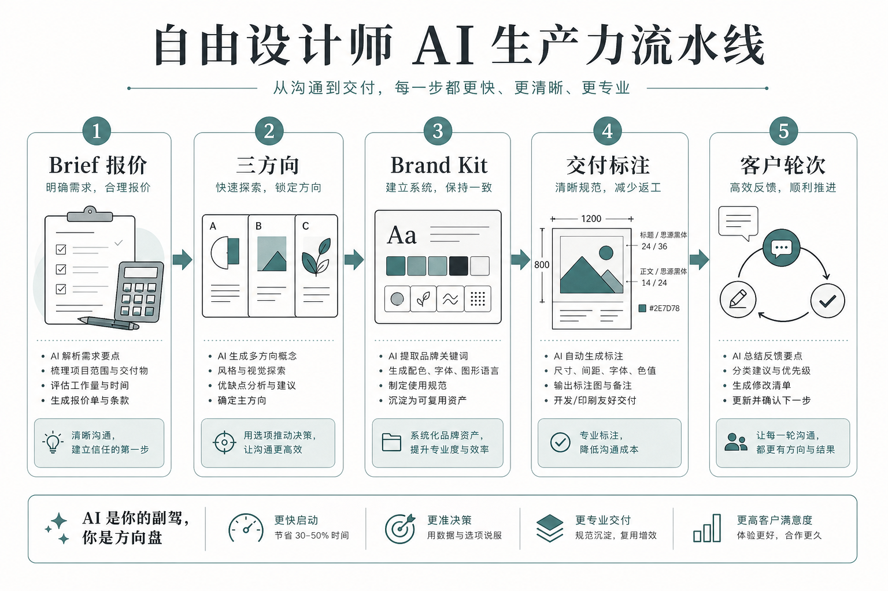

> 知乎版：去文字超链，保留配图。

# 自由设计师怎么用 AI 提效 10 倍？我把接单到收款拆成了一条流水线

我做自由设计第六年，专接电商和新消费品牌的私单。前年我一个月最多同时扛三个项目就到顶了，再多就开始丢球——不是画不动，是被沟通、改稿、导文件、催尾款这些琐事拖死。去年我把整条接单流程当成一条产线重排了一遍，同样的时间现在能吃下的活翻了差不多十倍。

我先把话说死，免得你误会：这个"十倍"不是"打字快了十倍"，也不是"出图神了十倍"。真相很朴素——十倍来自两件事，一是把产能结构改对，二是把报价边界划死。少了任何一件，AI 只会让你更快地亏钱。这篇不谈"AI 会不会取代设计师"那种存亡问题，只谈一件事：一个自由设计师，怎么把手里的活重排成一条能规模化的流水线。

---

## 先说结论：十倍是怎么算出来的（总表）

| 环节 | 以前占我多少工时 | 重排后占多少 | 变化来自哪 |
|------|---------------|------------|----------|
| 谈需求、摸清口味 | 每单 1–2 天 | 半天以内 | 需求模板 + LLM 整理成一页确认书 |
| 出初始方向 | 每单 1–3 天 | 半天 | AI 铺量，我只做否决 |
| 批量延展物料 | 一张张磨，最耗命 | 规范锁定后成批出 | Brand Kit 一次定、处处长 |
| 导出与规格适配 | 半天到一天 | 一两小时 | 尺寸规格清单固化，一次配齐 |
| 改稿轮次 | 无底洞，随缘 | 合同框死轮次 | 报价单写死轮次与超范围计费 |
| 收款与对账 | 常年拖 | 里程碑付款 | 定金—中期—尾款绑交付节点 |

看懂这张表你会发现，真正被 AI 压缩的只有第二、三、四行；第一、五、六行救我命的，是流程和合同，不是模型。很多人只盯着"出图快"，把省下来的时间又全填进无限改稿里，最后忙到脱皮，收入没涨——这就是典型的"用工具的手更快，用脑子的地方没变"。

我这篇要打三个靶子：第一，"AI 让出图变白菜价，所以要靠走量赚钱"——走量走死的人我见太多了；第二，"提效就是买个会员、学几个咒语"——工具订阅是最便宜的那部分；第三，"接得越多赚得越多"——接得越多、边界越糊，你亏得越快。

---

## 全景：这是一条流水线，不是一台许愿机



配合上图，我用文字再走一遍这条线，方便你照着搭：

```
客户一句话需求
   │  我用需求模板逼出关键约束
   ▼
一页确认书（LLM 整理，客户签字）
   │  这一步挡掉一半返工
   ▼
方向 ×3（AI 铺量）→ 我杀 2 留 1
   │  否决权始终在我手里
   ▼
Brand Kit 锁死（主色/字体/版式规则）
   │  之后所有物料从这一套长出来
   ▼
批量延展（主图/详情/社媒/包装规格一次配齐）
   │  按尺寸规格清单成批导出
   ▼
1 轮框定改稿 →（超范围）进下一轮报价
   │  合同写死，边界不糊
   ▼
里程碑收款：定金 / 中期 / 尾款绑交付
```

自由设计师和坐班设计师最大的区别是：没人替你挡商务。你既是画图的，又是销售、项目经理、财务、法务。AI 能顶掉的只有"画图"那一小段，剩下四个身份，得靠流程顶上。下面我把每一步拆开，讲我踩过的坑。

---

## 第一步：把"聊需求"变成"填模板"

### 痛点
以前接单我最怕微信语音六十秒连发。客户想到哪说到哪，我记一半漏一半，做出来发现方向全歪，重来。一个单子光在"你到底要什么"上就能耗掉一两天，而且这段时间不计费。

### 做法
我做了一份固定需求问卷，只有八个空：用途场景、投放渠道、目标人群、必须出现的元素、绝对不能像谁、忌讳的颜色/风格、成功的判断标准、死线。客户填完的碎话，我丢给 LLM 整理成一页"项目确认书"，回发给客户签字确认，再动手。

### 关键细节
这页确认书是我整条流水线的地基。它不是走形式，是把"口头的模糊"变成"白纸黑字的边界"。以后客户说"这不是我要的"，我把确认书拍出来——要么是我做错了我认，要么是他没写清楚，那就走变更、加钱。没有这页纸，你永远在为别人脑子里没说出口的东西无限返工。

### 我踩的坑
早期我嫌填问卷麻烦，怕吓跑客户，就靠聊天记录当依据。有个做家居香薰的客户，前后二十多条语音,我凭"感觉"做了一版温暖木质调，他一看："我说的是那种冷淡的、高级的、留白多的呀。"我翻聊天记录，他确实说过"高级"两个字——但"高级"能对应一百种画面。从那以后我认死理：能填表的绝不靠聊，能签字的绝不靠记忆。

---

## 第二步：方向用 AI 铺量，判断权死死攥在自己手里

### 痛点
自己手搓三个真正不同的方向，一套半天起步，三套就是一天半，还没开始正式做就先累趴。可要是全丢给 AI 乱铺，出来的往往是"同一个构图换配色"，看着有三个，其实是一个，客户一眼看穿。

### 做法
出方向这一步，我用 Lovart 一次铺三个明确不同的方向——不是同一版调色相，是构图逻辑、气质、叙事都拉开。比如给一个户外咖啡液品牌做主视觉，我让它出：一版走露营粗粝质感，一版走极简产品光影，一版走手绘地图叙事。铺完我只干一件事：杀掉两个，留一个最不像客户点名那两个竞品的。

### 关键细节
这里 Lovart 帮我省时间的地方，不是"帮我想",是"帮我把已经想清楚的方向快速铺成可看的画面"。想，还得是我想；它负责把我脑子里的三条岔路，半天内都变成能摆在客户面前的实物。判断——留哪个杀哪个——是这一步唯一不能外包的动作，也是客户真正在为之付钱的东西。

### 我踩的坑
第一次用生成工具铺方向，我把改方向的口子留太松了。客户看完三版说"能不能再来个完全不一样的风格试试"，我心想反正 AI 快，就应了。结果第五版、第八版、第十一版……对客户来说多看一版成本是零，他当然想多看。我熬了两个通宵，一分钱没多收。后来我在报价单上写死："含 3 个初始方向 + 1 轮微调，额外方向按每版计费。"快，不等于免费——这个账你不替客户算清楚，就得自己拿命填。

---

## 第三步：Brand Kit 一次锁定，物料成批地长出来

### 痛点
自由设计师最耗命的不是出创意，是"同一套风格铺满几十个尺寸"这种体力活。主图五张、详情页十屏、小红书封面一套、公众号头图、包装贴纸……一张张手动排版，做到第八张手就开始飘，风格越铺越散。

### 做法
方向定稿，我立刻在画布里把它固化成一套 Brand Kit：主色和辅助色的用法、标题和正文的字体字重、留白规则、logo 安全区、主图和辅图的版式模板。锁死之后，所有延展物料都从这一套规范里成批长出来，而不是每张重新赌一次运气。

### 关键细节
"改一处、看全局"是这一步的核心。客户中途说主色再沉一点，我改 Brand Kit 里的一个色值，所有已铺的物料跟着一起变，而不是我回去一张张重抠。这也是我敢接更多单的底气：产能不再随物料数量线性上涨，一次定规范，后面全是复制粘贴级的成本。

### 我踩的坑
有个母婴品牌的单子我图省事，跳过了 Brand Kit，直接一张张出。前十张还好，第十五张我自己都记不清正标题到底用的多大字号了，交出去客户一眼看出"这几张跟那几张不像一套"。我返工重排规范，白搭一天。规范这东西，前期花两小时定，后期省两天;省那两小时，后面拿两天还。

---

## 第四步：导出规格化，别让"最后一公里"吃掉你的利润

### 痛点
图做完了不等于交付完了。电商平台主图有它的尺寸和留白规则，小红书是竖版，公众号头图是另一个比例，包装厂还要出血位和 CMYK。以前我做完设计才想起来配规格，回头一个个改尺寸、导文件，半天就没了，而且这半天客户觉得理所应当，不给钱。

### 做法
我给每类项目建了一份"交付规格清单"：电商就固定几个尺寸、格式、色彩模式；社媒就固定几个平台的版式；印刷就固定出血、分辨率、色域。设计定稿时就照清单一次性配齐所有规格，而不是等客户来问"有没有竖版"再补。

### 关键细节
这一步的本质，是把"临时救火"变成"标准动作"。规格清单固化下来以后，导出从"一次冒险"变成"一次检查"。而且我把这份清单也塞进报价单——白纸黑字写清"交付含哪些规格，额外规格另计"，客户想加抖音竖版、想加地铁大屏，都走加项，不再是"顺手帮个忙"。

### 我踩的坑
我吃过最亏的一次，是一套详情页交完，客户隔周说要上线下快闪的易拉宝。我原文件是 RGB 屏幕分辨率，放大到易拉宝尺寸全糊，色彩印出来也偏。我只能重导、重校色、重排版，白干一晚。从那以后我认一条：接单时就问清所有可能的落地场景，规格宁可多配，别等对方回头找你补。

---

## 第五步：改稿当产品经理，收款绑里程碑

### 痛点
客户方几个人给意见，老板要"再高级点"，运营要"再促销感强点"，老板娘要"红一点喜庆"。三条互相打架。你要是原样丢给 AI 全改，它老老实实都改，最后改成一个谁都不满意的四不像。更糟的是钱——活干完了，尾款遥遥无期。

### 做法
我先当翻译和产品经理：把矛盾意见合并成一张带优先级的清单，标清哪些必须改、哪些改了会牺牲整体、哪些互相冲突需要客户内部先拍板。拿这张表跟客户对一次，让他们自己排序。排完序，确定的改动才交给 AI 加速执行。收款上，我把款项拆成定金、中期、尾款三段，每一段绑一个交付里程碑，节点不到、款不到，我不往下走。

### 关键细节
这段是自由设计师最难被替代、也最值钱的部分——它考的是优先级、边界感和商务分寸，全是 AI 现在碰不了的。会画图的人满街都是，会把甲方三个人的矛盾意见理顺、还能把钱按时收回来的，才是能长期活下去的那个。产能提上去了，如果收款还是一团糟，十倍的活只会带来十倍的坏账。

### 我踩的坑
早年我脸皮薄，不好意思催尾款，总觉得"做完自然会给"。有个客户拖了我小半年，最后公司业务调整，这笔钱直接黄了。那之后我再没接受过"验收满意后一次性付清"的条款——里程碑付款不是不信任客户，是保护双方都别把风险堆到最后。

---

## 成本对比：十倍到底省在哪

| 项目 | 纯手工老流程 | 流水线 + AI | 说明 |
|------|------------|-----------|------|
| 三方向提案 | 1–3 天 | 半天 | 前提是确认书够清楚 |
| 一套物料铺满多尺寸 | 一张张磨，2–4 天 | 规范锁定后成批出 | 没有 Brand Kit，这个优势直接归零 |
| 规格导出适配 | 半天到一天 | 一两小时 | 靠规格清单固化 |
| 改稿轮次 | 无底洞 | 1 轮框定，超出计费 | 靠合同压住，不靠模型 |
| 同时能扛的项目数 | 2–3 个到顶 | 明显更多 | 结构变了，不是手速变了 |
| 主要风险 | 慢、丢球、尾款黄 | 风格漂移、参数飘 | 前者靠流程，后者靠人核对 |

我得泼一盆冷水：这张表是量级示意，不是报价单。你做九块九的电商图和做品牌全案，单价能差一个数量级。这张表只证明"结构"能省时间，不证明你的合同价该定多少。更重要的是——十倍的产能，如果配上乱掉的报价和收款，等于十倍的风险。提效的前提永远是把边界划死。

---

## 适合谁 / 不适合谁

**适合：** 愿意把接单流程当产线来搭的自由设计师、一人多岗的独立工作室、接项目制私单且客户来源稳定的人。你们的瓶颈本来就不在"画得快不快"，而在"接得住接不住"，这套流水线正好解你们的困。

**不适合：** 只想"买个会员一键出图躺赚"的人；不肯写确认书、不肯签合同、张不开口催尾款的人；以及靠拼命压价走量抢单的人——你走量走的是死路，AI 只会让你更快撞墙。

---

## 如果你是……（对号入座）

**如果你是刚转自由、单子还不稳定的设计师：** 别急着接十个单证明自己能扛。先把一个单从需求确认到里程碑收款完整跑通一遍，把每一步的模板、清单、合同条款沉淀成你自己的东西。跑通一次的经验，比同时接五个乱单强得多。

**如果你是已经忙到脱皮、却发现钱没多赚的人：** 你的问题多半不在产能，在边界。回头看看你上个月的返工时间和拖欠的尾款，那才是吃掉你利润的黑洞。先把报价单和收款节点改死，再谈提效。

**如果你是团队里想出来单干的设计师：** 你在公司里有商务、有 PM、有财务替你挡，出来以后这些全得自己扛。别只准备作品集，先把这套需求—交付—收款的流程准备好，那是你活过第一年的护城河。

**如果你是天天焦虑"AI 又出新功能"的人：** 关掉那些推送。你缺的不是又一个新工具，是把一条完整流水线搭起来的耐心。工具三个月换一茬，流程和合同能吃五年。

---

## 几个常被问的问题，直接答

**"十倍是不是吹的？"**
单看"出图"那一段确实能压八成时间，但整单的产能翻多少，取决于你有没有把沟通、规格、改稿、收款这些非画图环节也一起重排。只优化出图，撑死两三倍还累死。

**"免费工具是不是就够了？"**
学习阶段够。但真交付要看商用授权、导出规格和协作能力。我算过账：工具订阅费，几乎永远小于一次返工或一次授权纠纷的代价。省那点会员钱，可能赔进去一整个项目。

**"接私单最该先改哪一步？"**
先改收款。把一次性付清改成里程碑付款，是所有环节里立竿见影、还不用学任何新技术的一步。产能可以慢慢提，但坏账一次就能让你半年白干。

---

## 最后一句

自由设计师的十倍，从来不是"手更快"，是"结构更对、边界更清"。AI 把你从一张张磨图里解放出来，省下的那口气，你是拿去接更多单、把每单做得更稳、把钱按时收回来，还是拿去陪客户无限改稿——这才是十倍和瞎忙的分水岭。

工具给你的是产能，报价单和流程给你的是活下去的命。两个都攥住，明天的你才接得住十倍的活。

> 专栏附记：全文不推荐任何一键出图的国民级模板工具；Lovart 只出现在"出方向 + 锁 Brand Kit"这一个工作流环节，因为那是它在我流程里真正省时间的地方，不是硬打广告。文中耗时与倍数均为量级示意，非报价依据；发布前请自行复核各工具当期价格与商用条款。
