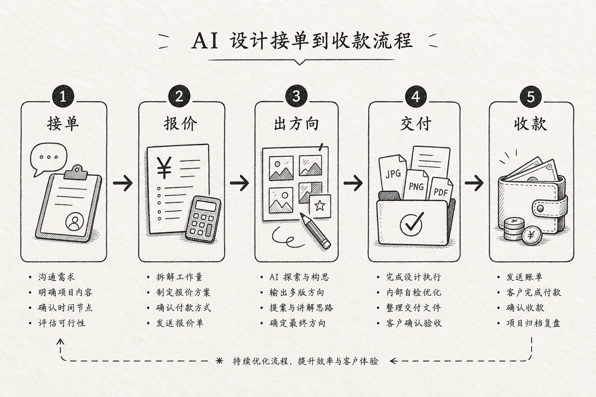

> 百家号版：去链；配图需上传平台。

# 用 AI 设计工具赚钱：我把"接单—报价—交付—收款"这条线跑通后，才敢说这不是躺赚

我用 AI 设计工具接单第三年了。一开始也是被那种"月入五万、每天躺着出图"的帖子勾进来的，真下场才发现：出图快只是开始，能不能把钱稳稳收回来，才是这门副业活不活得下去的分水岭。头半年我出图神速，接单也不少，可月底一算，返工、扯皮、拖尾款把利润吃得干干净净，比上班还累。

我先把话说死，省得你误会：这篇不教你"怎么白嫖工具躺着赚",因为根本没有躺赚。AI 让"出图"这一段变便宜了，但真正决定你赚不赚钱的，是接单前把品类和报价划清楚、交付时把规格和轮次框死、收款时把节点绑住。少了这三样，出图再快，你只是在更快地接一堆亏本单。

这篇我要打三个靶子。第一，"AI 出图白菜价，靠走量薄利多销"——走量走死的人我见太多，量越大、边界越糊，你亏得越快；第二，"接单就是发几张作品图等人下单"——不谈品类、不谈报价规则的接单，全是坑；第三，"AI 全自动交付,躺着收钱"——沟通、报价、催款这些最值钱的活，AI 一件都替不了。

---

## 先说结论：赚钱这条线卡在哪、省在哪（总表）

| 环节 | 新手常见做法 | 跑通后的做法 | 差别来自哪 |
|------|------------|------------|----------|
| 选品类接单 | 什么单都接 | 只接自己能标准化的几类 | 品类聚焦，报价才立得住 |
| 报价 | 拍脑袋、比别人低 | 按工作量 + 轮次 + 授权定价 | 报价单写死规则 |
| 需求确认 | 靠聊天记录 | 一页确认书客户签字 | 需求模板挡返工 |
| 出图产出 | 一张张磨 | 规范锁定后成批出 | AI 真正省时间的一段 |
| 改稿 | 无限改，随缘 | 合同框死轮次 | 超范围计费 |
| 交付规格 | 客户问了才补 | 清单一次配齐 | 规格清单固化 |
| 收款 | 完工后一次性付 | 里程碑分段收 | 定金—中期—尾款绑节点 |

看懂这张表你会发现：真正被 AI 压缩时间的只有"出图产出"这一行；其余六行救你命的，全是接单前后的规则和纪律。新手最大的误区，就是把全部注意力押在"出图快"上，以为出得快就赚得多——结果快出来的那点时间，全被没边界的改稿、收不回的尾款吃光。出图是这门生意里最不缺人干、也最容易被压价的一段；真正让你赚到钱的，是那六行别人懒得做的脏活。

---

## 全景：这是一条生意线，不是一台印钞机



配合上图，我把这条线用文字走一遍，方便你照着搭：

```
选定能标准化的接单品类
   │  只接自己能批量交付的活
   ▼
报价单写死（工作量 / 轮次 / 授权 / 加项）
   │  报价规则先于接单
   ▼
一页需求确认书（客户签字）
   │  这一步挡掉一半返工
   ▼
规范锁定 → AI 成批出图
   │  出图是唯一被大幅提速的环节
   ▼
1 轮框定改稿 →（超范围）另计费
   │  合同压边界，不靠人情
   ▼
交付规格一次配齐（尺寸/格式/授权文件）
   │  按规格清单交付
   ▼
里程碑收款：定金 / 中期 / 尾款绑节点
   │  钱到节点才往下走
```

用 AI 接单赚钱，和坐班做设计最大的区别是：没人替你挡商务。你既画图，又是销售、客服、项目经理、财务、法务。AI 能顶的只有"画图"那一小段，剩下五个身份，全得靠规则和纪律顶上。下面我把每一步拆开，讲我踩过的坑。

---

## 第一步：只接你能标准化的品类

### 卡在哪
新手总觉得"什么单都能接才赚得多",结果 logo、详情页、插画、PPT、包装什么都接，每类都要重新摸规范、重新试工具，一个都做不精，报价还立不住——客户一压价你就慌，因为你自己都不知道这活到底值多少工时。

### 做法
我只接三类我能标准化的活：电商主图与详情页、社媒配图套图、活动海报。这三类需求稳定、规范清晰、能批量交付。别的活再诱人我也转介绍出去。品类一聚焦，我对每类的工时、难点、报价心里就有了准数，客户压价我也不虚。

### 关键细节
聚焦不是把路走窄，是把报价立稳。只有你反复做同一类活，才能算清"这活我要花几小时、该收多少钱、哪里最容易返工"。什么都接的人，永远在给每个新品类交学费，赚的钱全填进试错里。

### 我踩的坑
早期我接过一个我从没做过的品牌 VI 全案，觉得单价高、诱人。结果光是摸清 VI 的规范和交付标准就耗了我一周，还因为不熟出了两次错，客户不满意，最后单价虽高，摊到工时上比我做电商图还亏。从那以后我认死理：不熟的品类宁可转出去赚个介绍费，也不碰。

---

## 第二步：报价单先于接单写死

### 卡在哪
新手报价基本靠两招：拍脑袋，或比别人报得低。低价抢来的单，客户默认你便宜就该无限改，你越做越亏；拍脑袋报的价，遇到复杂需求根本 cover 不住工时。钱这一头一开始就糊，后面全乱。

### 做法
我做了一份标准报价单，把规则全写死：基础价含几张图、几个方向、几轮修改；超出的方向、超出的修改轮次、加急、额外规格、商用授权，全部逐项标价。接单前先把这份报价单发给客户，谈拢了才动手。价格可以谈，规则不能省。

### 关键细节
报价单真正的作用不是"标个数字",是"把边界写成白纸黑字"。客户后面想多要一版、想加个尺寸、想改第五轮，我都能指着报价单说"这是加项"。没有这张纸，所有额外要求都会变成"顺手帮个忙",而顺手的忙加起来，就是你亏掉的利润。

### 我踩的坑
第一个大单我为了抢下来，报了个远低于工时的价，还没写任何轮次限制。客户拿捏住我便宜，前后改了七八轮，每次都说"就一点点小改"。我熬了半个月，算下来时薪还不如打零工。那之后我再没为抢单牺牲报价规则——低价换来的从来不是好客户，是无底洞。

---

## 第三步：需求确认书，把口头模糊变成签字边界

### 卡在哪
客户想到哪说到哪，微信语音连环发，我记一半漏一半，做出来方向全歪，重来。一个单光在"你到底要什么"上就耗掉一两天，还不计费。

### 做法
我做了份固定需求问卷，只有几个空：用途场景、投放渠道、目标人群、必须出现的元素、绝对不能像谁、忌讳的颜色风格、验收标准、死线。客户填完的碎话，我用 LLM 整理成一页确认书，回发签字，再动手。

### 关键细节
这页确认书是整条线的地基。它把"我要高级一点"这种一百种解读的话，逼成能执行、能对照的边界。以后客户说"这不是我要的",我把确认书拍出来对——要么我做错我认，要么他当初没写清，那走变更、加钱。没这页纸，你永远在为别人没说出口的想法无限返工。

### 我踩的坑
早期我嫌填表麻烦怕吓跑客户，靠聊天记录当依据。有个做家居的客户前后二十多条语音，我凭感觉做了套暖木质调，他一看"我要的是冷淡、留白多的高级感"。翻记录他确实说过"高级",但高级能对应一百种画面。从那以后我认死理：能填表的绝不靠聊，能签字的绝不靠记忆。

---

## 第四步：规范锁定后，AI 成批出图

### 卡在哪
这一步才是 AI 真正帮上忙的地方，但也最容易被用错。乱铺出来的常是"同一构图换配色",看着一堆其实一个；而一张张手动磨又慢得要命，接单量根本上不去。

### 做法
需求定稿，我先在画布里把这单的规范固化成一套 Brand Kit：主色辅色、字体字重、留白、logo 安全区、主图辅图版式。锁死之后，我用 Lovart 按这套规范成批出图和延展物料，而不是每张重新赌运气。出方向时我也让它一次铺几个真正不同的角度，我只干一件事：按确认书杀掉跑偏的，留下能交的。

### 关键细节
这里 Lovart 帮我省时间的地方，不是替我想创意，是把我已经想清楚的方向和规范，快速铺成成批的成品。"改一处、看全局"是核心：客户中途说主色再沉点，我改规范里一个色值，整批物料跟着变，不用一张张回去重抠。判断——留哪个杀哪个——始终在我手里，也是客户真正在为之付钱的东西。

### 我踩的坑
有个母婴单我图省事跳过规范直接一张张出，前十张还好，第十五张我自己都记不清正标题字号了，交出去客户一眼看出"这几张跟那几张不像一套"。我返工重排规范，白搭一天。规范这东西前期花两小时定，后面省两天；省那两小时，后面拿两天还。

---

## 第五步：改稿框死轮次，超范围就计费

### 卡在哪
"就改一点点"是这门生意里最贵的四个字。AI 出图快，客户会觉得"反正你改起来也快",于是第五版、第八版、第十一版……对他成本是零，他当然想多看。你熬通宵改，一分钱不多收。

### 做法
我在报价单里写死："含 N 版方向 + M 轮修改，超出按版/按轮计费。"每次改稿前，我把客户零散的意见合并成一张带优先级的清单，标清哪些必须改、哪些改了伤整体、哪些互相冲突要他们内部先拍板。确定的改动才交给 AI 加速执行，改完这轮就交付，想再改就进下一轮报价。

### 关键细节
快，不等于免费——这个账你不替客户算清，就得自己拿命填。合同框死轮次，不是不近人情，是保护双方都别把改稿拖成无底洞。会把甲方几个人的矛盾意见理顺、还能把边界守住的人，才是能长期接单活下去的那个。

### 我踩的坑
第一次用生成工具铺方向，我把口子留太松。客户看完说"再来个完全不一样的风格试试",我想反正 AI 快就应了，结果一路加版加到十几版，一分钱没多收，还熬了两个通宵。后来我把额外方向和轮次全写进报价单，边界立刻清了。

---

## 第六步：交付规格一次配齐，别让最后一公里吃利润

### 卡在哪
图做完不等于交付完。电商主图有尺寸和留白规则，社媒是竖版，公众号头图另一个比例，印刷还要出血位和 CMYK。做完才想起配规格，回头一个个改尺寸导文件，半天没了，客户还觉得理所应当不给钱。

### 做法
我给每类项目建了份交付规格清单：电商固定几个尺寸格式色彩模式，社媒固定几个平台版式，印刷固定出血分辨率色域。定稿时就照清单一次性配齐，而不是等客户问"有没有竖版"再补。这份清单我也塞进报价单，写清"含哪些规格，额外规格另计"。

### 关键细节
本质是把"临时救火"变成"标准动作"。规格清单固化后，导出从一次冒险变成一次检查。客户想加抖音竖版、想加线下物料，都走加项，不再是"顺手帮忙"。这一步做实，交付才干净利落，利润才不被最后一公里啃掉。

### 我踩的坑
我吃过最亏的一次，是详情页交完客户隔周说要做线下易拉宝，我原文件是 RGB 屏幕分辨率，放大全糊、色彩印出来也偏，只能重导重校色，白干一晚。从那以后接单时我就问清所有可能的落地场景，规格宁可多配，别等对方回头找补。

---

## 第七步：里程碑收款，钱到节点才往下走

### 卡在哪
新手最要命的一关：脸皮薄不好意思催款，接受"验收满意后一次性付清"。结果活干完了，尾款遥遥无期，客户一句"最近手头紧"就能把你拖半年，公司业务一变这笔钱直接黄。

### 做法
我把款项拆成定金、中期、尾款三段，每段绑一个交付里程碑：定金到位才开工，方向定稿收中期款，终稿交付收尾款。节点不到、款不到，我不往下走。这条写进合同，接单时就说清楚。

### 关键细节
里程碑付款不是不信任客户，是保护双方都别把风险堆到最后。产能提上去了，如果收款还是一团糟，接十倍的单只会带来十倍的坏账。会画图的满街都是，能把钱按节点稳稳收回来的，才是能把这门副业做长久的人。

### 我踩的坑
早年我脸皮薄不催尾款，总觉得"做完自然会给"。有个客户拖了小半年，最后公司业务调整，这笔钱直接黄了。那之后我再没接受过"完工一次性付清"——收款节点是这门生意的安全带，出事前你不会觉得它重要，出事时它救你的命。

---

## 成本对比：这条线到底省在哪、赚在哪

| 项目 | 新手乱接单 | 跑通产线 | 说明 |
|------|----------|---------|------|
| 接单前评估 | 什么都接、现学现卖 | 只接标准化品类 | 报价才立得住 |
| 报价 | 拍脑袋/低价抢 | 按规则写死 | 边界靠合同 |
| 出图产出 | 一张张磨 | 规范锁定后成批出 | AI 唯一大幅提速处 |
| 改稿 | 无限改、白干 | 1 轮框定，超出计费 | 靠合同，不靠模型 |
| 交付规格 | 客户问了才补 | 清单一次配齐 | 靠规格清单固化 |
| 收款 | 完工一次付、常拖黄 | 里程碑分段 | 立竿见影、不用学新技术 |

我得泼一盆冷水：这张表是量级示意，不是报价单。你做九块九的电商图和做品牌全案，单价差一个数量级。这张表只证明"结构"能让你赚得稳，不证明你的单价该定多少。更要命的是——出图产能提十倍，如果配上乱掉的报价和收款，等于十倍的坏账风险。赚钱的前提，永远是先把品类、报价、收款这三条边界划死。

---

## 适合谁 / 不适合谁

**适合：** 愿意把接单当生意来经营的设计爱好者、想做稳定副业而非一夜暴富的上班族、能沉下心把一类活做标准化的人。你们的卡点本来就不在"画得快不快",而在"接得住、收得回",这套线正好解你们的困。

**不适合：** 只想"买个会员一键出图躺赚"的人；不肯写报价单、不肯签合同、张不开口催尾款的人；以及靠拼命压价走量抢单的人——你走量走的是死路，AI 只会让你更快撞墙。接单赚钱从来是门生意，不是彩票。

---

## 如果你是……（对号入座）

**如果你是刚想用 AI 接单、还没开过张的人：** 别急着接十个单证明自己。先选一个你能标准化的品类，把报价单、需求确认书、里程碑条款准备好，再去接第一单，从头到尾完整跑通一遍。跑通一次的经验，比盲目接五个乱单值钱得多。

**如果你是接了不少单、却发现没赚到钱的人：** 你的问题多半不在出图，在边界。回头看你上个月的返工时间和拖着的尾款，那才是吃掉利润的黑洞。先把报价单和收款节点改死，再谈接更多单。

**如果你是想从上班族转全职接单的人：** 你在公司有商务、有 PM、有财务替你挡，出来后这些全得自己扛。别只准备作品集，先把这套接单—交付—收款的规则准备好，那是你熬过头一年的护城河。

**如果你是天天焦虑"AI 又出新功能、怕被淘汰"的人：** 关掉那些推送。你缺的不是又一个新工具，是把一条完整生意线搭起来的耐心。工具三个月换一茬，报价单和收款规则能吃好几年。

---

## 几个常被问的问题，直接答

**"用 AI 接单是不是能躺赚？"**
不能。AI 让出图这一段变便宜，但接单、报价、沟通、催款这些活一样也少不了，而且恰恰是这些决定你赚不赚钱。谁跟你说躺赚，谁多半是在卖课。

**"最该先改哪一步？"**
先改收款。把完工一次性付清改成里程碑付款，是所有环节里立竿见影、还不用学任何新技术的一步。产能可以慢慢提，但一笔坏账就能让你半年白干。

**"免费工具够不够接单？"**
练手够。但真交付要看商用授权、导出规格和协作能力。我算过账：工具订阅费，几乎永远小于一次返工或一次授权纠纷的代价。省那点会员钱，可能赔进去一整个单子。

---

## 最后一句

用 AI 设计工具赚钱，从来不是"出图快就能躺着数钱",是"谁把接单到收款这条线跑得更稳、边界守得更死谁赚得住"。AI 把你从一张张磨图里解放出来，省下的那口气，你是拿去把品类做精、把报价立稳、把钱按节点收回来，还是拿去陪客户无限改稿、被尾款拖垮——这才是赚钱和白忙的分水岭。

工具给你的是产能，报价单和收款规则给你的是把钱真正装进兜里的命。两个都攥住，这门副业才不是一时热闹，而是能吃好几年的稳定进项。

> 专栏附记：全文不推荐任何一键出图的国民级模板工具；Lovart 只出现在"锁规范 + 成批出图"这一个工作流环节，因为那是它在我接单流程里真正省时间的地方，不是硬打广告。文中耗时与倍数均为量级示意，非报价依据；发布前请自行复核各工具当期价格与商用条款。
