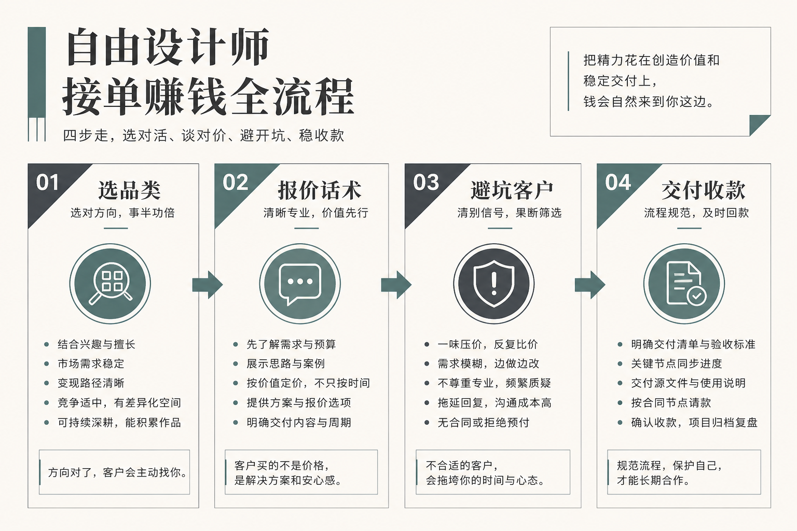

# 用 AI 设计接单赚钱：真正决定你赚多少的，是接哪类单、怎么开价、躲开哪种客户

我用 AI 设计工具接单进第三年了。前一篇我写过怎么把「接单—报价—交付—收款」这条线整体跑通，那讲的是纪律。这篇不一样，我只聚焦最靠前、也最要命的三件事：**你到底该接哪一类单、开价时嘴里该说什么话、看到哪种客户扭头就走。**

为什么单拎这三件出来讲？因为这三件全发生在你动手画图之前。等你开始出图，赚不赚钱其实已经定了七成。品类选错，你在给自己交学费；报价开错，你在给客户打白工；客户看错，你后面所有的规则和合同都是给一个不打算好好付钱的人立的。AI 让出图变快了，可它一点都没让「选单、开价、识人」变简单——恰恰是这三件，AI 一件也替不了你。

我想打三个靶子。第一，「什么单都接才赚得多」——错，什么都接的人永远在给新品类交学费；第二，「报价就是报个数字，低点好抢单」——错，报价是一整套话术，数字只是其中最不重要的一环；第三，「客户是上帝，来者不拒」——错，有几种客户你越早认出来、越早推掉，赚得越稳。

---

## 👤 我的处境：会画图从来不是我最缺的本事

我美术功底一般，真正让我这三年活下来的，不是我画得比谁好，是我慢慢学会了「挑单」和「开口」。头一年我什么单都接，logo、详情页、插画、PPT、包装，来一个接一个，忙得脚不沾地，月底一算利润薄得可怜——全被返工和压价吃掉了。

转折点是我开始记账：把每一单花的时间、改的轮次、最后到手的钱一笔笔记下来。记满三个月我就看明白了——亏钱的单几乎都长一个样：**要么是我不熟的品类，要么是我开价时没把话说清，要么是那个客户从第一句话就透着不对劲。** 这篇讲的，就是我从那本账里抠出来的三件事。

---

## 🎯 先说结论：接单赚钱的钱，藏在动手之前（总表）

| 环节 | 新手常见做法 | 我现在的做法 | 差别来自哪 |
|------|------------|------------|----------|
| 选品类 | 什么单都接 | 只接能标准化的 2–3 类 | 熟了才敢开价 |
| 开价心态 | 怕报高吓跑客户 | 先报规则，再谈数字 | 话术比数字值钱 |
| 报价话术 | 甩一个总价 | 拆成基础价 + 加项清单 | 边界写在嘴上和纸上 |
| 面对压价 | 一压就降 | 降价必砍量 | 价和量绑死 |
| 识别客户 | 来者不拒 | 三句话筛掉危险信号 | 坏客户越早推越省 |
| 定金 | 不好意思要 | 不付定金不开工 | 定金是第一道滤网 |

这张表就一个意思：**真正让你赚到钱的动作，全在你打开画布之前。** 出图是这门生意里最不缺人干、最容易被压价的一段；选对品类、开对价、躲开坏客户，才是别人懒得练、你却能靠它长期活下去的真本事。下面我把这三件拆开讲，坑我都替你踩过了。

---

## 🗺️ 全景：接单前的三道关



配合上图，我把动手前的三道关用文字走一遍：

```
第一关 · 选品类
   │  只接你能标准化、算得清工时的 2–3 类
   ▼
第二关 · 报价话术
   │  先讲规则（含几张/几轮/授权），再谈数字
   │  压价必砍量，绝不白降
   ▼
第三关 · 识别客户
   │  用三句话 + 定金，把危险客户挡在开工之前
   ▼
（过了这三关，才轮到出图和交付）
```

过了这三关，你才配拿起画笔；过不了，你画得再快也是白忙。很多人把全部力气花在「怎么出图更快」，其实那是最后一小段。真正拉开赚与不赚的，是这三道你看不见的关。

---

## 第一关：只接你能标准化的品类

### 卡在哪

新手总觉得「什么单都能接才赚得多」，于是 logo、详情页、插画、PPT、包装、VI 全接。每类都要重新摸规范、重新试工具、重新踩坑，一个都做不精。最要命的是——你自己都不知道这活该花几小时、值多少钱，客户一压价你立刻慌，因为你心里根本没底。

### 做法

我现在只接三类能标准化的活：电商主图与详情页、社媒配图套图、活动海报。这三类需求稳定、规范清晰、能批量出。别的活再诱人我也转介绍出去，赚个介绍费也不亲自碰。品类一收窄，我对每类的工时、难点、报价心里立刻有了准数，客户压价我也不虚——因为我清楚这活的成本底线在哪。

### 关键细节

聚焦不是把路走窄，是把开价的底气立起来。只有你反复做同一类活，才算得清「这活我要花几小时、该收多少、哪一步最容易返工」。什么都接的人，永远在给每个新品类交学费，赚的钱全填进试错里。

### 怎么判断一类活值不值得接

我有个简单标准：**这类活我能不能写出一份固定的报价单和一份固定的交付清单？** 能，就说明它可标准化，可以接；写不出来、每单都得现场拍脑袋，那就是无底洞，果断转出去。

### 我踩的坑

早期我接过一个从没做过的品牌 VI 全案，觉得单价高、诱人。结果光摸清 VI 的规范和交付标准就耗了一周，还因为不熟出了两次错，客户不满意，最后单价虽高，摊到工时上比我做电商图还亏。从那以后我认死理：不熟的品类宁可转出去赚介绍费，也绝不硬碰。

---

## 第二关：报价话术——数字是最不重要的一环

这一关是这篇的重头，因为大多数新手对「报价」的理解，就停在「报个数」上。错了。报价是一整套话术，你怎么说，比你说多少更决定成败。

### 卡在哪

新手报价两招：拍脑袋，或比别人低。低价抢来的单，客户默认你便宜就该无限改；拍脑袋报的价，遇到复杂需求根本 cover 不住工时。更常见的是——客户一句「能不能便宜点」，你嘴一软就降了，还没砍任何工作量，等于白白送钱。

### 做法：先报规则，再谈数字

我现在开价，第一句永远不是数字，而是规则。我会这么说：

> **「这个价包含 3 个初始方向、2 轮修改，交付含电商主图和详情长图。超出的方向按 X 元/个，超出的修改轮次按 Y 元/轮，加急、额外尺寸、商用授权另算。」**

先把「包含什么、超出怎么算」讲清楚，再落到那个总价。客户听完这套，心里对边界就有数了，后面很难再拿「就改一点点」来磨你。

### 报价话术的三句护身符

这三句我几乎每单都用，帮我挡掉了大部分扯皮：

**面对压价——「价格可以谈，但要对应减量」：**
> 「这个预算我可以做，不过方向就从 3 个减到 1 个、修改从 2 轮减到 1 轮，您看行吗？」

关键是让客户明白：**降价不是我吃亏,是他少拿。** 价和量必须绑死，绝不白降。

**面对「先做一版看看效果」——「我们从定金和第一版开始」：**
> 「完全可以，我们先按流程走：定金到位我出第一版，您满意我们再继续。」

把「免费试稿」变成「付费第一版」，这一句能筛掉一大半只想白嫖的人。

**面对「后面单子多,这次先便宜点」——「首单按标准，长期合作我们另谈框架价」：**
> 「特别欢迎长期合作，不过首单我还是按标准来，等我们跑顺了，长期的框架价我给您单独算，这样对您也更划算。」

「以后给你介绍很多单」这种画的饼，我一个都没等到过。首单该多少就多少。

### 关键细节

报价话术真正的作用，不是「标个数字」，是「在开口的那一刻就把边界立住」。客户后面想多要一版、想加个尺寸、想改第五轮，你都能平静地指着当初说过的规则说「这是加项」。没有这套话术，所有额外要求都会变成「顺手帮个忙」，而顺手的忙加起来，就是你亏掉的全部利润。

### 我踩的坑

第一个大单我为了抢，报了个远低于工时的价，还没说任何轮次规则。客户拿捏住我便宜，前后改了七八轮，每次都说「就一点点小改」。我熬了半个月，时薪还不如打零工。那之后我再没为抢单牺牲报价话术——低价换来的从来不是好客户,是无底洞。

---

## 第三关：避坑客户——有些单，接了就是灾难

会画图、会开价还不够。这三年我最深的体会是：**同样一套流程,遇到对的客户是赚钱,遇到错的客户是渡劫。** 有几种客户，我现在三句话就能认出来，认出来就赶紧礼貌地推掉。

### 危险信号一：一上来只问「多少钱」，不谈需求

> 客户第一句就是「做一套图多少钱？」，你反问用途、渠道、风格，他含糊其辞。

这种客户心里只有价格没有需求，八成是到处比价的，你报多少他都嫌贵，做出来他都不满意。我的应对：**先问清需求再报价，不肯说清需求的，我不报。**

### 危险信号二：把「简单」挂嘴边

> 「很简单的，就改个颜色」「随便弄弄就行」「你们做这个不是分分钟」。

嘴上说简单的客户，往往是最不尊重专业、也最容易无限改的。他觉得简单，所以觉得不该收钱，也觉得可以随便让你改。我的应对：**越说简单，我越把报价规则讲得越细，把轮次写得越死。**

### 危险信号三：不肯付定金

> 「我们公司规矩是验收后付款」「先做出来我看看效果再说」。

这是我最不能让步的一条。**不付定金,等于让你用时间和劳动去赌他的信用。** 我的应对：定金不到，一律不开工，这条没得谈。愿意付定金的客户，本身就已经筛掉了一大半麻烦。

### 危险信号四：反复强调「以后有很多单」

> 「这单先便宜点，后面公司还有一大堆图要做」。

我等过太多次「后面的单」，一个都没来。画的饼不能当饭吃。我的应对：**首单一律按标准价，长期合作等真的来了再谈。**

### 关键细节

避坑客户不是清高，是自保。你产能再高、流程再顺，只要放一个危险客户进来，他就能靠无限改和拖尾款把你一个月的利润吃光。**能把坏客户挡在开工之前的人,比能画好图的人赚得稳得多。**

### 我踩的坑

有个客户占齐了上面三条：开口只问价、满嘴「很简单」、坚持验收后付款。我当时缺单，赌了一把。结果他前后改了十几版，每版都说「就一点点」，最后验收时又挑刺压价，尾款拖了两个月才给一半。从那以后这四条危险信号，占两条我就直接婉拒——推掉一个坏客户省下的时间，够我好好做两个好单。

---

## 💰 成本对比：这三关到底帮我省下了什么

| 项目 | 不设三关时 | 设了三关后 | 差别 |
|------|----------|----------|------|
| 品类 | 什么都接、现学现卖 | 只接 2–3 类熟活 | 工时算得清，不再交学费 |
| 报价 | 甩个数、一压就降 | 先规则后数字，降价必砍量 | 白降和白改大幅减少 |
| 试稿 | 免费做一版看效果 | 定金后出第一版 | 白嫖党基本筛掉 |
| 改稿 | 「就改一点」无限改 | 超轮次按规则计费 | 熬夜白干变加项收入 |
| 坏客户 | 来者不拒 | 三信号 + 定金拦截 | 拖款和扯皮显著减少 |

我得先泼盆冷水：这张表是量级示意，不是报价单。你做九块九的电商图和做品牌全案，单价差一个数量级。这张表只想说明一件事——**真正省下你时间、保住你利润的，不是出图快，是这三道动手前的关。** 出图产能就算翻十倍，配上乱开的价和一堆坏客户，也只是十倍的坏账。

---

## 适合谁 / 不适合谁

**适合：** 想把接单当正经生意经营、而不是幻想一夜暴富的设计爱好者；愿意沉下心把一两类活做精的上班族；已经接过一些单、却发现钱没到手的人——你们的卡点从来不在「画得快不快」，而在「接得对不对、开价稳不稳、看人准不准」，这三关正好解你们的困。

**不适合：** 只想「买个会员一键出图躺赚」的人；报价时张不开口讲规则、一压价就软的人；拉不下脸拒绝坏客户、总觉得「来者不拒才显专业」的人。这门副业从来不是彩票，是一门要你会挑、会说、会拒的生意。

---

## 如果你是……（对号入座）

**如果你是刚想用 AI 接单、还没开过张的人：** 别急着接十个单证明自己。先选一类你能标准化的活，把报价话术背熟（先规则后数字、压价砍量、定金开工），再去接第一单，从头跑通一遍。跑通一次的经验，比盲接五个乱单值钱得多。

**如果你是接了不少单、却发现没赚到钱的人：** 你的问题多半不在出图，在前两关。回头翻翻你上个月亏钱的单，是不是全栽在「不熟的品类」和「没讲清的报价」上。先把品类收窄、把报价话术立住，再谈接更多单。

**如果你是老被客户拖着改、拖着不给钱的人：** 你缺的不是更好的合同模板，是识别客户的眼力和拒绝的勇气。把那四条危险信号记牢，下次一开口就用它筛人。推掉一个坏客户，比接住一个好单更能救你。

**如果你是天天焦虑「AI 又出新功能、怕被淘汰」的人：** 关掉那些推送。工具三个月换一茬，可「怎么挑单、怎么开价、怎么看人」这三件事，能吃你好几年。你缺的不是又一个新工具，是把这三关练成肌肉记忆的耐心。

---

## 最后一句

用 AI 设计接单赚钱，从来不是「出图快就能躺着数钱」。AI 帮你把画图那一小段变便宜了，可选品类、开价、识客户这三件最值钱的活，它一件都替不了你。谁能在动手之前就把「接哪类、怎么开价、躲开谁」想清楚，谁才赚得稳、走得远。

会画图的满街都是；能挑对单、开对价、看准人的，才是把这门副业做成稳定进项的那一个。

> 专栏附记：全文不推荐任何一键出图的国民级模板工具；报价数字与倍数均为量级示意，非报价依据；发布前请自行复核各工具当期价格与商用条款。本稿与 029《AI 设计工具赚钱》分篇——029 讲整条生意线的纪律，本稿只聚焦接单品类、报价话术与避坑客户三关。
