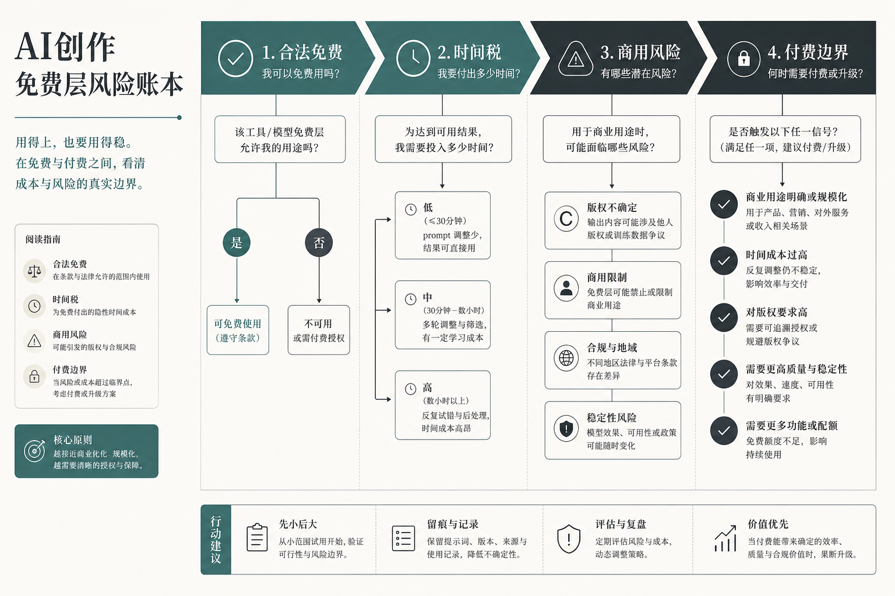

> 知乎版：去文字超链，保留配图。

# AI 创作"白嫖"我玩了三年，最后算清一笔账：白嫖不是零成本，是把钱换成了别的东西

我算是最早一批把"白嫖"当正经方法用的人。刚做 AI 创作那两年，我几乎没为工具付过钱——图用开源模型自己出，配音用免费 TTS，剪辑用命令行工具，连大模型都自己在本地跑。朋友看我一分钱不花做出一堆东西，都以为我捡了大便宜。

直到有一次接了个商用单子，我才第一次认真算了笔账：那个月我为了"省"下大概三百块的工具订阅费，光是折腾环境、等出图、返工重做，实打实搭进去了将近二十个小时。按我自己的时薪算，这笔"白嫖"其实比订阅贵好几倍。更吓人的是交付后客户问了一句"这图版权干净吗"，我当时答不上来——那张图是拿一个免费额度出的，商用授权我压根没看清楚。

从那天起我对"白嫖"这两个字的理解彻底变了。**白嫖不是零成本，它只是把"钱"这一项成本，换成了时间、风险和不确定性这三项你看不见的成本。** 这篇不教你怎么"薅到极致",更不会教你破解、盗号、绕授权那套——那不叫白嫖，那叫违法，翻车了没人替你兜底。这篇讲的是一个玩了三年白嫖的人,怎么算清这笔账,把白嫖用在它真正划算的地方。

---

## 先摆三个我要打掉的靶子

关于白嫖，网上流传最广的三种说法，恰恰是最坑人的。我先把它们摆出来打掉。

**第一个靶子："免费 = 零成本"。** 这是最大的误解。免费工具省的是订阅费这一项显性成本，但它同时给你加了三笔隐性账：你要花时间搭环境、等生成、修问题（时间税）；你要自己承担版权是否干净的风险（商用风险）；你要担心哪天工具跑路、账号被封、额度突然砍掉（账号风控）。这三笔账不写在价签上，但你迟早要还。

**第二个靶子："能白嫖的就绝不付费"。** 这是把手段当成了目的。白嫖是为了省成本，可如果为了省三百块搭进去两千块的时间，这买卖就做反了。真正会算账的人，是该白嫖的地方一分不花，该付费的地方绝不心疼——因为他知道付费买回来的是时间和确定性。

**第三个靶子："白嫖就是想办法绕过限制"。** 大错特错，而且危险。破解软件、共享盗版账号、用脚本刷免费额度、绕过商用授权——这些不是白嫖，这是违规甚至违法。轻则封号，重则吃官司。真正的白嫖只在一个范围内成立：**合法的免费额度、开源协议允许的自托管、以及作者明确开放的免费功能。** 越过这条线的，都不在这篇的讨论范围里。

这三个靶子，下面我用一张风险账本和一套流程逐个拆。

---

## 白嫖风险账本：先看清你到底在付什么代价



我把三年踩过的坑，归纳成一张"风险账本"。每次想白嫖一个工具前，我都会先在心里过一遍这三栏。

| 隐性成本 | 具体表现 | 什么时候会爆 | 我的应对 |
|---------|---------|------------|---------|
| **时间税** | 搭环境、装依赖、等出图、修报错、反复抽卡 | 活越急、量越大，时间税越贵 | 高频重复的活，宁可付费买省心 |
| **商用风险** | 免费额度的商用授权模糊、训练数据来源不明、生成结果版权归属不清 | 交客户、上架、印刷、投放时 | 商用活必须逐条看授权，看不清就不用 |
| **账号风控** | 工具突然收费、免费额度砍半、项目停更、账号被封 | 你最依赖它、又没有备份方案时 | 关键环节永远留一个备胎方案 |

这张账本的用法很简单：**如果一件活三栏成本都低——量小、不商用、工具稳定，那放心白嫖，一分钱别花。如果任何一栏亮红灯——活很急、要商用、或者你重度依赖某个不靠谱的免费工具，那就要认真考虑花钱买回确定性了。**

我自己的经验是：个人练手、做着玩、非商用的内容，白嫖栈完全够用，而且很多开源工具的效果一点不比付费的差。可一旦这件事要交付、要商用、要稳定持续地产出，白嫖的三笔隐性账就会一笔笔找上门。

---

## 合法免费栈：这些是我用了三年、真能白嫖到底的

先说清楚，下面这些全部是**开源自托管**或**作者明确开放的免费额度**，没有一个是靠破解或绕限制得来的。这是白嫖的合法边界之内，你可以放心用。

```
合法白嫖全景（按创作环节）
  出图    → Fooocus / FLUX.1（开源，Apache 可商用）
  抠图放大 → Rembg（一行命令抠图）/ Upscayl（永久免费放大）
  配音    → Edge-TTS（免 API Key）/ GPT-SoVITS（本地声音克隆）
  语音转写 → FunASR（中文强，本地跑）
  视频    → Wan2.1（8G 显卡可跑）/ AutoCut（字幕剪辑）
  本地大模型 → Ollama + Qwen3（Apache 可商用）
  自动化   → n8n 自托管（把重复杂活交出去）
      │
      ▼
  人只做判断，机器做重复
```

### 第一步：出图——别一上来就想着替代 Midjourney

**难点：** 很多人白嫖出图第一反应是装一套复杂的节点式工作流，结果三天没跑通就放弃了。

**做法：** 如果你只是要出图、不折腾流程，直接上 Fooocus。它是开源的 Stable Diffusion 前端，三个按钮就能出图，效果直逼付费工具，完全本地免费。要商用、要更高质量，再上 FLUX.1——它是 Apache 2.0 协议，明确可商用，这一点对商用党很关键。

**关键细节：** 这一步的时间税主要在装环境。显卡够、耐心够，一次装好长期白嫖；显卡不够、又急着要，那这一步的时间税可能比订阅费还贵，该认就认。

### 第二步：抠图与放大——这两个是纯赚的白嫖

**难点：** 抠图去背景、图片放大，市面上付费工具一个月十几块起，看着不多，长期也是笔钱。

**做法：** 抠图用 Rembg，一行命令搞定，替代那些按张收费的在线工具；放大用 Upscayl，跨平台、永久免费，替代动辄一两百刀的付费放大器。

**关键细节：** 这两个是我最推荐的白嫖项——它们时间税极低（装好就能用）、商用风险低（处理的是你自己的图）、账号风控几乎为零（本地运行不怕跑路）。三栏全绿，闭眼白嫖。

### 第三步：配音与转写——中文效果反而比付费的好

**难点：** 配音工具付费档不便宜，而且很多对中文支持一般。

**做法：** 图省心用 Edge-TTS，直接调微软的 TTS 服务，连 API Key 都不用；要克隆自己的声音，用 GPT-SoVITS，一分钟音频就能训一个声音模型，本地跑。语音转文字用 FunASR，达摩院出品，中文精度和速度都很能打。

**关键细节：** 声音克隆这里有条红线必须说——**只能克隆你自己的声音，或拿到明确授权的声音。** 拿别人的声音去克隆、去商用，这是侵权，不在白嫖范围，是违法。工具是中性的，怎么用是你的责任。

### 第四步：把重复杂活交给自动化

**难点：** 白嫖出图之后，下载、改名、分类、归档这些机械活，一张张手动做能把人磨死，这也是时间税的大头。

**做法：** 我把这些重复动作全交给 n8n 自托管接管。批量出图之后的下载、按项目命名、分类存档，机器一条龙做完，人只在需要判断的地方出手。


**关键细节：** n8n 自托管是免费的，但它省的不是钱，是时间税。当你的白嫖量上来了——一次出几十上百张——有没有自动化，决定了你是"高效白嫖"还是"用免费工具把自己累死"。

---

## 白嫖会在哪一步撞墙：这就是该付费的边界

聊完免费栈，得诚实地说说它的天花板在哪。三年白嫖下来，我发现免费栈几乎能覆盖"单点能力"——出一张好图、克隆一个声音、转一段文字，这些开源工具都能白嫖到底，效果不输付费。

但它会在一个地方稳定地撞墙：**当你要的不是"出一张好图"，而是"让一批物料看起来是同一套东西"的时候。** 免费工具每次生成都有细微偏移，你自己拿手感一张张对，出到第五第六张，主色悄悄漂了、风格悄悄散了。个人玩无所谓，可一旦要商用交付、要品牌一致、要团队按同一套规范产出，这个"一致性"就是免费栈补不上的短板。

我自己的边界是这么划的：**练手、做着玩、非商用，全程白嫖；一旦进入要商用、要一致、要持续产出的活，我会在"锁规范、批量延展"这一个环节上花钱买省心。** 这一步我用 Lovart，把主色、字体、版式定成一份规范，后面所有物料从这份规范里长出来，改一处全局跟着变，不用一张张回去重抽。我推荐它的理由很实在：不是它万能，是它恰好补上了免费栈最补不上的那块——一致性和可控性。这就是我说的"该付费的边界"——不是白嫖不行了，是这件事的价值已经超过了那点订阅费。

说白了，白嫖和付费从来不是对立的。会算账的人是：**能白嫖的单点能力一分不花，撞到一致性和交付这道墙时，果断花钱买回确定性。**

---

## 成本对比：三条路我都走过，账摆给你看

开创作这摊事，最实在的就是把账算明白。下面三条路我都长期走过，数字是量级不是报价，仅供你对号入座。

| 项目 | 全程白嫖 | 全程付费 | 白嫖为主+关键付费 |
|------|---------|---------|-----------------|
| 显性支出 | 几乎为零 | 每月订阅叠加，不便宜 | 只在关键环节付费，可控 |
| 时间税 | 高，搭环境+等生成+修错 | 低，开箱即用 | 中，杂活自动化后可压低 |
| 商用风险 | 高，授权要自己逐条盯 | 低，付费档授权通常清晰 | 低，商用环节走付费拿干净授权 |
| 账号风控 | 高，怕跑路/封号/砍额度 | 低，付费服务相对稳 | 低，关键环节有付费兜底 |
| 适合谁 | 练手、非商用、量小 | 团队、高频、重交付 | 大多数认真做事的个体 |

我要泼盆冷水：**"全程白嫖"这条路，省的是显性的钱，赔的是隐性的时间和风险。** 你练手阶段走它没问题，但真要靠创作赚钱、要稳定交付，纯白嫖的三笔隐性账迟早把你省下的钱连本带利收回去。我现在走的是第三条——白嫖为主，关键处付费。这条路省下了大头的工具费，又用可控的支出把时间税、商用风险、账号风控这三个雷都拆了。

---

## 适合谁 / 不适合谁

**适合走白嫖路线的：** 刚入门、在练手、做非商用内容的人；显卡够、也愿意花时间折腾环境的人；接受"免费工具要自己搭、自己修、自己盯授权"这个现实的人。你们用免费栈，能用零成本把手艺练出来。

**不适合硬白嫖的：** 要靠创作稳定接单赚钱、交付时间卡得死的人；要商用、要品牌一致、带团队的人；以及那种"为了省几十块愿意搭进去几小时"却从没算过时间税的人。你们该做的不是全白嫖，是把免费栈当底盘，在交付和一致性这些关键处该付费就付费。

**以及，谁都不适合的那条路：** 破解、盗号、共享盗版账号、绕商用授权。这不是白嫖，是违规违法，翻车了工具不背锅，你自己扛。这条线，再省钱也别碰。

---

## 如果你是……

**如果你是学生党/纯练手：** 放开白嫖，一分钱别花。Fooocus 出图、Edge-TTS 配音、Rembg 抠图、FunASR 转写，这套免费栈足够你把每个环节练熟。这个阶段你最该投入的是时间不是钱，把手艺练出来比什么都值。

**如果你是接单的自由职业者：** 把"商用授权"当成硬指标写进流程第一行。免费栈可以用来出草稿、试方向，但真要交付客户的成品，走可商用授权的工具（比如 FLUX.1 或付费档）把版权拿干净。你丢一次版权，赔的是整个口碑，那点省下的订阅费根本不够填。

**如果你是要规模化出图的人：** 别在单张效果上白嫖到极致，把精力放在自动化上。用 n8n 自托管把下载、改名、归档这些重复杂活接管过来，人只做判断。你的成本大头不是工具费，是时间税，压住时间税才是你的胜负手。

**如果你是带团队的：** 白嫖可以是个人练手的方式，但团队产出必须统一。工具选定后，把标准流程录下来沉淀成 SOP，新人照做就能跟上，别让每个人各自白嫖一套、出一堆互不相干的东西。团队阶段，一致性远比省那点工具费重要。

---

## 最后一句

玩了三年白嫖，我最大的收获不是"薅到了多少免费资源"，而是学会了算那笔看不见的账。**白嫖从来不是零成本，它只是把钱换成了时间、风险和不确定性。** 想清楚这三笔账各自值多少，你就知道哪里该白嫖到底、哪里该果断付费。

能免费的地方一分不花，是本事；该花钱的地方绝不心疼，是清醒。把这两件事都做到，你才是真会白嫖的人。至于那些教你破解、盗号、绕授权的"白嫖攻略"，离得越远越好——那不是省钱，那是给自己埋雷。

> 专栏附记：本文所列工具均为开源自托管或作者公开的免费能力，请以各项目当期开源协议与商用条款为准；声音克隆、图像素材涉及第三方权益的，务必取得授权。全文仅在"锁规范、批量延展"这一环节提到 Lovart，因为那是免费栈最补不上、也最值得付费的地方，不是硬广。价格与授权条款发布前请自行复核。
