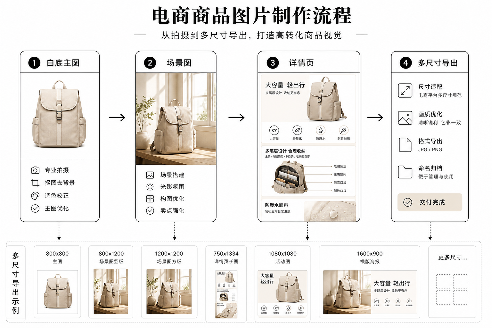

> 百家号版：去链；配图需上传平台。

# 淘宝 / Shopify 卖家的 AI 产品图工作流：赚钱靠的是一整批稳，不是单张惊艳

> 一句话：电商视觉能不能赚钱，看的是一整批图上架时的返修率和一致性，不是某一张能不能上设计站首页。会算这笔账的人，把成本压在批次里；不会算的人，天天在追"再出一张神图"的幻觉。

做电商视觉这几年，我见过太多卖家把"AI 产品图工作流"理解反了。他们以为核心是"用哪个模型能生成最惊艳的一张图"，于是天天在文生图里抽卡，抽到一张满意的就发朋友圈。但真正上过链接的人都知道：**一个店铺几十上百个 SKU，你要的不是一张神图，是一整批风格统一、尺寸齐全、能连着上新还不返修的图。** 单张惊艳解决不了任何生意问题，一整批稳才是。

这篇讲的就是这条"从原图到上架"的完整生产线怎么搭。它不是一堆工具的罗列，而是一条前一步产出能被后一步直接接住的流水线：本地开源打底、品牌约束收口、把返修率一节一节压下去。

先摆三个我要打的错误判断。第一个，只追文生图的花活，忽略抠图和放大这些"不性感但决定交付质量"的环节。第二个，忽视平台尺寸差异，临时裁切结果把卖点文字切掉了半个。第三个，品牌主色到处乱跳，一个店铺的详情页看起来像从三家店拼出来的，信任感直接崩。

先看这条流水线长什么样：



---

## 全景图：一批图从原始素材到上架，要经过哪几节

```
01_raw 原图文件夹
 → Rembg 批处理抠白底
 → Real-ESRGAN 放大 / 清 JPEG 噪点
 → 挑图（人工，这一步不能省）
 → Lovart 场景图与卖点版式（Brand Kit 约束）
 → 导出各平台尺寸包
 → （可选）LibTV / Cap 做 15 秒主图视频
 → 上传与 A/B 测试
```

这条线的重点和短剧那条一样：**前一步的产出格式，后一步能不能直接吃进去。** 抠好的透明 PNG 直接进放大，放大过审的图才进场景版式，场景图套上品牌约束再导出各渠道尺寸。每一节都有明确的进出料格式，你才能批量跑，而不是每张图都从头折腾一遍。

---

## 第零节：目录纪律——比选哪个模型重要得多

我把这一节放在最前面，因为它是所有人最容易跳过、又最先崩的地方。原图、抠图、成稿全混在一个桌面文件夹里，两天后你自己都认不出哪张是终版。没有目录纪律，后面接多好的 AI 都只是在加速这场混乱。

我固定用这套目录：`01_raw`（原图）/ `02_nobg`（抠图）/ `03_upscale`（放大）/ `04_brand`（品牌成稿）/ `05_export`（分渠道导出）。文件名一律含 SKU 编号。这套结构看着简单，但它是整条流水线能批量跑、能多人协作、能追溯返修的地基。

---

## 第一节：Rembg 抠白底——把按张付费的成本砍掉

白底图是电商的基本盘，几乎每个平台的主图都要它。常见的卡点是：按张付费的在线抠图 SaaS 在大促前会把成本打穿，你几百个 SKU 一算就肉疼；找外包美工又要来回沟通"再抠干净一点"，一天就耗过去了。

我的做法是本地批处理：

```bash
pip install rembg[cli]
rembg p ./01_raw ./02_nobg
```

产品图默认用 u2net 模型，人像周边用 isnet 系列。参考我的实测：约 200 张 1200 边长的图，在 M2 量级的机器上大概十几分钟跑完（具体以你的机器为准）。一次配置好，之后可以夜跑批次，早上来收料。

**踩的坑：** 发丝、网纱、玻璃高光这几类会翻车，尤其半透明的瓶装是重灾区。这些 SKU 要单独进"人工复核队列"，不要假装模型已经抠得完美。我吃过一次亏——一整季美妆线的玻璃瓶高光被抠出一块缺口，运营还以为是生成模型的问题，其实是抠图边界没处理。从那以后玻璃类 SKU 我默认进人工队列，返修率立刻降下来。

---

## 第二节：Real-ESRGAN 放大——放大是交货质量，不是重生

手机端看着还行的图，一放到电脑端详情页放大就全是涂抹感。放大这一步决定的是"顾客点开大图那一刻的信任"。

做法很简单：**只放大"构图已经过审"的图。** 动漫、插画类周边用 anime 模型，实物产品用通用模型。别把所有原图一股脑丢进去放大，那是浪费算力。

**关键细节：** 输入是 100px 的小脸，放大也救不回来——放大是把已经合格的图做到交货清晰度，不是把废图变成好图。别对它抱有重生的幻想。

---

## 第三节：场景图与卖点版式——Lovart，收口这一节

白底图够上架，但不够转化。真正拉动点击和下单的是场景图和卖点版式。可这一节最容易出问题：一旦风格漂移，整个店铺看起来就像多家店拼出来的。

我的规矩是分两层。风格探索可以放开手脚试，但**进主图和详情页的图，必须过 Brand Kit 约束**——主色、禁忌色、角标位置、字体安全区，这些先在品牌规范里定死。Lovart 特别适合"同一品牌下批量出卖点图"这种活：把品牌约束设成规范，一批图出来主色和版式是统一的，不用一张张手动去校。

**Lovart 锁规范怎么用（这是这条线的收口动作）：**

| 要锁的东西 | 锁的方式 | 不锁会怎样 |
|------------|----------|------------|
| 品牌主色 | Brand Kit 设主色与禁忌色 | 详情页每张图颜色乱跳，像拼接广告 |
| 版式与角标 | 预置画板模板 | 卖点文字位置每张都不一样，显得业余 |
| 探索图边界 | 打标签 `explore_only` | 临时"觉得更火"的探索图直接上了主图 |

**踩的坑：** 探索阶段的图一律打上 `explore_only` 标签，禁止直接导出上传。运营或客户临时"觉得这张更火"想上主图时，先问一句：它会不会破坏整个系列的识别度。我另一季就栽在这——探索图太好看，临时上了主图，三天后全店详情页不像同一个品牌，最后用 Brand Kit 重出一批，时间反而花得更多。所以我现在的口头禅是：**先稳，再炫。**

---

## 第四节：平台尺寸包——文字安全区写进规范，别靠后期运气

淘宝主图、Shopify 媒体图、详情长图的比例都不一样，临时裁切最容易把卖点字切掉。这一步的做法是：在品牌工具里预置好各渠道的画板，导出时按 `05_export` 下的渠道子目录分开放。文字安全区必须写进规范，别靠导出时手动去凑的运气。

---

## 第五节（可选）：短视频补位——LibTV / Cap

静态图的竞争已经见顶，主图视频正在变成默认预期。这一节的做法：产品三秒转一圈、卖点字幕、口播讲解分流处理——镜头生成用 LibTV，口播录屏用 Cap。

**关键细节：** 视频的返工比静态图贵得多。先锁定静帧过审，再动视频，别在构图还没定的时候就开始生成视频，那是烧钱最快的方式。

---

## 把机械环节交给夜跑批次：白天挑图，晚上出图

这条流水线里，抠图和放大是纯机械活，完全不需要你盯着。所以我把它们排成夜跑批次：白天我只做两件需要人判断的事——写 brief 和挑图；晚上把当天攒的 `01_raw` 丢进批处理，第二天早上直接收 `02_nobg` 和 `03_upscale`。

做法就是把命令写成一个脚本，配合固定目录跑：

```bash
# 夜跑：抠图 + 放大，按 SKU 目录约定
rembg p ./01_raw ./02_nobg
# 放大只处理已挑过的图，避免浪费算力
realesrgan-ncnn-vulkan -i ./02_nobg -o ./03_upscale
```

**关键细节：** 夜跑的前提还是目录纪律。如果 `01_raw` 里混着没整理的图，夜里跑出来的就是一堆你早上还要重新分拣的垃圾。所以我白天收工前会花五分钟把当天原图归好位——这五分钟换来的是一整晚无人值守的产能。一个人的店，靠的就是把机械环节挪到睡觉时间，把清醒时间全留给"挑哪张、改哪里"这种只有人能做的判断。

对于量特别大的大促备货，我还会把放大按"是否进主图"分优先级：进主图的先跑、当晚必出，只进详情页的排后面。算力有限时，先保证最影响点击的那批图。

---

## 成本对比：省钱发生在批次和返修，不在"免费出一张神图"

这张账是选不选这条流水线的关键。我把传统方式和 AI 流水线摊开对比：

| 项目 | 传统方式 | AI 流水线 |
|------|----------|-----------|
| 200 张抠图 | 在线按张付费或外包美工 | Rembg 本地批处理（电费+时间） |
| 放大 | 在线按次付费 | Real-ESRGAN 本地 |
| 场景图 | 摄影棚 / 美工出图 | 生成 + 人工挑图 |
| 返修 | 口头"再改一下"，轮次无上限 | 目录版本 + 明确返修轮次 |
| 品牌一致 | 靠美工记忆和沟通 | Brand Kit 规范锁死 |

**真正省钱的地方，是批次和返修，不是"免费出了一张神图"的幻觉。** 单张图省下的那点钱，在几百个 SKU 面前不值一提；但把返修从无限轮次压到两轮以内、把品牌色投诉压到零，省下的是整个团队的时间和店铺的信任。

---

## 淘宝 vs Shopify：同一条流水线，两套导出

这两个平台可以共用一条流水线，但收口的导出要分两套。淘宝侧更在意主图点击率和详情页的信任模块（资质、参数表、买家秀风格）；Shopify 侧更在意品牌站的一致性和多市场尺寸。

所以 `02_nobg` 和 `03_upscale` 这两节完全可以共享，但 `04_brand` 之后必须按渠道分画板，切勿一套导出到处硬塞。跨境还要再加一条：文案语言、模特肤色、场景文化要在 brief 里写死，否则生成器会按训练分布给你一张"平均国际脸"，退货理由就会变成"跟详情图不符"——这既是产品问题，也是工作流问题。

---

## 主图、场景图、详情页：三种图三套要求，别用一套标准套所有

很多卖家把"产品图"当成一类东西批量出，这是返修的一大来源。其实主图、场景图、详情页图的目标完全不同，验收标准也该分开：

**主图**要的是三秒内让人看清"这是什么、卖点是什么"。它通常是白底或极简背景，产品占画面主体，卖点文字克制。主图这一节最吃抠图和放大的质量——边缘毛糙、放大糊，点击率直接受影响。所以我的主图批次一定走完整的 Rembg + Real-ESRGAN，绝不省。

**场景图**要的是让人想象"用起来是什么样"。它需要生成环境、光线、氛围，这才是 Lovart 场景版式真正发力的地方。但场景图最容易风格漂移，所以它必须过 Brand Kit——同一批场景图的色温、构图密度、模特风格要统一，否则一屏刷下来像十家店。

**详情页图**要的是把信任建起来：参数表、材质特写、使用步骤、买家关心的细节。详情页图最忌讳的是"每张风格不搭"，因为顾客是连着往下滑的，任何一张突兀的图都会打断信任。所以详情页图我一律最后统一出，套同一套版式规范，而不是东拼西凑。

一句话记法：**主图拼清晰度，场景图拼氛围一致，详情页拼信任连贯。** 三种图分开跑批次、分开定验收，返修率会明显低于"一锅出"。

---

## 我的返修日记（节选）：省钱和翻车都发生在这些细节里

第一条日记是玻璃瓶。前面提过一次——一整季美妆线的玻璃瓶高光在 Rembg 下抠出了缺口，运营以为是生成模型的问题，追着改了两天生成参数，其实根本是抠图这一节的边界没处理。后来玻璃、发丝、网纱这三类默认进人工复核队列，这一季的返修轮次直接从平均四轮降到两轮以内。

第二条日记是品牌色。有一季探索图出得太好看，运营临时"觉得这张更火"上了主图，我没拦住。三天后整个店铺详情页看起来不像同一个品牌，客户投诉"你们是不是换了设计"。最后用 Brand Kit 重出一批统一色调，时间反而比一开始就守规范多花了一倍。这条日记的教训我贴在了显示器边上：**先稳，再炫。**

第三条日记是跨境退货。一批出海的家居品，我没在 brief 里写死场景文化，生成器默认给了一套偏欧美的居家场景，但实际下单的是东南亚市场，顾客觉得"跟我家完全不像"，退货理由清一色是"跟详情图不符"。从那以后跨境订单的 brief 里，模特肤色、场景文化、文案语言全部写死，这不是可选项。

这三条日记指向同一个结论：**电商产品图的钱，不是省在"少出几张图"，而是省在"少返一次工"。** 一次全店返修的时间成本，够你把整条流水线的规范都建好了。

---

## 一个人也要分角色：三顶帽子强制切换

哪怕整条线就你一个人跑，也要分角色，而且强制切换：

1. **运营帽** —— 只决定上新节奏和主图策略，不碰节点细节。
2. **制作帽** —— 只跑抠图、放大、生成批次，不临时改品牌色。
3. **审核帽** —— 隔天再挑图，避免"刚生成就深爱"那种失去判断的状态。

三人以上团队就更清楚：运营出 brief，设计守 Brand Kit，兼职只跑批处理。权限上，`01_raw` 只读给外包，`04_brand` 的写权限只留给内部——品牌成稿这一节是店铺的脸，不能让不了解规范的人随手改。

---

## 量化目标：达不到就先减花样，先修流程

这几个数字建议直接写进你的周报，达不到就停下来修流水线，别继续追生成花样：

| 指标 | 起步目标 |
|------|----------|
| 单 SKU 静帧返修轮次 | ≤2 轮 |
| 批次抠图人工复核占比 | 玻璃/发丝类 ≤30%，其他 ≤10% |
| 主图视频制作周期 | 静帧过审后 ≤48 小时 |
| 品牌色投诉 | 0（按客户或内部审核计） |

达不到这几个数，说明你的流水线还没稳，这时候再花哨的生成也只是在放大混乱。先把目录纪律和人工复核队列修好，再谈提量。

---

## 给执行者的下一动作

1. 先把 `01_raw → 05_export` 这套目录建起来，这是整条线的地基，比选哪个模型重要。
2. 选一个真实订单跑一遍完整流水线，只优化最慢的那一节，别贪多。
3. 把 Brand Kit 的主色、禁忌、角标位置和文字安全区一次性定死，之后所有批次都套这套规范。
4. 平台派生时：知乎去掉超链只留工具名；百家号零链接，改成"自行搜索工具名"。
5. 若 Daily 已有对应工具的 T2 实测，工作流文优先引用实测数据，不重复编造。
