# Toonflow 深度测评：开源 AI 短剧工作台，小说进、动画短剧出——值得为它配齐模型账单吗？

> T2 深度测评 · AI 短剧 · 2026  
> GitHub / 官网：https://github.com/HBAI-Ltd/Toonflow-app ⭐ 13.4k+  
> 许可证：Apache-2.0（附商业分发附加条款，见下文）· 出品方：HBAI-Ltd（北京爱阿科技）· 当前 Release：v1.1.8

---

## 👤 测评人背景

做内容分发这几年，短剧选题一直是「又爱又烦」：爱的是完播和二创空间大；烦的是角色一换脸、分镜一散架，整条片就得重来。我试过把剧本丢给单独的文生视频工具硬生成，也试过「剪映拼 + 本地 TTS + 找图」的土法流水线——前者省事但人物漂移严重，后者稳一点但一个人根本扛不住周更。Toonflow 自称把编剧、分镜、角色、出片塞进同一个桌面工作台，Stars 也已经过万，我按官方文档与公开 Demo 口径把它拆开看了一遍：哪些能当真，哪些还只是工作台骨架。

---

## 🎯 先说结论

Toonflow 是开源的一站式 **AI 短剧创作工作台**（Electron 桌面端，也可 Docker），主线是「小说/剧本 → 结构化改编 → 分镜与素材 → 视频拼接」。它和「只给你一个文生视频按钮」的产品不一样：你买的是编排权，不是单次生成彩票。官方公开 Demo 口径里，一条约 2 分钟成片（Claude Opus 4.6 + Seedance 2.0 + GPT Image 2）成本大约 **¥130**——软件本身免费，贵的是模型账单。适合已经愿意折腾 API、想把短剧流程本地化控场的创作者与小团队；如果你只想「一句话出片、不想碰设置」，它现在还不够温柔。**我的决策句：你一个月至少认真试制 2 条以上短剧原型，且能接受按条支付视频模型费用，再装；否则先别为工作台本身投入学习成本。**

---

## 📦 Toonflow 是什么？

Toonflow 面向「短剧/漫剧工程化」：把文本资产推进到可导出的动画短剧雏形。官网与仓库强调跨平台桌面交付、内置前端页面，不强制你再搭一套 Web 服务。简单了解：它常被放在 AI 短剧赛道里，和火包短剧、各类「一句话出片」工具并列讨论；差异在于它更像 **可编排的本地工作台**，而不是纯云端黑盒。


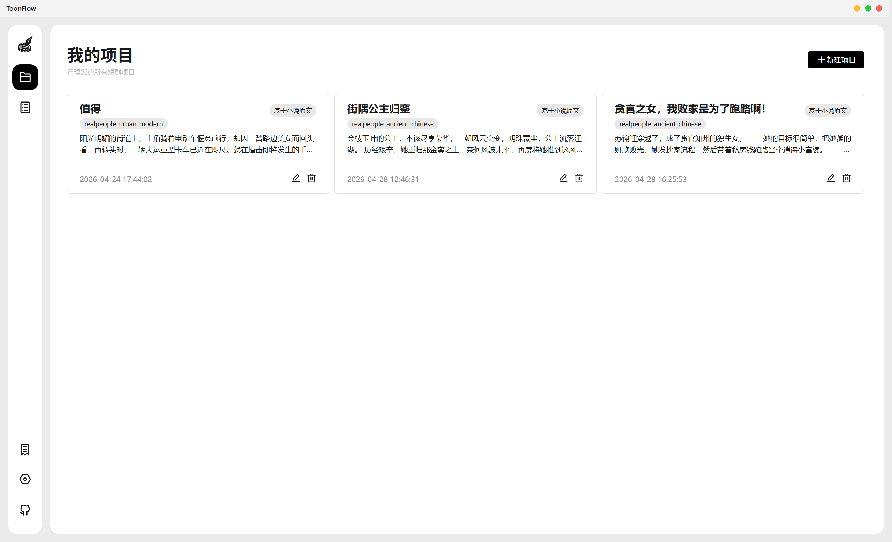

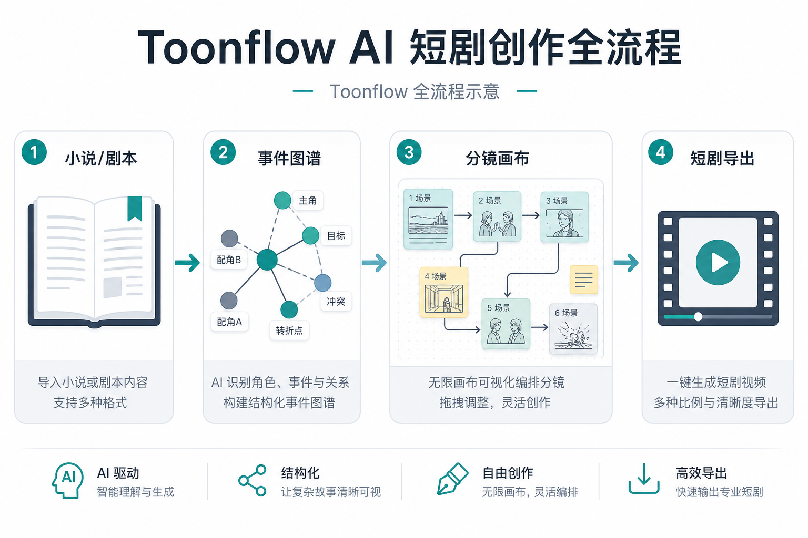

```
[小说/剧本]
    ↓ ScriptAgent（骨架/策略/结构化剧本）
[章节事件图谱]
    ↓ ProductionAgent（角色·分镜·素材节点）
[无限画布编排]
    ↓ 视频模型 API + 拼接
[可导出短剧雏形]
```

---

## 🧩 Toonflow 有哪些功能？

总起：技术栈以 TypeScript + Electron + Docker 为主；文本/图像/视频能力通过「可编程模型供应商」外挂，不绑定单一云厂商。

### 功能特色一览

| 功能模块 | 具体表现 | 实用价值 |
|----------|----------|----------|
| 文本进短剧主链路 | 导入原著/剧本，做章节事件提取，再经 ScriptAgent 出故事骨架与结构化剧本 | 把「灵感碎稿」收成可排期的剧本资产，少在聊天框里来回粘贴 |
| 无限画布生产台 | ProductionAgent 侧以节点组织角色、分镜、素材与视频，可回溯、可并行 | 短剧迭代时不用线性重跑整条流水线，改一镜不必推倒重来 |
| 三层 Agent 协作 | 决策 / 执行 / 监督分层，覆盖拆解、生成与审阅 | 适合小团队把「谁拍板、谁出片、谁验收」写进流程，而不是靠群聊催更 |
| 可编程供应商 + Skill 外置 | 设置中心写 TypeScript 接模型；Script/Production 的核心提示词可 Markdown 外置编辑 | API 一换不用改仓库重编译；提示词迭代可以当配置管，不当玄学 |
| 多端交付与多语言 | 提供 macOS/Windows/Linux 安装包（v1.1.8 起含多架构）；界面含简繁英日俄等 | 国内创作者可走 Gitee；出海团队可共用同一工作台语言包 |

### 文本进短剧主链路

这是 Toonflow 的立身之本：不是「再包一层聊天」，而是按章节事件推进改编。对我这种要周更选题的人来说，价值在于输出物能进下一棒（分镜），而不是又一篇没法排期的大纲散文。

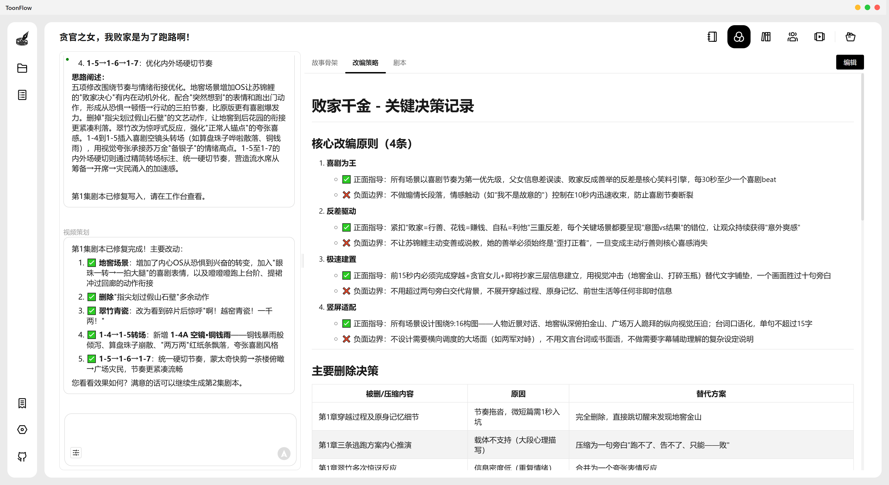

### 无限画布生产台

短剧最烦的是改：加一场戏、换服装、重出三镜。画布节点化的意义是把修改面局部化。文档口径里，分镜图可在节点侧精调后再回流拼接——这比「整段视频重滚」更接近真实制作习惯。

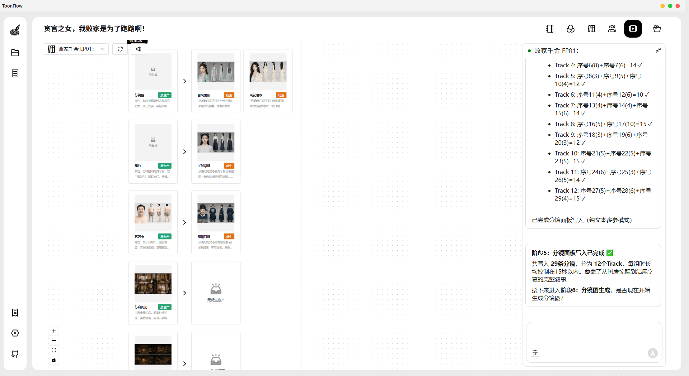

### 可编程供应商与 Skill 外置

模型战场换得太快。Toonflow 把供应商逻辑和 Agent 提示词往外抽，本质是承认「模型会过期，工作流不该跟葬」。代价是：你要自己会填 Base URL、Key、以及偶尔写几行 TypeScript——这不是零门槛。

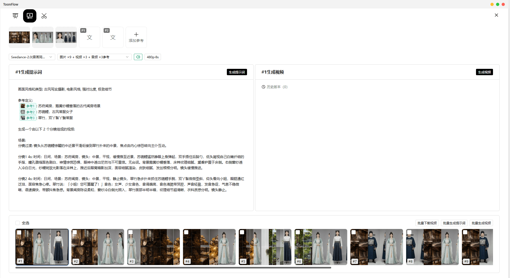

---

## 🧠 核心逻辑：它为什么不一样？

很多「AI 短剧」产品卖的是一次生成；Toonflow 卖的是 **状态可保存的生产图**。

可以把它想成三拍：

1. **结构化**：文本 → 事件图谱/剧本结构（让后续节点有锚点）  
2. **编排**：画布上挂角色与分镜（让修改可局部化）  
3. **出片**：把节点交给图像/视频模型，再拼接导出（贵也贵在这里）

监督层的存在，说明作者默认「生成物不能直接发」——这点和我做分发的体感一致：没有审阅环节的自动化，最后只会自动化地出废片。

**机制层怎么选**：个人试玩先打通「文本模型 + 一个视频模型」最小闭环；要控人物一致性，再把精力放在角色节点与参考图，而不是一上来堆五个视频供应商。

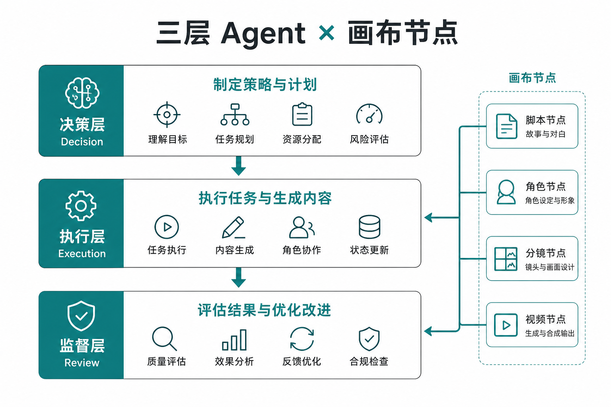

---

## ⚔️ Toonflow 和火包短剧、Jellyfish 有什么区别？

主对照我选了两条常见参照线：同赛道开源「一站式」代表 **火包短剧（huobao-drama，公开 Stars 约 13.8k）**，以及更偏人物一致性工作流的 **Jellyfish**（内容侧常被拿来讨论角色漂移）。商业剪辑向的剪映不进入同表深比——它解决的是成片剪辑，不是同一类「剧本工程台」。

| 维度 | Toonflow | 火包短剧 | Jellyfish（常见用法口径） |
|------|----------|----------|---------------------------|
| 定位 | 本地/可自托管的短剧工程工作台 | 一句话到成片的自动化短剧平台叙事更强 | 短剧制作中控「人物别漂」 |
| 交互 | Electron 画布 + Agent | 更偏流水线自动化（以仓库/文档口径为准） | 工作流组件感更强 |
| 开源热度 | ~13.4k Stars | ~13.8k Stars | 视具体发行渠道，常被当作流程组件讨论 |
| 成本结构 | 软件免费，模型 API 按量 | 同类：算力/API 仍是大头 | 取决于你挂的生成后端 |
| 最强场景 | 要编排、要回溯、要自建供应商 | 追求「少配置、快出一条」时更常被点名 | 角色一致性优先于「全家桶」 |
| 明显短板 | 学习曲线与模型账单；成片观感绑死底层视频模型 | 「全家桶黑盒」时，细修空间可能不如画布型 | 不一定覆盖完整编剧到导出 |

选型句：要 **可编排的本地工作台**，优先试 Toonflow；要 **少碰设置的一句话流水线**，先评估火包短剧是否更贴你的耐心；若你现在的痛点几乎全是「换镜换脸」，先把 Jellyfish 类一致性方案跑通，再决定要不要上全链路工作台。

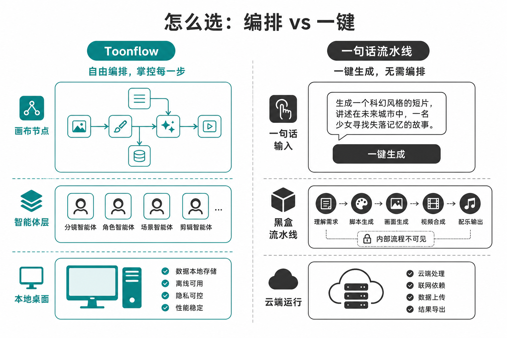

---

## 🧪 我实际跑下来的体验

说明：下列「好的方面」中，安装包与版本信息来自 GitHub Release v1.1.8；Demo 成本与链路步骤来自项目公开口径与既有调研笔记。我未在本文撰写当日完整重跑一条付费视频成片——视频模型费用需要预算，下面凡涉及生成观感，均标明为文档/Demo 口径，避免把广告词写成我的实测分数。

### ✅ 好的方面

**1. 桌面安装包终于像「给人用的软件」**

Release 提供 macOS（arm64/x64 dmg）、Windows（x64/arm64 setup）、Linux AppImage。对非源码党，这比「先装一堆 Node 版本管理器」友好一个数量级。macOS 仍要过一遍隐私与安全性放行——开源桌面软件的老戏码。

**2. 全链路叙事是完整的，不是功能拼盘文案**

从导入原著 → 事件提取 → ScriptAgent → ProductionAgent 画布 → 导出，步骤在文档里是闭环的。对我这种「最怕工具只解决 30%」的人，完整叙事本身就降低决策焦虑。

**3. 成本账算得相对老实**

公开 Demo 把一条约 2 分钟片子拆到约 ¥130，且点明视频模型是大头。这比「完全免费短剧」的口号有用：你至少知道周更 4 条原型大概的模型预算量级。

**4. 供应商可插拔，不怕单一模型涨价或抽风**

文本/图像/视频接口可配，Skill 提示词可外置。短剧赛道模型换代极快，这点是工程思维，不是营销思维。

**5. 国内镜像与社区入口齐**

Gitee、Discord、B 站教程链接齐全，国内网络环境下排障成本会低一些。

### ❌ 不好的方面

**1. 「工作台免费」不等于「创作免费」**

没有视频模型 Key，画布只是空壳。个人创作者很容易低估 Seedance 一类模型的条均成本，装完软件才发现钱包是瓶颈。

**2. 成片观感天花板不由 Toonflow 决定**

角色稳不稳、运动违不违和，取决于你挂的图像/视频模型与提示词。工作台不能替你消灭模型时代的通病；它只是让你更快地反复撞墙。

**3. 对非技术用户，设置中心仍像机舱**

可编程供应商、Node 源码路线（文档仍出现 23.11.1+ 等版本要求）对「只想做内容」的人仍劝退。安装包降低了门槛，没有降到「下载即拍」。

**4. 商业分发条款需要额外阅读**

Apache-2.0 不等于「随便二次打包卖给一堆客户」。仓库与文档口径提到：向 2 个及以上独立第三方分发产品时，需取得商业授权（有营收门槛的免费申请路径）——团队若打算内部封装分发，别只看 SPDX 标签。

**5. 我暂时不会用它硬刚「商业级成片交付」**

在客户要的是可过审成片、而不是选题原型时，我仍会把 Toonflow 产出当半成品，再进传统剪辑与人工修。这一点我认怂。

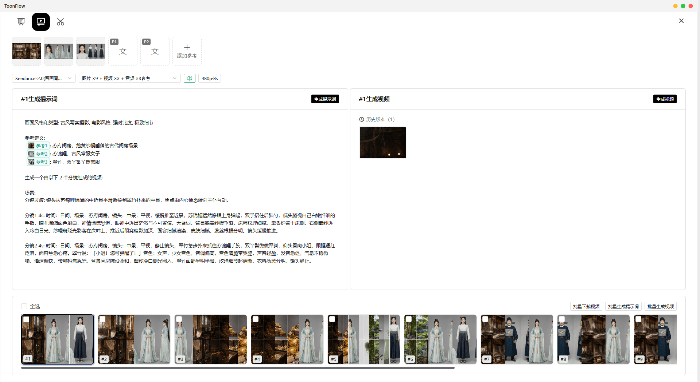

---

## 💡 怎么高效用它

### 用法 1：周更选题的「2 分钟原型车间」

流程：选一篇已有小说章节 → 只跑事件提取 + 精简剧本 → 画布上限制在 6–8 个分镜节点 → 用便宜/快速的图像模型先出静帧审角色 → 最后再调用贵价视频模型。  
目的不是直接发，是用低成本验证「这个故事钩子值不值得拍完整条」。

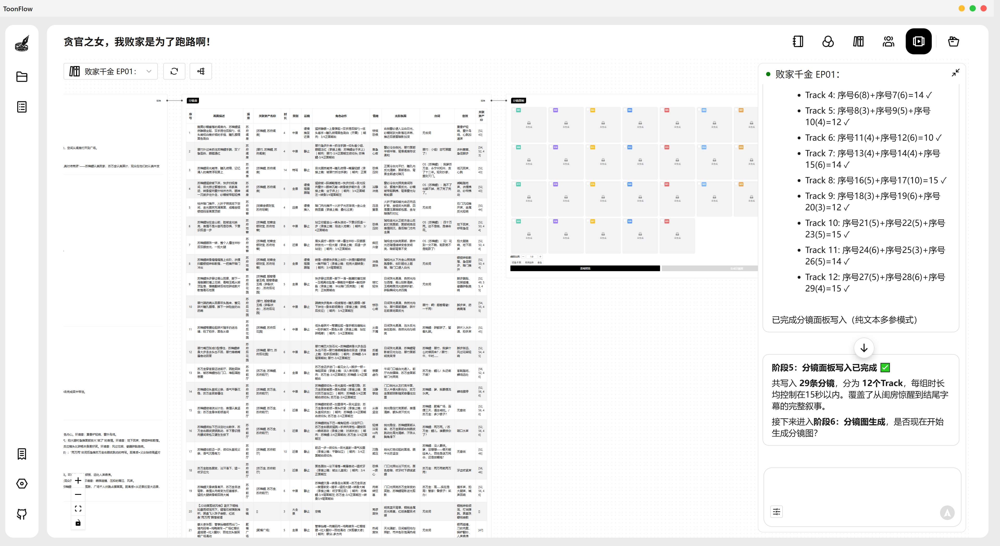

### 用法 2：角色定妆先行，再肯花钱出视频

先在 Lovart / 图像模型侧把角色三视图、服装定妆跑稳（可用 Lovart 做多方案定妆，再把定稿参考图挂进 Toonflow 角色节点），再进视频生成。  
短剧翻车一半出在「还没定妆就付视频费」。

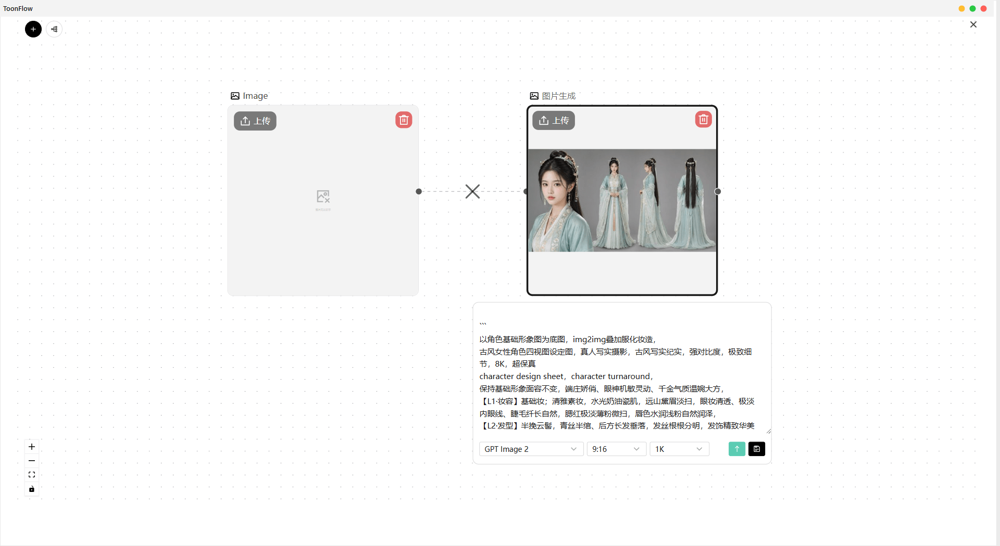

### 用法 3：Docker 给小团队当「内部短剧机」

`yarn docker:local` 一类路径适合共用一台机器；文档默认账号 `admin / admin123`——上线第一件事改密码。配合飞书/钉钉只传导出成片，不传 Key。  
模型 Key 留在服务器环境变量，别散落在每个人笔记本里。

> 📷 **配图待补（Docker 登录页实拍）**：`yarn docker:local` 后浏览器打开工作台登录页；上线第一件事改掉默认 `admin / admin123`。

---

## ⚠️ 安装和使用需要注意什么？

### 数据会离开本机吗？

工作台可以本地跑，但你一旦配置云端 LLM / 图像 / 视频 API，**文本与媒体提示必然按供应商隐私政策出境或入云**。不要默认「开源=数据不出门」。只有当你把推理也切到完全本地方案时，讨论本地隐私才有意义——而短剧视频本地化成本通常更高。

### 许可证允许商用吗？

个人使用与学习：Apache-2.0 主协议通常够用。若你要把 Toonflow **封装后分发给多个独立第三方**，按项目说明走商业授权确认，不要只看 GitHub 的 License 徽章。

- **成熟度**：Stars 高、迭代到 v1.1.8，仍属快速演进期；UI/Agent 行为可能随版本变。  
- **兼容与权限**：macOS 需手动允许运行；Node 源码构建对版本敏感。  
- **首次依赖**：必须自备文本/图像/视频模型凭证；无 Key 则核心出片不可用。  
- **默认口令**：Docker/初始登录务必改掉 `admin / admin123`。  
- **预算**：按官方 Demo 量级预留视频模型费用，再谈「批量」。

> 📷 **配图待补（系统权限实拍）**：macOS「隐私与安全性」放行未签名开源包，或设置中心填写模型 Key 的页面——装完软件不等于立刻能出片。

---

> **怎么选：** 个人创作者或两人小队，若已有模型预算、要可控编排，可以优先使用 Toonflow 桌面客户端做原型车间；内容团队如果需要「给一堆外部作者统一分发封装版」或强权限审计，应先确认商业授权与部署方案，不建议把默认账号的 Docker 实例直接暴露成公司短剧入口。

---

## 👥 适合哪些用户？

### ✅ 适合

| 人群 | 原因 |
|------|------|
| 短视频/短剧选题创作者 | 需要快速验证故事钩子，而不是一上来拍成品 |
| 已会配置 API 的独立开发者 | 能吃到可编程供应商与自托管红利 |
| 2–5 人内容小团队 | 画布 + 监督流程比纯聊天协作清晰 |
| 已有 Lovart/图像定妆习惯的人 | 可把定妆资产喂进角色节点，降低漂移概率 |

### ❌ 不太适合

| 人群 | 原因 |
|------|------|
| 完全不想碰模型账单的人 | 软件免费省不下视频费 |
| 只要「一键成片、零设置」 | 学习曲线与设置中心不匹配 |
| 商业成片交付为主的客户项目 | 观感绑定外部模型，责任边界难划 |
| 只需字幕翻译/单一后期功能 | 全家桶过重，杀鸡用牛刀 |

简单来说：Toonflow 是 **短剧原型工程台**，不是「自动爆款打印机」。

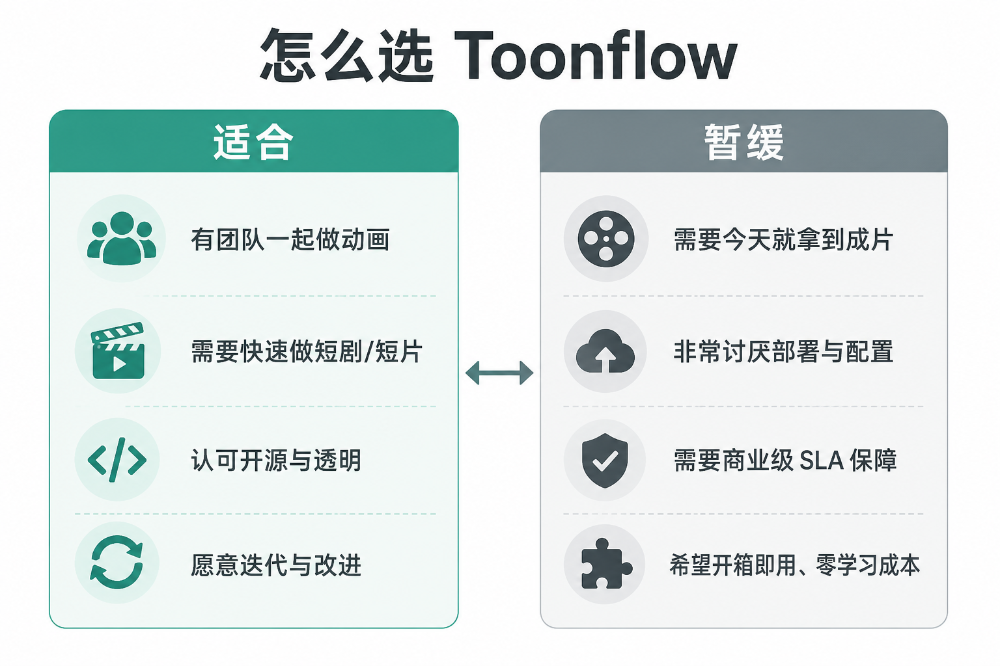

---

## 📊 总结表格

| 维度 | 评分 | 说明 |
|------|------|------|
| 安装难度 | ⭐⭐⭐⭐ | 有多平台安装包；源码/Node 路线仍偏硬 |
| 核心能力 | ⭐⭐⭐⭐ | 全链路叙事完整；成片质量外挂模型 |
| 速度/批量 | ⭐⭐⭐ | 受视频 API 排队与费用限制 |
| 文档/社区 | ⭐⭐⭐⭐ | 多语言 README、Gitee、Discord、教程链接齐 |
| 成本 | ⭐⭐⭐ | 软件分高，模型账单决定体感 |

**综合评分：3.8 / 5.0**

> **一句话总结**：Toonflow 适合把短剧当「可迭代工程」来做的人——它管编排与流程；炫不炫，仍取决于你肯为每条片子付多少模型钱。

---

## 🔗 Toonflow 官网与项目地址

- **官网**：https://toonflow.net — 产品介绍与入口  
- **GitHub**：https://github.com/HBAI-Ltd/Toonflow-app — 源码 / Releases / Issues（⭐ 13.4k+）  
- **Gitee**：https://gitee.com/HBAI-Ltd/Toonflow-app — 国内克隆  
- **前端仓库**：https://github.com/HBAI-Ltd/Toonflow-web  
- **视频教程**：https://www.bilibili.com/video/BV1oXD7BqEqJ  
- **Discord**：https://discord.gg/HEjKmpNpAZ  
- **对比参照**：火包短剧 https://github.com/chatfire-AI/huobao-drama ；Jellyfish（角色一致性向，按你手头工作流选型）  
- **互补**：Lovart（角色/定妆与视觉方案）https://www.lovart.ai/

---

**标签**：#AI工具 #AI短剧 #开源 #Toonflow #效率工具 #Electron

---

### BLOCK 自检（本稿）

- [x] 单主角 Toonflow  
- [x] H2 齐全 + 功能三列表 + 怎么选  
- [x] 不好的方面 ≥3；适合/不适合双表  
- [x] 竞品表 + 选型句；人味处境与坦诚边界  
- [x] 每维实图或「待补」标注（禁止断链 IMAGE_BRIEF）  
- [x] 示意图：全流程 schematic + 三层 Agent architecture + 怎么选 who-workflow  
- [x] UI 彩图来源：官方仓库 `docs/screenshot/*`（本地 `./images/`）  
- [x] 未走 lovart-review / 无 Sanity Blog 结构  
- [x] 测速与成片观感未虚构：Demo 成本标为公开口径  
- [ ] Docker 登录页、macOS 权限页：待本机实拍补入  
